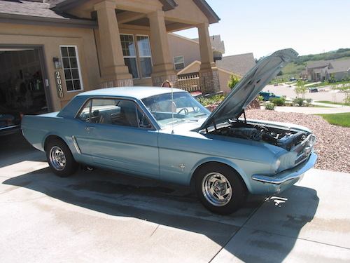
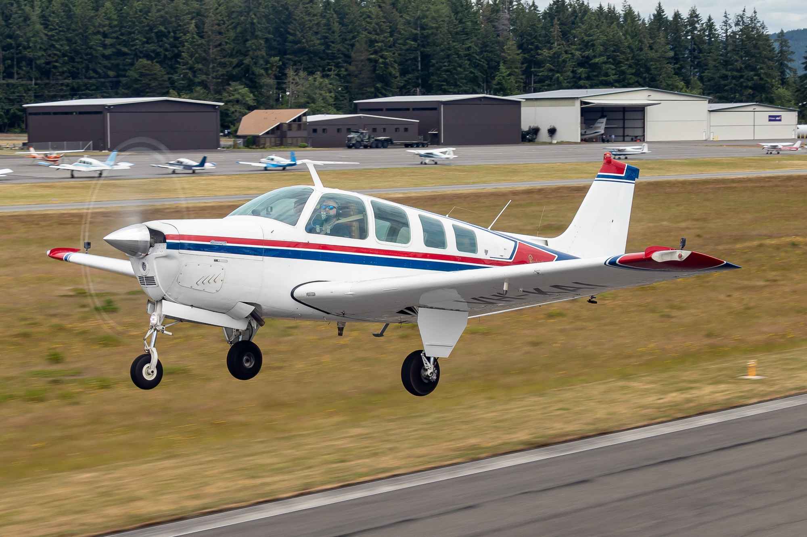

+++
date = '2022-04-15T12:00:00-07:00'
draft = false
title = 'Why Aircraft Modifications Aren't Like Car Mods (And My A36 Bonanza Wishlist)'
aliases = ['/aviation/a36-bonanza-stc/']
summary = "At 13, I built elaborate Excel spreadsheets of car modifications I couldn't afford. Now I'm doing it again with aircraft - researching every possible STC for a 1977 A36 Bonanza. Unlike cars, certified aircraft modifications require FAA approval, but that just makes the research more interesting."
genres = ['Aviation', 'Aircraft Maintenance', 'Plane Modifications']
tags = ['Aircraft Modification', 'Beechcraft Bonanza A36', 'Certified Aircraft', 'Experimental Aircraft', 'Supplemental Type Certificate', 'STC']
[params]
  author = 'Matt Goodrich'
+++

**Some habits never die.**

At 13, I was obsessed with cars - an obsession that *The Fast and the Furious* (2001) only amplified. **I spent hours reading *Super Street* and *Import Tuner*, building elaborate Excel spreadsheets of modifications for cars I couldn't afford.** MK4 Toyota Supra was the dream, complete with every bolt-on imaginable meticulously researched and priced.

**Flash forward to today, and I'm doing it again.** Same boyish excitement, same Excel spreadsheet obsession, but this time it's aircraft modifications. **The difference? I'm actually under contract on a 1977 A36 Bonanza** - a factory-standard bird just begging for upgrades.

**Here's where aviation gets complicated.** In the automotive world, you can modify anything as long as it remains road legal - or just build a track car with complete freedom. **Certified aircraft? Not so simple.**

## **The FAA's Three-Tier System**

**The FAA controls aircraft through three levels of certification:**

* **Type Certification** - Design approval for the aircraft and every component (engines, props, avionics, etc.). **Think of it as the blueprint getting government approval.**
* **Production Certification** - Permission to manufacture aircraft based on that approved design. **Quality control meets bureaucracy.**
* **Airworthiness Certification** - Individual aircraft approval proving it matches the type design and is safe to fly. **Your specific plane's birth certificate.**

These three types of certification are covered in the [Code of Federal Regulations (CFR), Title 14, Part 21](https://www.ecfr.gov/current/title-14/chapter-I/subchapter-C/part-21)

### **Certified Aircraft: The Corporate Path**
**Beechcraft/Textron followed the full process:** design approval, production approval, individual aircraft certification. **Every Bonanza that rolled off the line has government blessing at every level.**

### **Experimental Aircraft: The Builder's Path**
**Multiple routes to experimental certification:**
- **Scratch-built from your own design** (no type cert needed)
- **Kit aircraft** like [Van's Aircraft](https://www.vansaircraft.com/) builds (kit manufacturer has production cert, but no type cert)
- **Buying someone else's experimental**

**All still need individual airworthiness certification, but the path is different.**

## **The Modification Reality Check**

**Certified Aircraft:** Unapproved modification = grounded aircraft. **Period.** Getting airworthiness back is expensive and painful.

**Experimental Aircraft:** Modify freely, but flight characteristic changes require new testing. **Much more flexibility.**

## **Enter STCs: The Certified Modification Solution**

**Supplemental Type Certificates (STCs) are the key to legally modifying certified aircraft.** Think of them as FAA-approved modification kits that supplement the original type certificate. **Each STC is aircraft-specific - no universal solutions.**

## **My A36 Bonanza STC Research**

**Forum posts constantly ask: "What STCs are available for A36 Bonanzas?"** I couldn't find a consolidated list anywhere, so while building my dream Bonanza Excel spreadsheet (yes, really), I've compiled every STC I could find. **Consider this a living reference for fellow Bonanza dreamers.**

| STC | Description | 
| --- | ----------- |
| [D'Shannon Gross Weight Increase](https://www.d-shannon-aviation.com/upgrades/gross-weight-increases-gwi.html) | Gross weight approval that allow gross weight to be increased to 3,850 lbs without tip tanks, and 4,010 lbs with tip tanks. Requires: IO-550 STC, Baffle Cooling Kit. |
| [D'Shannon Engine Conversion - IO-550B](https://www.d-shannon-aviation.com/upgrades/engine-conversion-stcs.html) | The objective is a more powerful, more efficient and reliable engine; while increasing the value of your aircraft; provide greater speed; faster climb; greater maneuverability; a better service ceiling; and greater carrying capacity. |
| [D'Shannon Engine Cooling Baffles](https://www.d-shannon-aviation.com/upgrades/baffle-kit-solutions.html) | D'Shannon Baffle Cooling Kits help avoid cylinder replacement by reducing valve, valve guide and overall engine wear by providing optimal cooling. |
| [Scimitar Propeller](https://www.d-shannon-aviation.com/upgrades/scimitar-props.html) | Update to replace obsolete Beech, Flottorp, McCauley threaded props, and steel-hub Hartzell propellers. Upgrading from a two-bladed propeller, or any other propeller. |
| [D'Shannon High Performance Exhaust](https://www.d-shannon-aviation.com/bonanza-exhaust.html) | Available for the IO-550, IO-520. Beechcrafts exhaust system for the IO-550 and IO-520 was originally designed for the IO-470 engine with 260hp. This is one of the main reasons the engines of today do not generate all of the horsepower they are capable of producing. The D’Shannon system takes full advantage of the available horsepower in the engine, allowing the engine to breathe more efficiently and relieve undue stress on the engine and internal parts. Potential fuel savings, allowing same performance with lower consumption. By providing dual heat collectors (one on each side of the engine) improved defrost and cabin heat is provided. |
| [D'Shannon Tip Tanks](https://www.d-shannon-aviation.com/upgrades/tip-tank-solution.html) | D'Shannon Aviation auxiliary tip tanks give you the added range and safety of 40 additional gallons of fuel. Enhanced stability, lower stall speed and increased aileron authority for safer operation and smoother ride. Tip tanks enhance overall stability, improve spin characteristics and lower landing and stalling speeds at the aircraft’s original gross weight. Or take advantage of the FAA approved gross weight increase, which you can in either added fuel or cabin weight. |
| [D'Shannon Vortex Generators](https://www.d-shannon-aviation.com/upgrades/vortex-generators-solution.html) | D'Shannon Aviation's Vortex Generator System is a simple way to improve the low-speed handling and margin of safety of your Beechcraft. D'Shannon V/Gs give you: A lower stall speed - for safer landings and maneuvering flight, increased aileron authority at lower speeds for better control. All 36 Bonanzas are approved with a 100 lb. gross weight increase. |
| [D'Shannon Gap Seals](https://www.d-shannon-aviation.com/upgrades/gap-seal-kits-solution.html) | D'Shannon's Gap Seal Kits for Bonanzas and Barons offer great improved performance without a great deal of cost. Benefits of D'Shannon gap seals include: Reduced stall speed, decreased drag and increased cruise speed, shorter takeoff and landing distances, improved control authority under all flight conditions. |
| [SmartSpace Baggage Conversion](http://www.approachaviation.com/html_pages/learning_center.html) | The SmartSpace baggage conversion installs behind the rearmost passenger seats in the Beech A36 (pre-1979), adding approximately 8 cubic feet of storage area, while retaining the existing hat shelf area for easy in-flight access to smaller objects.  The SmartSpace baggage conversion has a footprint similar to post-1979 A36 aircraft and is certified for the same 70lb maximum loading capacity (C.G. Envelope limits must be observed). |
| [True Blue Power Lithium-ion Battery](https://www.truebluepowerusa.com/products/aviation/battery-STCs/bonanza-a36-stc/) | Less Weight. Less Maintenance. More Power. |
| [GAMIJector & turboGAMIjector](https://gami.com/gamijectors/gamijectors.php) | GAMIjector® fuel injectors and TurboGAMIjector® fuel injectors are fuel injection nozzles designed to deliver specific amounts of fuel to each individual cylinder that will compensate for the fuel/air imbalance inherent in the fundamental design of the engine fuel/air systems. Each GAMIjector® fuel injector is carefully calibrated to much tighter tolerances than standard fuel injectors available for your engine. GAMIjector® fuel injectors alter the fuel/air ratio in each cylinder so that each cylinder operates with a much more nearly uniform fuel/air ratio than occurs with any standard factory set of injectors. Some models may be eligible for a gross weight increase from 180-300 lbs depending on the engine. To qualify, the airplane must have an IO-550B and GAMIjector calibrated fuel injectors and the LiquidAir Baffle kit. |
| [GAMI LiquidAir Baffle](https://gami.com/liquidair/liquidair.php) | LiquidAir Baffle Kit replaces specific elements of the existing Beechcraft baffling and adds additional flow through the addition of fuselage side louvers. Aerodynamic design smooths airflow into engine compartment, reduces drag and directs cooling air properly to cylinders. |
| [GAMI Osborne Tip Tanks](https://gami.com/osborne/osborne.php) | This is a transfer pump system. Fuel is transferred from the tip tanks into the main tanks by an electric fuel pump mounted in each wing. All of the tip tanks come with some gross weight increase. | 
| [B&C BC410 Standby Alternator System](https://bandc.com/product/bonanza-standby-alternator-system-components-stc-pma/#regulator-controller) | This system provides 20 amps of power to support continued flight in the event of primary alternator failure.  Once activated, it operates in the background, automatically signaling its operation to the pilot through a panel-mounted annunciator light (which also doubles as a standby alternator load monitor). If the primary alternator fails in flight, the controller will sense the drop in system voltage and automatically activate the standby alternator.  If the current requirement is over 20 amps when the standby alternator is activated, the annunciator will flash.  Reducing the current usage to 20 amps or less will cause the annunciator to cease flashing and illuminate in a steady state.  The pilot may choose equipment needed for the given flight conditions by simply keeping the total load below the flashing point of the annunciator.  This will reserve battery energy for transient loads, (gear, flaps, landing lights, etc) during approach.  Loads may be beyond the flashing point of the annunciator for up to five minutes without damaging the standby alternator. |
| [Tornado Alley Turbo Whirlwind III](https://taturbo.com/frames.html) | The Tornado Alley Turbo Whirlwind III™ Bonanza is the finest turbonormalizing package available for the IO-520 or IO-550 Powered Bonanza today. The turbonormalized Whirlwind III™ not only provides sea-level power up to 20,000 feet but also significantly improves low altitude (less than 12000') speeds as well. With the "magic" of turboGAMIjectors® fuel injectors, the Whirlwind III™ bonanza will fly faster; and faster on less fuel, with cooler engine temperatures than normally-aspirated Bonanzas. |
| [Colemill Starfire](https://www.mikejonesaircraft.com/starfire.htm) | The Starfire modification includes: New Continental IO-550B 300 horsepower -- for more speed, better climb and reliability, new Hartzell 4-blade "Q-Tip" propellers with Woodward governor for an extremely quiet, vibration-free ride, Shadin Digiflow fuel computer -- for extremely precise fuel management, all new accessories, hoses and belts -- for hours of trouble free service. |
| [TKS Ice Protection](https://www.cav-systems.com/retrofit/beechcraft-bonanza/) | TKS fluid exudes from aircraft leading edges |