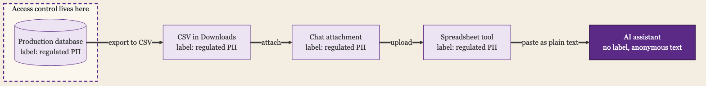
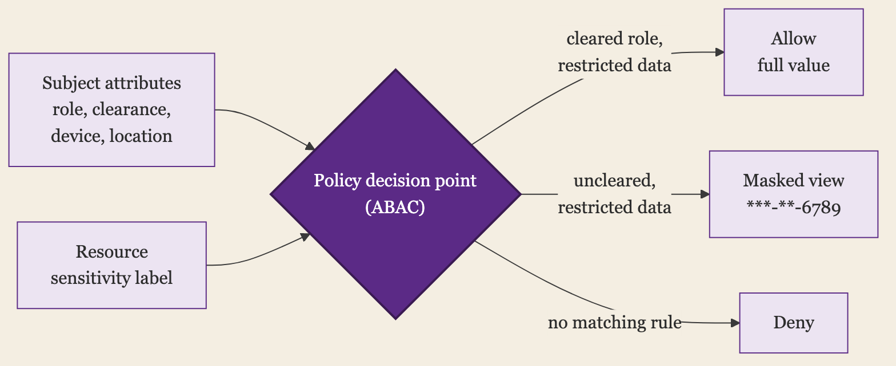

+++
date = '2026-06-29T00:01:00-07:00'
draft = false
title = 'Access Should Know What the Data Is'
aliases = []
description = "Most access control protects systems: this database, that app, this bucket. It says nothing about the sensitivity of what is inside, so the same permission guards a marketing list and a table of social security numbers. Data-centric access ties the control to the data's classification, so protection follows the data across the systems that hold it. Here's how classification, labeling, and policy fit together, and why it's the hardest pillar to finish."
categories = ['Security', 'Engineering']
tags = ['Security', 'IAM', 'Identity', 'Data Security', 'Data Classification', 'DLP', 'Zero Trust', 'CISO']
image = 'header.png'
[params]
  author = 'Matt Goodrich'
+++

Grant someone read access to a database and you have made a decision about a system. You have said nothing about the data inside it. The same read permission covers the table of marketing email addresses and the table of social security numbers sitting one schema over, because the permission is attached to the database, and the database does not care what it holds. Your access control is guarding a container and is blind to the contents.

That blindness is the gap the data pillar of zero trust exists to close. Every other control in this series gates a system: a login, a device, a network path, an API. They ask where data lives and who can reach that place. The data pillar asks what the data is, and whether the protection matches what it is worth.

## System-Centric vs Data-Centric

The two models differ in what the control is attached to, and that attachment decides what happens when data moves.

**System-centric** access ties protection to a location: this database, this bucket, this share, this app. It is how almost all access control works, and it is necessary. Its limit is that the protection belongs to the container, so the moment data leaves the container, the protection stays behind.

**Data-centric** access ties protection to the data itself, through a classification that travels with it. A record marked as containing regulated personal data carries that mark when it is copied, exported, or moved, and the controls key off the mark rather than off the location. The protection rides with the data instead of staying with the box it came in.

The difference only matters because data does not hold still, and in a real company it never does.

## Why the Container Model Leaks

Picture the path a sensitive table actually takes. It starts in a well-governed production database with tight access. An analyst with legitimate access runs a query and exports the result to a CSV. The CSV lands in their Downloads folder, gets attached to a message in chat, uploaded to a spreadsheet tool for a quick pivot, and pasted into a slide for a meeting. Maybe it gets fed to an AI assistant to summarize. At every hop, the careful access controls on the production database are irrelevant, because the data is no longer in the production database. It is in five places that never heard of those controls.

System-centric security protects the first location and loses the data at the first copy. The classification is the only thing that can follow it, because the classification is a property of the data, not of any one system it passes through. If the export carried a label that said this is regulated personal data, the chat tool, the spreadsheet tool, and the AI assistant could each refuse it, redact it, or flag it. Without the label, every one of them sees an anonymous block of text and treats it like any other.



## Classify, Label, Then Enforce

Data-centric access runs as a pipeline, and each stage depends on the one before it.

**Classify.** First you have to know what is sensitive, which means scanning your data for the patterns that matter: personal data, payment card numbers, health records, secrets, regulated categories. Tools like [AWS Macie](https://aws.amazon.com/macie/) for cloud storage do this discovery automatically, finding the social security numbers and card numbers hiding in buckets nobody remembered. [NIST's FIPS 199](https://csrc.nist.gov/pubs/fips/199/final) gives the standard frame for the output: categorize data by the impact of its loss, low, moderate, or high, so the classification means something consistent. On the open-source side, [Microsoft Presidio](https://microsoft.github.io/presidio/) detects and redacts personal data in text, and catalogs like [OpenMetadata](https://open-metadata.org/) and [DataHub](https://datahubproject.io/) store the classification tags alongside the data so the rest of the pipeline can read them.

**Label.** Classification is only useful if it sticks to the data, so the next step is attaching the result as a durable label, and where the label physically lives decides how far it travels. [Microsoft Purview's sensitivity labels](https://learn.microsoft.com/en-us/purview/sensitivity-labels) embed the mark inside the file or the record, so it persists when the file is copied, emailed, or downloaded, instead of living in a separate registry that the copy escapes. For structured data the label rides with the schema: [BigQuery policy tags](https://cloud.google.com/bigquery/docs/column-level-security) and [AWS Lake Formation tag-based access control](https://docs.aws.amazon.com/lake-formation/latest/dg/tag-based-access-control.html) attach the classification to the column itself, and the warehouse keys off it at query time, before the data is ever handed out.

The catch is that a label needs somewhere to live. A document format with metadata can hold one. A database schema can hold one. A flat CSV in a Downloads folder, a block of text pasted into a chat box, a screenshot of a table, cannot, because there is no field for the label to sit in. The moment classified data becomes plain characters with nowhere to carry the mark, the label falls off, and every tool downstream is back to seeing the anonymous block of text from the leak above. That is why the label has to be applied at the source, in a format that can hold it, rather than added after the data has already scattered.

**Enforce.** With a label that travels, policy can finally key off what the data is. Access can require a clearance matched to the label. Data loss prevention can block a high-impact label from leaving by email or upload. Encryption can be applied automatically by sensitivity. The same label drives access, movement, and protection, and it drives them wherever the data goes, because the label went too.

The payoff is that protection stops depending on the data staying put. A high-sensitivity label means the same thing, and triggers the same controls, in the production database and in the CSV that escaped it.

## The Label Is Just Another Attribute

The enforce step is the access-control half of this, and the part worth dwelling on, because if you run IAM you already own the machinery it needs. A sensitivity label is an attribute of the resource. Clearance, role, group, device posture, and location are attributes of the subject. Attribute-based access control, the model [NIST SP 800-162](https://csrc.nist.gov/publications/detail/sp/800-162/final) describes, is a rule over both: a policy decision point reads the subject's attributes and the resource's label and returns allow, deny, or a masked view.

This is the same policy-decision split I have written about for application authorization, pointed at data instead of at API objects. The label is the input that was missing from the decision [the gateway could not make because it could not see the object](/posts/the-gateway-cant-see-the-object/). Classification is what puts the object in front of the policy. Without it, a role grants by job function and never looks at what the rows hold; with it, the rule gets short and specific: a `restricted` label requires a cleared role, a `confidential` label requires a managed device, and everything else falls back to a masked or denied read. The data pillar feeds the access decision one more attribute, the one that finally lets it see what it is protecting.



## The Stores Already Have the Hooks

You do not have to build this from scratch. The major stores where regulated data actually sits already ship the classify, label, and enforce loop, and the shape is the same in each: bind the label to the column or the file, then let policy key off the label instead of off a list someone maintains by hand.

| Where data lives | How it classifies | How the label travels and enforces |
|---|---|---|
| Snowflake | [Automatic classification](https://docs.snowflake.com/en/user-guide/classify-intro) tags columns by semantic category | [Tag-based masking policies](https://docs.snowflake.com/en/user-guide/tag-based-masking-policies): a policy attached to a tag fires the moment the tag lands, so a newly classified column masks itself |
| Databricks Unity Catalog | Built-in [data classification](https://www.databricks.com/blog/abac-row-filtering-and-column-masking-policies-governed-tags-and-data-classification-are-now) writes governed tags | [ABAC policies](https://docs.databricks.com/aws/en/data-governance/unity-catalog/abac/) on those tags apply row filters and column masks automatically across whole catalogs |
| Google BigQuery | [Sensitive Data Protection](https://cloud.google.com/sensitive-data-protection) discovers, Dataplex stores the tags | [Policy tags](https://cloud.google.com/bigquery/docs/column-level-security) drive column-level security and masking, enforced at query time |
| AWS S3 and Lake Formation | [Macie](https://aws.amazon.com/macie/) finds sensitive data in buckets | [LF-Tags](https://docs.aws.amazon.com/lake-formation/latest/dg/tag-based-access-control.html) on catalog columns gate access by tag on every query |
| Microsoft 365 and Azure | Auto-labeling by sensitive info type | [Sensitivity labels](https://learn.microsoft.com/en-us/purview/sensitivity-labels) embed in the file and extend to SQL and Fabric; DLP and encryption key off the label |
| Google Workspace | [AI classification](https://knowledge.workspace.google.com/admin/security/label-google-drive-files-automatically-using-ai-classification) auto-labels Drive files; DLP rules also label by content match | [Drive labels](https://knowledge.workspace.google.com/admin/security/apply-classification-labels-to-drive-files-automatically-with-dlp-rules) travel with the file; Workspace DLP keys off the label to block external sharing across Drive, Gmail, and Chat |
| Open source: Atlas and Ranger | [Apache Atlas](https://atlas.apache.org/) classifications, propagated through lineage | [Apache Ranger](https://ranger.apache.org/) tag-based policies mask, filter, and gate access, even after the data is copied into a new table |

Concretely, in Snowflake that is a few lines of SQL:

```sql
-- Define the masking once
CREATE MASKING POLICY mask_ssn AS (val STRING) RETURNS STRING ->
  CASE WHEN CURRENT_ROLE() = 'HR_FULL' THEN val
       ELSE '***-**-' || RIGHT(val, 4)
  END;

-- Bind it to the classification tag, not to any single column
ALTER TAG pii_ssn SET MASKING POLICY mask_ssn;
```

After those two statements, any column that classification tags `pii_ssn`, in any table, returns the real value to `HR_FULL` and `***-**-6789` to everyone else. Tag a freshly loaded column and it is masked on the next query, with nobody touching the table.

The common move across all of them is auto-classification writing a tag, and a policy bound to that tag enforcing the instant the tag lands, so a newly loaded column protects itself with nobody touching it. The limit is the platform boundary. Inside Snowflake the tag and its masking policy follow the column through every derived table. Export that column to a CSV and email it, and you are back at the plain-text problem from the label step: the destination has to speak the same tag system, or the label does not survive the trip. That is why the discovery layer matters as much as the enforcement. It is what re-finds and re-labels sensitive data after it lands somewhere that stripped the original tag.

## Where Labels Run Out

Two things break the clean picture, and both are worth knowing before you trust a label too far.

The first is derivation. A label sits on a column, but data does not stay in its column. Join the social security numbers into a new table, or aggregate them into a feature for a model, and the derived column is just as sensitive and usually carries no tag at all. Many stores do not carry a column's classification onto the columns computed from it, so the new column starts unlabeled. This is why [column-level lineage](https://atlas.apache.org/) matters: it can push a classification from a source column to everything downstream of it, so the label follows the data through the pipeline instead of stopping at the first table. Without lineage, every transformation is a place labels quietly fall off.

The second is aggregation. A field can be harmless alone and sensitive in company. Date of birth, ZIP code, and sex are each low-impact on their own, and together they re-identify most people: Latanya Sweeney's work showed those three fields [uniquely identify about 87% of the US population](https://en.wikipedia.org/wiki/Quasi-identifier). A per-column label cannot see that, because the sensitivity lives in the combination, not in any one field. Catching it means classifying for combinations of quasi-identifiers, which is exactly where automated tools are weakest.

## Make the Data Worthless

Everything so far protects the data by controlling who can read it. The more durable move, where you can make it, is to take the sensitivity out of the data itself, so a copy that escapes is worth nothing to whoever ends up holding it.

Tokenization replaces a sensitive value with a meaningless stand-in and keeps the mapping in a separate vault. The order record holds a token where the card number was, the token means nothing anywhere else, and only a service that can call the vault can turn it back. [HashiCorp Vault's transform engine](https://developer.hashicorp.com/vault/docs/secrets/transform), data-privacy vaults like [Skyflow](https://www.skyflow.com/), and platforms like [Protegrity](https://www.protegrity.com/) offer this as a service. Format-preserving encryption is the variant that keeps the shape, so a 16-digit card stays 16 digits and survives systems that validate the format. The PCI-DSS payoff is the clearest case: tokenize the card numbers and the systems holding only tokens drop out of audit scope, because the sensitive value is not in them.

The cheaper version is to not hold the data at all. Plenty of fields that leak were never needed in the form they were stored: an age band instead of a date of birth, the last four instead of the whole SSN, a region instead of a street address. Data minimization is unglamorous, and it is the only control that cannot leak what was never collected. A traveling label helps only when every downstream tool honors it; a value that was tokenized at the source, or never kept, carries no such dependency.

## DSPM Finds the Data You Lost Track Of

The discovery layer has a name now: data security posture management, or DSPM. These platforms, [Cyera](https://www.cyera.com/), [Wiz](https://www.wiz.io/), [Sentra](https://sentra.io/), [Varonis](https://www.varonis.com/), and others, scan your cloud and SaaS stores without an agent and answer the three questions the rest of this post depends on: where the sensitive data is, including the shadow copies nobody registered; who and what can reach each store; and how exposed it is, the public bucket, the over-permissioned role, the table sitting outside any governed system. They pull in IAM and network context, so the classification is tied to the access in one view, which is the whole argument of this post sold as a product. The real-time sibling, data detection and response (DDR), watches for sensitive data being moved or accessed in ways that do not fit, and tracks where it flows.

What DSPM does not do is make the label travel. It finds and maps data at rest, which is the best answer to re-finding what scattered after it leaves a governed store. It does not ride along into the chat box or the pasted block to stop the leak at the point of use. It tells you where the risk is and who can reach it; closing the gap where the data is used is still the labeling and enforcement from the earlier steps.

## Classification Is the Pillar Nobody Finishes

Here is the honest part, and the reason the data pillar sits at the end of every zero-trust roadmap. It is the hardest one, and almost nobody completes it.

The problem is coverage. Data is created faster than it is classified, by people who are not thinking about labels, in formats that resist scanning. Structured database columns classify reasonably well. The unstructured sprawl, the documents, the chat history, the screenshots, the notes, the years of accumulated files in shared drives, does not, and that is where a great deal of the sensitive data actually lives. Automated classification has false positives and false negatives, manual labeling depends on people bothering, and labels drift out of date as data changes. A program that waits to classify everything before it enforces anything waits forever.

So the realistic version is scoped and continuous, not complete. Auto-classify the patterns you can detect with confidence, the regulated identifiers with clear formats, and enforce on those first.

The reliable ones have a fixed shape, and most carry a checksum that a pattern match alone does not. A regex narrows the field; the checksum drops the false positives.

| Identifier | Pattern | What confirms it | Validator |
|---|---|---|---|
| Payment card (PAN) | `\b(?:\d[ -]?){13,19}\b` | Luhn checksum | [python-stdnum](https://arthurdejong.org/python-stdnum/) |
| US Social Security number | `\b(?!000\|666\|9\d\d)\d{3}-(?!00)\d\d-(?!0000)\d{4}\b` | invalid area, group, and serial ranges | [python-stdnum](https://arthurdejong.org/python-stdnum/) |
| IBAN | `\b[A-Z]{2}\d{2}[A-Z0-9]{11,30}\b` | mod-97 equals 1 (ISO 7064) | [python-stdnum](https://arthurdejong.org/python-stdnum/) |
| US National Provider Identifier | `\b[12]\d{9}\b` | Luhn check digit over an 80840 prefix | [python-stdnum](https://arthurdejong.org/python-stdnum/) |
| AWS access key ID | `\b(?:AKIA\|ASIA)[0-9A-Z]{16}\b` | known prefix plus 20-character length | [gitleaks](https://github.com/gitleaks/gitleaks) |

You configure these detectors rather than write them. [Microsoft Presidio](https://microsoft.github.io/presidio/) ships recognizers for cards, SSNs, and IBANs with the checksums built in, and secret scanners like [gitleaks](https://github.com/gitleaks/gitleaks) and [TruffleHog](https://github.com/trufflesecurity/trufflehog) carry hundreds of key patterns out of the box. A paragraph of prose has none of this, no shape to match and no checksum to confirm, which is where classification stops being a regex problem and starts being hard.

Label the crown-jewel data stores, the handful of systems whose contents would hurt most, by hand if you must, and protect those well. Accept that coverage will be partial and that the long tail of unclassified data is a standing risk you are reducing rather than eliminating. The same telemetry and detection that watches access can watch for sensitive data showing up where it should not, which is how you catch what the classification missed. Partial data-centric protection on your most sensitive data beats perfect protection on the systems while the data walks out in a CSV.

## A Permission That Knows What It Guards

An access decision that cannot tell a newsletter list from a table of social security numbers is guessing, and it guesses the same way for both. Tying the control to the data's classification is what lets it stop guessing, and lets the protection survive the copy, the export, and the upload that system-centric security never sees.

You will not classify everything, and you should not wait to. Find the data that matters, label it so the label travels, and enforce on the label wherever the data goes. The data inside is the thing worth protecting, and the control should know the difference between a newsletter and a table of social security numbers.
