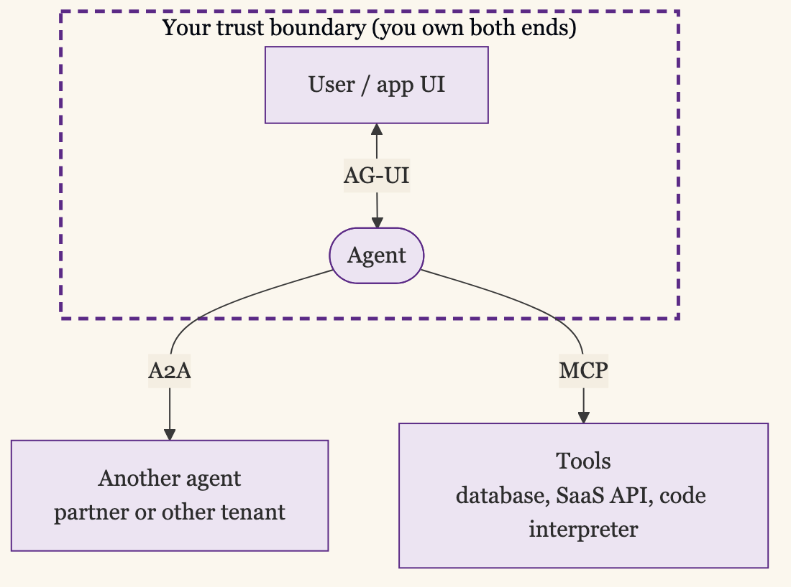
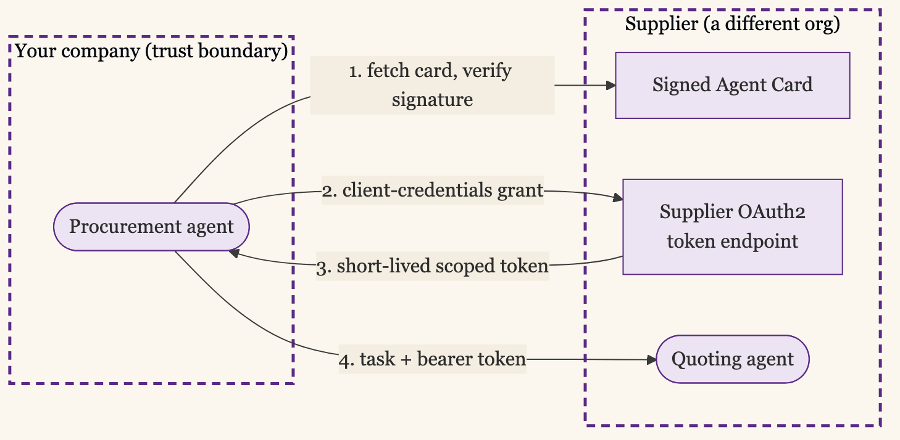

+++
date = '2026-06-05T12:00:00-07:00'
draft = false
title = 'Every Agent Protocol Earns Its Keep at a Boundary'
aliases = []
description = "The agent stack runs in three directions: MCP to tools, A2A to other agents, AG-UI to the user. Two of them cross a trust boundary, and a single boundary test decides which protocols earn their keep there and which are theater inside a system you already own."
categories = ['Security', 'AI', 'Engineering']
tags = ['Security', 'AI', 'AI Agents', 'A2A', 'MCP', 'AG-UI', 'Architecture', 'Protocols', 'IAM', 'CISO']
image = 'header.png'
[params]
  author = 'Matt Goodrich'
+++

**The protocol wars everyone braced for in 2025 are over, and they ended in a way most of the predictions missed. Nobody won outright. The protocols sorted themselves by the job they do, and then most of them moved in under the same roof.**

In [MCP Earns Its Keep at the Boundary](/posts/mcp-at-the-boundary/) I argued that MCP follows the same arc as every abstraction layer of the last twenty years: it earns its keep at the boundaries you do not own, and becomes theater at the boundaries you do. I ended that post promising to cover A2A specifically. This is that post, and the short version is that A2A is the same lesson rotated ninety degrees.

[MCP](https://modelcontextprotocol.io) is the agent-to-tool protocol. [A2A](https://github.com/a2aproject/A2A) is the agent-to-agent protocol. Around them sit a runtime layer ([LangGraph](https://www.langchain.com/langgraph), [AutoGen](https://github.com/microsoft/autogen), [CrewAI](https://www.crewai.com), Google's [ADK](https://adk.dev)) and an identity layer ([SPIFFE](https://spiffe.io), OAuth, workload identity). Architects keep asking which one to bet on. The more useful question is which boundary the protocol crosses, because that decides whether it does any work for you at all.

## The Stack Runs in Three Directions

A stack implies layers sitting on top of each other. The more useful picture for an agent is three directions of traffic out of a single point: down to its tools, sideways to other agents, and up to the person using it.

One direction runs down, from the agent to the things it calls: a database, a SaaS API, a code interpreter. That is MCP's lane. It is north-south traffic, in the language the API gateway world settled on years ago, and the prior post is entirely about it.

The other direction runs sideways, from one agent to another: your agent handing a task to a partner's agent, a planner delegating to a specialist it did not build. That is A2A's lane. It is east-west traffic between peers.

A third direction runs up, from the agent to the person using it: streaming progress, asking for input, rendering intermediate results inside the application's own UI. That is what [AG-UI](https://github.com/ag-ui-protocol/ag-ui), the agent-user interaction protocol from CopilotKit, standardizes, and in 2026 it has become the consensus third leg of the stack, supported by AWS, Google, Microsoft, and Oracle and wired into agent frameworks like LangGraph and CrewAI. The common phrasing now is MCP for tools, A2A for agents, AG-UI for users.

Two of those three directions cross a trust boundary. The tool call and the agent call can both land on something you do not own, which is where a security architect's boundary test bites. The agent-to-user call almost never does, because the frontend is yours. AG-UI earns its keep as an interoperability standard, so you don't rewrite the streaming layer for every framework. That is worth solving, and it is a different problem from the one this post is about. The rest of this is about the two axes that cross trust boundaries.



MCP and A2A run perpendicular to each other. Both are open standards, most production systems in 2026 run both at once, and Google's own ADK implements both because the reference architecture needs both. The winner-take-all protocol war everyone expected in 2025 did not happen. MCP connects an agent to its tools. A2A connects an agent to other agents. You will use them together, or you will rebuild one of them badly.

So the question is never MCP versus A2A. It is: for this specific call, am I crossing a boundary I own, or one I don't?

## What A2A Does That MCP Cannot

If A2A were MCP pointed at another agent, it would not need to exist. The difference is the trust model, and it shows up in three concrete places.

**Discovery between parties that never coordinated.** An A2A agent publishes an [Agent Card](https://a2a-protocol.org/latest/specification/): a document describing what the agent can do, how to reach it, and what authentication it expects. In v1.0 those cards are cryptographically signed, so a calling agent can verify the callee is who it claims before sending anything. MCP has no equivalent, because MCP assumes you already know the tool you are wiring up. Agent Cards exist because the agent on the other end might belong to a company you have a contract with and nothing else.

Here is the card a supplier's quoting agent publishes at `/.well-known/agent-card.json`, the document your procurement agent reads before it sends a single task:

```json
{
  "protocolVersion": "1.0",
  "name": "Northwind Components Quoting Agent",
  "description": "Returns price and lead-time quotes for industrial parts, given a part number and quantity.",
  "url": "https://agents.northwind-components.com/a2a/v1",
  "preferredTransport": "JSONRPC",
  "version": "2.4.0",
  "provider": {
    "name": "Northwind Components, Inc.",
    "url": "https://www.northwind-components.com"
  },
  "capabilities": {
    "streaming": true,
    "pushNotifications": true
  },
  "defaultInputModes": ["application/json", "text/plain"],
  "defaultOutputModes": ["application/json"],
  "skills": [
    {
      "id": "request-quote",
      "name": "Request a quote",
      "description": "Given a part number and quantity, returns unit price, lead time, and a quote validity window.",
      "tags": ["pricing", "procurement", "quotes"],
      "examples": [
        "Quote 500 units of part NWC-4471-A",
        "Lead time on 1200 of SKU 88-2231 at our contract pricing?"
      ]
    }
  ],
  "securitySchemes": {
    "partner-oauth": {
      "type": "oauth2",
      "flows": {
        "clientCredentials": {
          "tokenUrl": "https://auth.northwind-components.com/oauth2/token",
          "scopes": { "quotes:read": "Request price and lead-time quotes" }
        }
      }
    }
  },
  "security": [{ "partner-oauth": ["quotes:read"] }],
  "signatures": [
    {
      "protected": "eyJhbGciOiJFUzI1NiIsImtpZCI6Im53Yy1zaWduaW5nLTIwMjYtMDkifQ",
      "signature": "MEUCIQDx7nQ2…Jq8Yc0d1pZ2k"
    }
  ]
}
```

Three of those fields carry the whole difference from MCP. `securitySchemes` and `security` tell the caller how to authenticate before it is allowed to ask for anything. `signatures` is the JWS that lets the caller confirm the card was issued by Northwind and not altered in transit. MCP has none of these, because MCP never has to introduce two parties who have never met.

**Opacity by design.** A2A treats the remote agent as a black box. You send it a task and get back a result. You do not see its tools, its prompts, its internal state, or which sub-agents it called. That opacity is the point. It is what lets two organizations compose agents without either one exposing its internal architecture or its tool credentials to the other. MCP is the opposite: it exists precisely to expose a tool surface in detail.

**Identity that crosses an org boundary.** MCP translates one identity into one downstream credential. A2A has to carry identity across a trust boundary between two parties, which is a harder problem, and the reason A2A leans on signed cards and standard OAuth flows rather than a shared secret. The handshake establishes trust between two parties. The transport is the easy part.



Those three together describe a protocol built for composition across organizations. That is the boundary A2A is for.

## The Boundary Test, One Axis Over

Here the lesson from the last post repeats exactly, just rotated.

**Inside a trust boundary you own, A2A is theater.** If every agent in your system runs in your runtime, under your identity provider, in your cloud account, then "agent-to-agent communication" is a function call or a message on a queue you already operate. Wrapping it in A2A buys you a signed Agent Card you did not need, an HTTP hop you did not need, and a discovery handshake for an agent whose address is a constant in your own config. Use the runtime. LangGraph edges, an AutoGen group chat, a CrewAI crew: that is how agents you own talk to each other. A2A there is the east-west API gateway all over again, smart pipes between services that share an owner.

**Across a trust boundary you don't own, A2A earns its keep.** Your procurement agent calling a supplier's quoting agent. A marketplace where third-party agents register and get discovered. A multi-tenant platform where tenant A's agent must never see tenant B's tools. These are the cases where you cannot just call the function, because there is no shared function, no shared identity provider, and no shared trust. A2A is the only surface where authentication, audit, and blast-radius control between the two agents can be made to live. The signed card, the opacity, the identity handshake stop being overhead and become the reason the call is safe at all.

The test is the one sentence from the last post: an abstraction earns its keep at the boundary you do not own, and becomes theater at the boundary you do. MCP applied it to the agent-to-tool call. A2A applies it to the agent-to-agent call. Same test, perpendicular direction.

## A Protocol Is Not a Runtime

The fastest way to make a mess of this is to put protocols and runtimes in one list and try to choose between them. They answer different questions.

A protocol is a contract between things you do not both own. MCP and A2A are protocols. Their entire value is interoperability across a boundary, which is why they are worth standardizing and worth governing in the open.

A runtime is how you wire together things you do own. LangGraph, AutoGen, CrewAI, and Google's ADK are runtimes. ADK ships in Python, TypeScript, Go, and Java, runs your agents, manages their state, and routes messages between the agents you built. ADK is the thing on your side of the boundary, and it speaks A2A when it needs to reach the other side. Calling it a competitor to A2A is a category error. A runtime's whole job is to own the inside and speak the protocols at the edges, which is exactly why ADK implements both MCP and A2A.

This maps straight onto the boundary test. Runtimes live inside the boundary you own. Protocols live at the boundary you cross. When someone asks whether to "use A2A or LangGraph," the comparison does not hold: one is how agents reach across a boundary, the other is how you wire agents together on your own side of it. Pick a runtime for ergonomics and lock-in tolerance, because you can swap it. Pick a protocol for the boundary it spans, because that is not yours to redesign.

## The Proliferation Already Resolved

The fear in 2025 was a sprawl of incompatible protocols with no way to bet: A2A, MCP, IBM's ACP, AGNTCY's Agent Connect Protocol, and a dozen framework-specific schemes. That fear was reasonable. It is also mostly resolved, and the resolution arrived faster than the protocol-wars framing predicted.

Two things happened. First, the redundant agent-to-agent protocols consolidated into A2A. IBM's [Agent Communication Protocol](https://research.ibm.com/projects/agent-communication-protocol) merged into A2A, with the ACP team winding down active development and contributing its work upstream. AGNTCY, the Cisco-led collective behind a competing Agent Connect Protocol, donated its specs to the Linux Foundation. The fact that three separate efforts were all abbreviated "ACP" was itself a sign the space had more names than ideas.

Second, the survivors moved in together. In December 2025 the Linux Foundation announced the [Agentic AI Foundation](https://www.linuxfoundation.org/press/linux-foundation-announces-the-formation-of-the-agentic-ai-foundation), with OpenAI, Anthropic, Google, Microsoft, AWS, and Block as co-founders. Anthropic's MCP, Block's goose, and OpenAI's AGENTS.md came in as founding projects. A2A, already a Linux Foundation project after Google donated it in 2025, sits in the same ecosystem. By April 2026 the foundation had passed 170 members. The six companies that would have fought a protocol war are instead the co-founders of the body that governs the protocols. There is even a joint MCP and A2A specification effort anticipated for later in 2026, to formalize how the tool layer and the agent layer hand off.

For an architect, that changes the risk calculation. A year ago, picking MCP or A2A meant betting on a vendor. Now both are neutral-governed standards backed by every hyperscaler at once. The thing you used to fear, choosing the protocol that loses, is far less likely once the protocols have stopped competing and started layering.

## Where the Boundary Test Gets Blurry

I have made this sound cleaner than it is. The boundary test is a sharp tool with a few dull edges, and they are worth naming.

Trust boundaries inside one company are not always clean. Two teams in the same org can sit in different compliance scopes, different cloud accounts, different regulatory regimes. The call between their agents is technically internal and practically cross-boundary. There, A2A inside "your own" company is not theater. The boundary is real even when the org chart says you own both ends.

Adopting a protocol early can be a deliberate hedge. If you know you are building toward an external agent marketplace next year, standing up A2A between your own agents now, before you strictly need it, can be cheaper than retrofitting it later. That is paying for the abstraction before it earns its keep, on purpose, as an option on the future. The test says it is theater today. A roadmap can still justify it.

And "the protocol wars are over" is a claim about early 2026, not a law. The joint MCP/A2A spec has not shipped. New domain-specific protocols are still appearing, including payment and commerce protocols layered on top of A2A. Consolidation can fork again. The foundation lowers the odds of betting wrong; it does not remove them. Anyone who watched the SOA era knows "the standards have settled" is a sentence with a short shelf life.

None of this breaks the test. It means the test tells you where the work is, not that the work is easy.

## The Caller Changed. The Boundary Didn't.

Strip the agent framing away and the architecture underneath is the one that has held for twenty years. A protocol is worth its cost at a boundary you cannot reimplement, and it is overhead inside the boundary you control. MCP put that test on the agent-to-tool call. A2A puts it on the agent-to-agent call. The runtimes live on your side, the protocols live at the edge, and the identity layer underneath decides who is allowed to cross.

So the order of decisions is fixed. Sort by boundary first. If you own both ends, reach for the runtime and skip the protocol. If you do not, reach for the protocol and accept its cost, because it is the only place your policy can live. Sort by maturity second, and here the news is good: the protocols at the boundaries that matter, MCP and A2A, are now governed in the open by the same foundation, which is about as settled as a two-year-old technology gets. Do not bet your architecture on a single runtime, because you will want to swap it. Do bet on the protocols at your real boundaries, because those boundaries were never yours to design.

The caller is an agent now. The boundary it crosses is the same one it always was.

