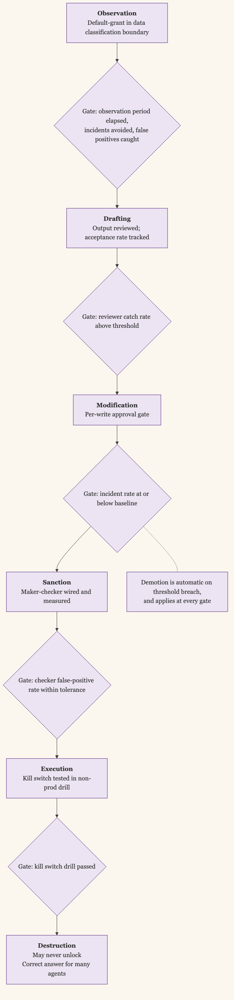

+++
date = '2026-05-27T12:00:00-07:00'
draft = false
title = 'Agents Need Capabilities, Not Roles'
aliases = []
description = "Security has been doing fine-grained action-based authorization since POSIX rwx in 1973 and since capability-based security named the per-action token in the sixties. Agents are a new identity class where that heritage matters more, not less. The unit of an agent's permission is the action it can take, grouped by blast radius, and the framework that holds it is the ISMS you already run."
categories = ['Security', 'AI', 'Engineering', 'Leadership']
tags = ['Security', 'AI', 'AI Agents', 'IAM', 'Authorization', 'Capabilities', 'CISO', 'Compliance', 'NIST', 'Least Privilege']
image = 'header.png'
[params]
  author = 'Matt Goodrich'
+++

**An AI agent is not a user, and permissioning one like a user is the most expensive shortcut in the AI rollout.**

A user is a person with judgment, a slow reaction time, and a strong incentive not to do anything that gets them fired. The permission model you grant a user assumes all three. A user with database write access does not, in practice, drop tables, because their hand stalls at the keyboard before the command runs.

An agent has none of those properties. It executes the action it was prompted into in milliseconds. It does not stall. It does not weigh the social consequence. It carries the user's identity, and therefore the user's access, but applies none of the user's judgment. The shortcut of just inheriting the invoking user's auth at agent runtime is the version of this mistake most companies are making right now, and the bill for it will come due in a postmortem nobody wants to write.

I argued in [AI Governance, Calibrated](/posts/ai-governance-existing-controls-identity-guardrails/) that most of the controls we need already exist and the gap is the identities granted to agents. This post goes one layer deeper. The identity model itself has to change. The right model has been sitting in security infrastructure for fifty years. Most teams just have to apply it.

## Security Has Known This Since 1973

Unix shipped with `rwx` in the early seventies, and POSIX formalized it in 1988. Three bits per principal, granting one specific action each: read, write, execute. It is the original implementation of action-based authorization. The system did not ask whether you were *senior* or *trusted*. It asked whether the action you were trying to perform was on your list. The granularity was the action, not the role.

Capability-based security predates even that. [Dennis and Van Horn published the idea in 1966](https://dl.acm.org/doi/10.1145/365230.365252): instead of asking the system whether a subject is allowed to take an action against an object, hand the subject an unforgeable token (a *capability*) that authorizes the specific action against the specific object. The model held for decades, mostly in academic and high-assurance contexts, because issuing and revoking capabilities at scale was inconvenient.

The cloud era brought it back. [AWS IAM actions](https://docs.aws.amazon.com/IAM/UserGuide/reference_policies_actions-resources-contextkeys.html) are exactly this idea, named in modern form. `s3:GetObject` is read. `s3:PutObject` is write. `iam:DeleteRole` is destruction. The policy grants the action against the resource, and the identity is just whoever happens to carry the policy. OAuth scopes are the same thing at the application layer. `read:user`, `write:repo`, `admin:org`: each scope is a capability the third-party app received from the user. Modern security architects have been writing these policies for fifteen years.

What none of that was designed for was an identity that acts thousands of times per minute at machine speed and was never told no by an HR conversation. That is what an AI agent is. The heritage is right; the application has to catch up.

## Six Action Classes by Blast Radius

The granularity of "every AWS IAM action" works for human-written IAM policies, but it is too fine for governing an agent's overall behavior. An agent that can call `s3:GetObject` against ten buckets but not `s3:DeleteObject` against any is doing something coherent at the policy level and incoherent at the program level. The security-relevant question for an agent is not "which API calls is it allowed to make," it is "what class of damage can it do, and how reversible is that damage."

Six classes, grouped by what fails if it is wrong, and ordered by escalating blast radius.

**Observation.** Reads, queries, searches, inspections. The agent looks at something but does not change it. Reversible by definition, because the system state does not move. Default-grant for any new agent within its data classification boundary.

**Drafting.** Recommendations, summaries, proposed changes that exit the system as text to a human or another agent for review. The output is consumed downstream but no state in the system has been modified. Reversible because the *agent* did not act, the downstream consumer did.

**Modification.** Writes, updates, configuration changes inside the system. Reversible with effort: a git revert, a configuration rollback, a database restore. Default-deny; granted per workflow with logging and a defined recovery path.

**Sanction.** Approvals, denials, escalations. The agent makes a downstream-binding decision on someone else's behalf: approves a refund, denies a ticket, escalates a deal-terms negotiation. Reversibility depends on what the downstream consumer does. Default-deny; granted only with a maker-checker pattern in place.

**Execution.** Triggering side effects beyond the current system. Running a deployment, kicking off a workflow, initiating a transaction, posting to a customer-facing channel. The agent has reached out of the sandbox. Default-deny; granted only with a documented kill switch and a per-action approval policy.

**Destruction.** Deletes, revokes, permanent terminations. Irreversible by definition. Default-deny, always, with no exceptions automated by the agent itself. Every destruction action escalates to a named human, regardless of the agent's confidence in itself.

| Class | Example actions | Reversibility | Default policy and grant requirement |
|---|---|---|---|
| **Observation** | Reads, queries, searches, inspections | Reversible by definition | Default-grant within data classification boundary |
| **Drafting** | Recommendations, summaries, proposed changes that exit as text for review | Reversible — downstream consumer acts, not the agent | Earned after Observation period; review and acceptance rate tracked |
| **Modification** | Writes, updates, configuration changes inside the system | Reversible with effort (revert, rollback, restore) | Default-deny; granted per workflow with logging and a defined recovery path |
| **Sanction** | Approvals, denials, escalations on someone else's behalf | Depends on what the downstream consumer does | Default-deny; granted only with a maker-checker pattern in place |
| **Execution** | Deployments, transactions, customer-facing posts | Often irreversible | Default-deny; granted only with a documented kill switch and per-action approval policy |
| **Destruction** | Deletes, revokes, permanent terminations | Irreversible by definition | Default-deny always; every action escalates to a named human |

Read this as a security-architecture reference, not as a coined dichotomy. The class names are what I find useful; the underlying axis is what matters. What does the agent do? What fails if it is wrong? How hard is it to put back? Every authorization decision an agent's policy makes is one of those three questions answered.

## Promotion Through Classes Is the Trust Ladder

A new agent does not get all six classes on day one. It gets *Observation* and earns the rest, one class at a time, against measured evidence.

The promotion path runs from least to most consequential. An agent in *Observation* runs read-only against the systems in its scope, with full logging. After a defined observation period (measured in incidents avoided and false positives caught, not calendar days), the agent earns *Drafting*. Its output goes to humans for review, the review is logged, and the percentage of accepted drafts is tracked. After a second window of measured eval, with the catch rate of its reviewer holding above threshold, *Modification* unlocks with a per-write approval gate. *Sanction* requires the maker-checker pattern to be wired in and measured for false-positive rate on the checker. *Execution* requires a documented kill switch tested in a non-production drill. *Destruction* may never unlock at all for some agents, and that is the correct answer.

The mistake every team makes here is allowing time to substitute for evidence. Six months on the job is not promotion criteria. A measured drift indicator within tolerance, an incident rate at or below baseline, a reviewer catch rate above a numerical threshold: those are promotion criteria. Demotion is automatic on threshold breach.

The shape of this ladder is not new either. [NIST SP 800-37's Risk Management Framework](https://csrc.nist.gov/pubs/sp/800/37/r2/final) already structures the *authorize-to-operate* progression as a sequence of gates evidenced by measurement. [FedRAMP's authorization levels](https://www.fedramp.gov/) follow the same pattern. What changes for agents is the cadence. Human service accounts get promoted over months. Agents have to be re-evaluated continuously, because the model underneath them changes, and so does the input distribution they operate on.

## Mapping to the ISMS You Already Run

Here is the part that most agent-governance content skips, and most security leaders will care about most. The framework above does not require a new control set. It maps onto the standards already in your ISMS.

The action-class taxonomy maps to **[NIST SP 800-53 AC family](https://csrc.nist.gov/pubs/sp/800/53/r5/upd1/final)** directly. *Observation* is AC-3 access enforcement against the read role. *Modification* and *Destruction* fall under AC-6 Least Privilege and AC-6(9) Auditing of Privileged Use. *Execution* triggers AC-17 Remote Access concerns. The agent's per-class authorization policy is just an AC-2 Account Management exercise with the agent as a new class of account.

The promotion ladder maps to **[NIST SP 800-37 Risk Management Framework](https://csrc.nist.gov/pubs/sp/800/37/r2/final)**. The agent goes through Categorize, Select, Implement, Assess, Authorize, Monitor exactly the way a system component does. Each class-promotion is an authorize-to-operate decision with evidence packaged for the AO.

The evidence-packet discipline maps to **[NIST SP 800-218A](https://csrc.nist.gov/pubs/sp/800/218/a/final)** (Secure Software Development Framework for AI Systems). The packet is what the SSDF asks for: artifact-level proof of testing, adversarial probing, and human review.

The agent-as-a-managed-system view maps to **[ISO/IEC 42001:2023](https://www.iso.org/standard/42001) Annex A**. A.6 covers the AI lifecycle (design through operation). A.9 covers the responsible use of the system. A.10 covers supplier and customer relationships when the agent acts on someone's behalf.

The threat surface maps to **[OWASP Agentic AI Threats v1.1](https://genai.owasp.org/resource/agentic-ai-threats-and-mitigations/)**. Privilege Compromise (action-class scoping is the mitigation), Tool Misuse (the tool surface is enumerated and bounded), Resource Overload (cost cap and rate limit), Memory Poisoning (the *Modification* class includes memory writes and requires the same governance as state writes).

None of this is new control work. It is mapping the agent into the existing controls. The ISMS already has the management-system spine: risk assessment, policy, internal audit, management review, continual improvement. The agent extends the scope; it does not start a parallel program.

## What Holds the Taxonomy Up in Production

Three pieces of operational discipline make the action-class taxonomy work in production. None of them are AI-specific; all of them are sharper now because the agent acts faster than the human reviewer.

**The evidence packet.** Every consequential output the agent produces ships with a packet: the spec it was given, the tests run against the output, the adversarial probes (fuzzing, prompt-injection, edge cases), the static analysis or symbolic exploration results where they apply, the change history, and the signature of the reviewer (human or agent) that signed off. The packet is the audit trail a future investigator will look at, and it is the eval set the next month's drift detection will run against. It is also what an auditor wants instead of "the agent did this and we trust it." [SLSA](https://slsa.dev/) gave us this discipline for build provenance. Agents need it for action provenance.

**The maker-checker pattern.** A primary agent makes the proposal. A second system, whether a review agent with a different objective function, a hard-coded check, or a human at the consequential gates, examines whether the proposal matches the spec, fits within policy, and avoids the irreversible class without explicit authorization. The pattern is older than computing; banking has run it for centuries. The novel part is making the checker an agent rather than a person at the volumes agents now produce. OpenAI's internal alignment team [published a number worth remembering](https://alignment.openai.com/scaling-code-verification/): their Codex-based PR reviewer leaves comments that the author addresses with a code change 52.7% of the time. That is the right kind of metric. Calibrate your eval coverage against the checker's measured catch rate, not against the absence of incidents.

**Escalation triggers.** Some conditions always escalate, regardless of agent state: any action in the *Destruction* class, any *Execution* against production. Some escalate based on agent state: cost over threshold, the agent's own confidence below cutoff, telemetry drift against baseline. [NIST AI 600-1](https://nvlpubs.nist.gov/nistpubs/ai/NIST.AI.600-1.pdf) MG-2.4-001 and MG-2.4-002 already require auto-suspension on resource consumption breaches; OWASP Agentic adds confidence-based and drift-based escalation. The work is not deciding *whether* to escalate. The standards already say. The work is choosing the thresholds and the path.

## Where This Fails

The action-class taxonomy carries the load for everything that maps cleanly to permission, but three concerns do not, and the post would oversell if it skipped them.

**Memory poisoning has no Unix analog.** An agent's memory layer is not a file with rwx bits on it. When upstream input contains instructions that change the agent's future behavior (a document the agent retrieved, a tool response, a teammate-agent message), no per-action policy catches it. The mitigation is OWASP's: session isolation, source attribution for memory updates, version control on the memory layer, snapshots for forensic rollback. None of those look like POSIX. This is genuinely new security work.

**Prompt injection lives at the tool boundary.** A tool that returns text the agent will read can contain instructions the agent will follow. Action-class authorization does not stop the agent from reading the malicious text and then performing an authorized action it was tricked into performing. The mitigation is at the tool layer (sanitize inputs, contain tool outputs, never let an agent loop indefinitely on uncontrolled inputs), and it is partially solvable, but the solution is not the action taxonomy.

**Cost runaway is fast.** A human service account that decides to retry an expensive API call eats one cycle of cost and gets noticed at scale. An agent that decides to retry can burn the monthly cloud budget in an hour. The kill switch has to fire on cost the same way it fires on irreversibility, and the cost telemetry has to be in the agent's loop, not in a dashboard a human reviews next week.

The action-class taxonomy is the right model for what an agent *does*. It is not the model for what gets *done to* the agent, or for what the agent does to itself. Those need their own controls, and they need to be wired in alongside the per-class policy, not instead of it.

## What POSIX Knew, Applied Forward

The security discipline that governs an AI agent has been written down for fifty years. POSIX scoped the action to the file. Capability-based security gave the action a token. AWS IAM actions and OAuth scopes generalized the model. The principle has been the same since 1973: the permission belongs to the action, not the identity.

What is new in 2026 is that the identity now acts faster than the change-management process can move. The mitigation is not a new framework. It is a tighter application of the framework already in your ISMS, with the agent enrolled as the new class of privileged service account it actually is.

Permission an agent the way you would permission any service account that runs as root in production: by action, by blast radius, by the evidence it can produce. The architecture is half a century old. The work is teaching your existing program to apply it to a new kind of caller.
