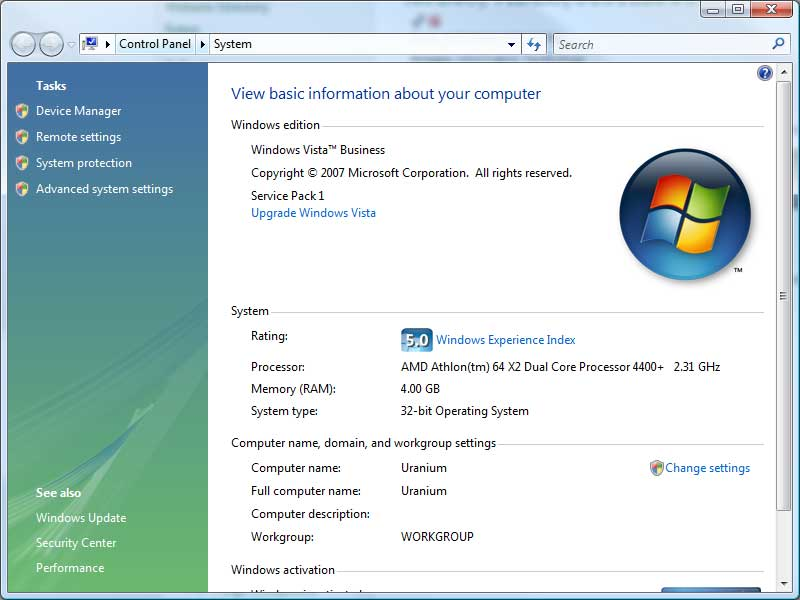
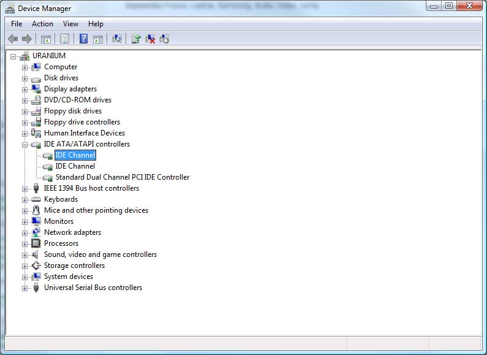
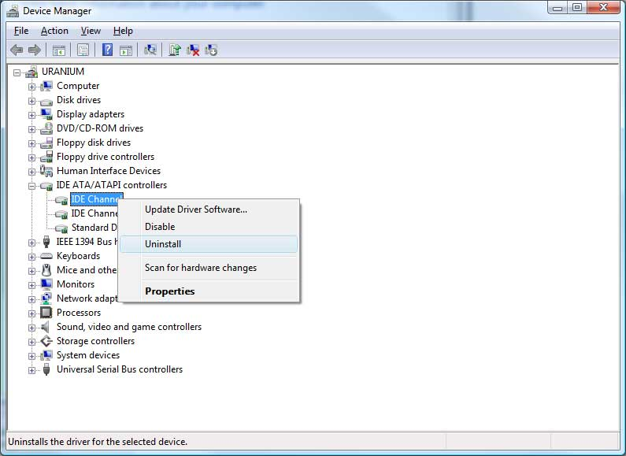

+++
date = '2009-05-09T12:00:00-07:00'
draft = false
title = 'Fixing Smooth Media Playback Issues on Laptops by Uninstalling IDE Channel'
aliases = ['/windows/audio-video-system-freezes-and-jumping/']
summary = "I was experiencing issues with smooth media playback on my laptop, but after researching the problem, I found that uninstalling the IDE channel solved the issue. By following a simple process in the device manager, I was able to resolve the problem and enjoy smoother video and audio playback."
genres = ['Software', 'Help desk']
tags = ['device-manager', 'audio', 'video', 'issue']
[params]
  author = 'Matt Goodrich'
+++

I have had a problem with my laptop a few times now where when I watch a video or try to listen to audio, the system will not play the media very smoothly.  After much research I found this is quite common in laptop disk drives as well as samsung disk drives.  The solution is quite simple.

The first thing to do is to Open up the device manager.  This can be done by right clicking "My Computer" then going to "Properties".  In Windows Vista there will be a link in the left column that says "Device Manager".  In XP you will click the "Hardware" tab, then "Device Manager". 

After you have the Device Manager open expand the "IDE ATA/ATAPI controllers" section.

In Vista your IDE Channel's will likely just shows as "IDE Channel", in XP it will likely show up as "Primary IDE Controller". Right click (usually the top option) the Primary IDE Controller and select "Uninstall".

Now simply restart the machine and everything should be back to normal