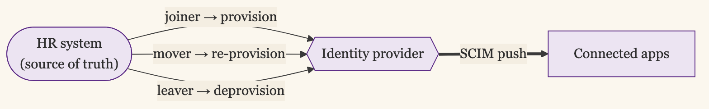

+++
date = '2026-06-16T12:00:00-07:00'
draft = false
title = 'Automate the Leaver Before the Joiner'
aliases = []
description = "Automated provisioning is the Scale-stage IAM investment, and the joiner-mover-leaver lifecycle is where it lives. The grant is the easy, visible half. The access that should have been removed and was not is the half that becomes a breach, which is why deprovisioning is the part to automate first, ahead of provisioning."
categories = ['Security', 'Engineering']
tags = ['Security', 'IAM', 'Identity', 'Provisioning', 'SCIM', 'Joiner-Mover-Leaver', 'Deprovisioning', 'IGA', 'CISO']
image = 'header.png'
[params]
  author = 'Matt Goodrich'
+++

When a new hire cannot log in on day one, you hear about it within the hour. They file a ticket, their manager escalates, someone fixes it fast. When a departed contractor's account still works three months after they left, you hear about it never, until the day it is used to get into something it should not. Both are failures of the same lifecycle. Only one of them complains.

That asymmetry is the whole reason provisioning programs get built backward. The joiner is loud and visible, so it gets the attention and the automation first. The leaver is silent, so it gets a manual checklist and a hope. The dangerous debt is on the silent side, which is why the order that actually reduces risk is to automate the leaver before the joiner.

## The Lifecycle Has Three Events

Identity has a lifecycle because people do: they join, they change roles, they leave. Each event should fire a change in access, and the [right-sized ladder](/posts/iam-for-the-company-you-have/) puts automating these events at the Scale stage, once manual handling has started to leak.

**Joiner.** Someone is hired and needs the access their role calls for, ready on day one. This is the event everyone designs for first, because the pain of getting it wrong is immediate and loud.

**Mover.** Someone changes role, team, or manager. They need new access for the new job, and they should lose the access from the old one. The second half almost never happens, which is why the mover is where access quietly piles up.

**Leaver.** Someone departs, and all of their access should end. This is the event with the real security weight, and the one most likely to be handled by a human running down a list.

The engine that drives all three is a source of truth for who works here and what their status is. That is your HR system, Workday or BambooHR or whatever holds the roster, because HR knows about the hire, the transfer, and the termination before IT does. Wiring the HRIS as the trigger is what turns these three events from tickets into automation.

## Provisioning vs Deprovisioning

These are the two halves of the lifecycle, and they are not equally hard or equally dangerous, so it is worth naming them apart.

**Provisioning** is granting access. It is visible by construction: if it fails, the person cannot do their job and says so. It tends toward correctness on its own, because the user is a built-in test that the grant worked.

**Deprovisioning** is removing access. It is invisible by construction: if it fails, nothing happens, until the leftover access is compromised. There is no user filing a ticket because their old account still works. The only thing that notices is an attacker, an auditor, or an incident.

The grant is the demo, the part that looks good when you show the lifecycle working. The removal is the job, the part that actually protects the company. An over-provisioned new hire is a problem you will catch and trim. An under-deprovisioned leaver is a standing credential outside your walls, and you will not catch it until something forces you to.

## Automate the Leaver First

Because the dangerous half is the silent one, the practical order is upside down from how programs usually get built. Wire deprovisioning before you perfect provisioning.

Mechanically, this runs through [SCIM](https://datatracker.ietf.org/doc/html/rfc7644), the protocol that pushes identity changes from your IdP into connected applications. When the HRIS marks someone terminated, the IdP disables their account, and SCIM propagates that deactivation downstream so the account is actually disabled or deleted in each app, rather than merely blocked at the front door. Without that downstream push, blocking the login leaves orphaned accounts behind in every system, still present, sometimes still holding local credentials or API tokens that do not care that the SSO login is off. If you want the governance layer without a commercial suite, [midPoint](https://evolveum.com/midpoint/) and [Apache Syncope](https://syncope.apache.org/) are open-source identity-governance platforms that run this lifecycle, provisioning, reconciliation, and deprovisioning, end to end.

Give the leaver path a measurable target. Access for the crown-jewel systems should end within minutes of the termination event, and everything else within a day. That is a number you can monitor and an auditor can test, and it is a far stronger control than a checklist whose completeness depends on whoever ran it that afternoon. The same discipline extends to the non-human side: when an owner leaves, [the service accounts they owned have to be reassigned, not orphaned](/posts/non-human-identities/), on the same termination event.

The grant side can stay partly manual while you build this, and that is the right trade. A slow joiner is an annoyed employee. A slow leaver is an exposure.

## Disabling the Account Doesn't Kill the Session

There is a gap in deprovisioning that a clean SCIM deactivation does not close: the account can be gone while a session is still running. I left a company once and kept working Slack access for weeks, because the session stayed alive long after my account should have been dead. Nothing reached out to Slack to end it, so it just kept going.

This is the difference between **account revocation** and **session revocation**. Disabling the IdP account stops the next login. It does nothing to the session already open, and the open session is the one that walked out the door with the person. A termination that blocks future logins while live sessions keep running has deferred the removal of access to whenever those sessions happen to expire, which for a long-lived session is weeks.

Closing the gap takes three things, because no single one covers it. Keep access-token lifetimes short, so a stranded token dies on its own in minutes rather than weeks. Use [back-channel logout](https://openid.net/specs/openid-connect-backchannel-1_0-final.html) where the app supports it, so the IdP can tell each app to end the session directly instead of hoping a browser redirect fires. And adopt the [Shared Signals Framework and CAEP](https://openid.net/specs/openid-caep-1_0-final.html), the now-final standard where the IdP pushes a `session-revoked` signal and participating apps drop the session in near-real-time. Microsoft's Continuous Access Evaluation is this running in production; the older SAML Single Logout aimed at the same target and never hit it reliably.

So write the leaver target in terms of sessions, not accounts. "Access ends within minutes" has to mean the session is dead within minutes, not that the next login is blocked while the current one keeps working.

## Birthright vs Requested

Once the leaver is handled, the joiner is worth automating well, and the model that works splits access in two.

**Birthright access** is what everyone in a role gets automatically, the moment they join: email, chat, the SSO portal, the baseline tools their department always needs. It is granted by rule from the HRIS attributes, with no ticket and no approval, because it is the same for everyone in that role and waiting on a human to approve the obvious is pure friction.

**Requested access** is everything beyond the baseline: the production database, the finance system, the admin console. It is asked for, approved by an owner, and granted for a reason, because it varies per person and carries enough weight to deserve a decision.

Getting this split right is what keeps automated provisioning from becoming automated over-provisioning. Make the birthright set too generous and you have handed everyone broad access by default, which is exactly the debt the lifecycle is supposed to prevent. Keep birthright tight and push everything sensitive to the requested path, and the automation grants the obvious instantly while the access that matters still gets a human yes. How you define those baseline roles is its own design problem, and a thoughtful role model is what the birthright half depends on.

## The Mover Is Where Access Piles Up

The joiner and leaver get all the attention, and the mover quietly does the most damage. Someone moves from support to engineering, gets the engineering access they now need, and keeps the support access they no longer do, because the system that grants on a role change rarely revokes on one. Do that across a few hundred people over a few years of internal mobility and you have a population of long-tenured employees who can reach almost everything, one old role at a time. This is the pattern auditors call privilege creep, and it is the strongest argument for tying access to current role attributes from the HRIS rather than to a pile of grants that only ever accumulates. When the role attribute changes, the birthright set for the old role should fall away as the new one is applied.

## You Cannot Automate the Judgment

The honest limit of all this is that automation handles the mechanical part of the lifecycle, not the judgment part. SCIM can grant and revoke on an event, and it can keep birthright access tied to a role. What it cannot do is decide whether a specific requested grant was the right call, or whether the access someone accumulated still matches what they actually do. That is a question of usage and intent, and it needs a different control: [access reviews driven by telemetry](/posts/telemetry-driven-access-reviews/) rather than by a calendar, so the review looks at what access is actually used instead of asking a manager to rubber-stamp a list.

There is also a coverage limit. SCIM only reaches apps that support it, and the same long tail that resists [single sign-on](/posts/one-front-door-one-place-to-revoke/) resists automated provisioning, for the same reasons. Those systems get a manual offboarding step with a checklist and a name attached, treated as the exception to monitor rather than the rule to trust. The goal is to shrink that manual set over time, not to pretend it does not exist.

## The Demo and the Job

A lifecycle that grants access cleanly on day one demos well. A lifecycle that removes access reliably on the last day is the one that keeps a departed account from becoming an incident. They are the same system, built in the wrong order by almost everyone, because the loud half asks for attention and the silent half is where the risk actually lives.

Wire the HRIS to the IdP, automate the leaver first and hold it to a number, split the joiner into birthright and requested, and make the mover subtract as well as add. The grant is the part people see. The removal is the part that matters.
