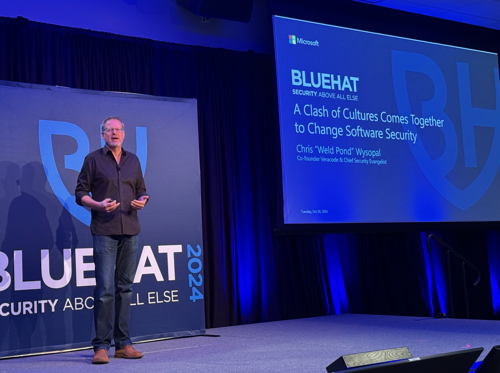

+++
date = '2024-10-29T21:00:00-07:00'
draft = false
title = 'BlueHat 2024: Security Challenges Are Universal (Just Ask Microsoft)'
aliases = ['/security/blue-hat-2024-day-1/']
summary = "After attending multiple security conferences this year, BlueHat 2024 stood out for all the right reasons: no vendors, no sales pitches, just pure technical content. The dual perspectives from security researchers and Microsoft's Security Response Center revealed that every security team faces the same fundamental challenges, just at different scales."
genres = ['Security', 'Conferences and Events' ]
tags = ['security conferences', 'BlueHat', 'CloudNativeSecurityCon', 'BSides Las Vegas', 'Black Hat', 'DEFCON', 'Microsoft Security Response Center', 'vulnerability disclosure', 'sdlc', 'authorization']
[params]
  author = 'Matt Goodrich'
+++

**2024 has been my year for security conferences:** [CloudNativeSecurityCon North America](https://events.linuxfoundation.org/cloudnativesecuritycon-north-america/), [BSides Las Vegas](https://bsideslv.org/), [Black Hat](https://www.blackhat.com/), [DEFCON 32](https://defcon.org/), and today - [BlueHat 2024](https://www.microsoft.com/bluehat/).

**BlueHat stood out immediately.** No vendors, no sales pitches, smaller scale, and completely free. **Just pure technical content.** Day one offered two tracks: Cloud & Identity Security, and OS & App Security. While I have experience across both domains, I gravitated toward the Cloud & Identity Security track.

**Chris Wysopal's (Weld Pond) keynote had me taking notes frantically.** I've sat through countless conference keynotes - some inspiring, others forgettable - but rarely do I walk away with specific action items. This time I did:

**Two ISO standards to investigate:**

- ISO 29147 (Information technology — Security techniques — Vulnerability disclosure)
- ISO 27034 (Information technology — Security techniques — Application security)

**What made this conference unique was the dual perspective approach.** Many talks featured both a security researcher/bug bounty hunter and someone from [Microsoft's Security Response Center](https://www.microsoft.com/en-us/msrc) who had to triage and fix the vulnerability. **This format delivered three key insights:**

**1. My Microsoft cloud knowledge has gaps.** I picked up several details about roles and entitlements within their ecosystem that I need to dig deeper into (time permitting - does it ever really permit?).

**2. Microsoft faces the same operational challenges we all do.** Seeing them deal with poorly written vulnerability reports, reproduction issues, and communication breakdowns was oddly comforting. **The scale is different, but the fundamental problems are identical.**

**3. Security challenges are universal.** Whether it's Microsoft or a startup launching their first product, the issues are the same: developers pushing secrets to source control, overly privileged tokens ending up in logged URLs, authorization complexity nightmares. **The response process is also universal: finding the right team, assessing architectural changes, identifying compensating controls, balancing risk and urgency.**

**BlueHat exceeded expectations.** Already planning to return next year.

