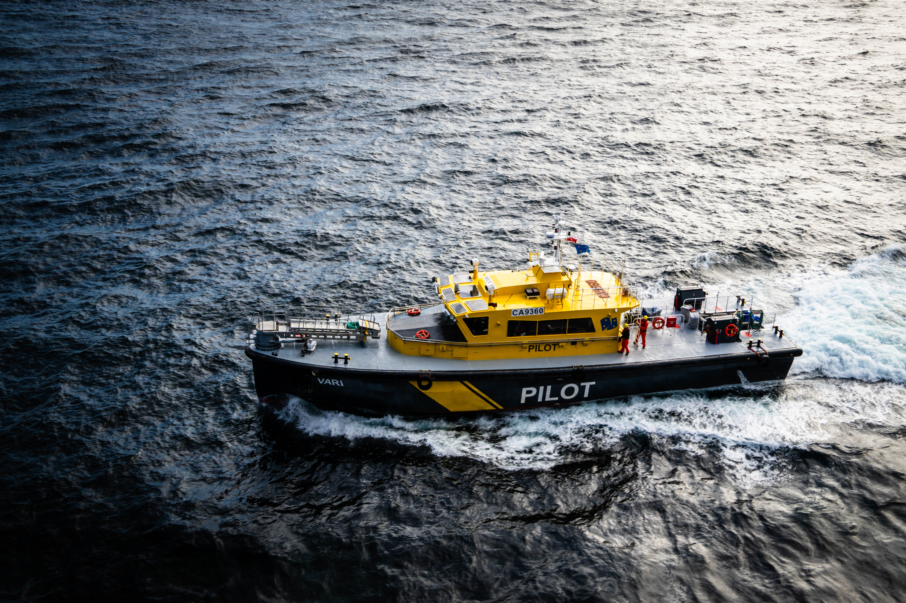
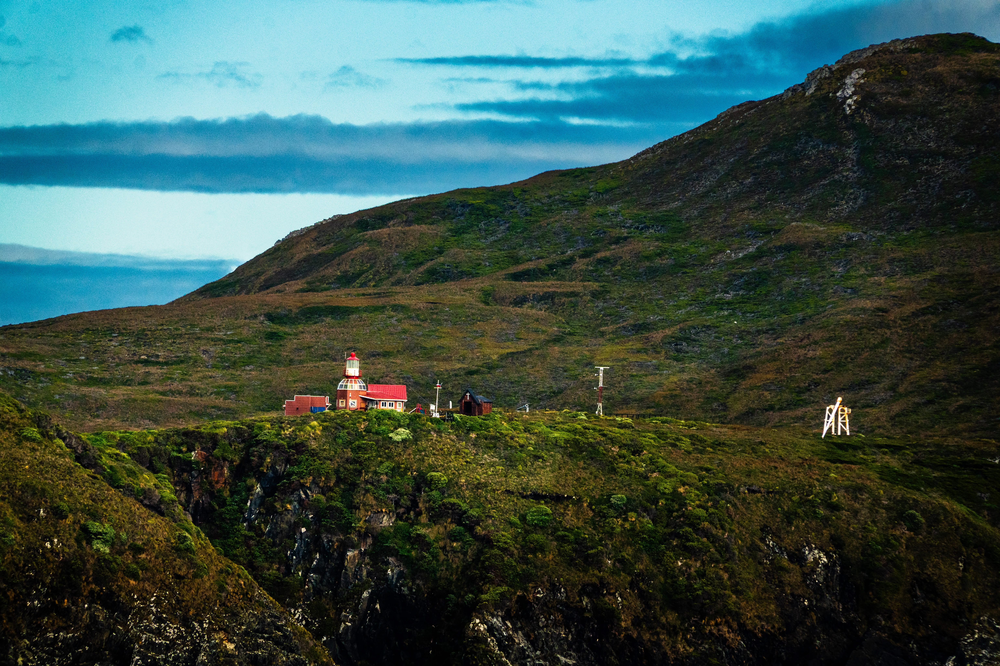
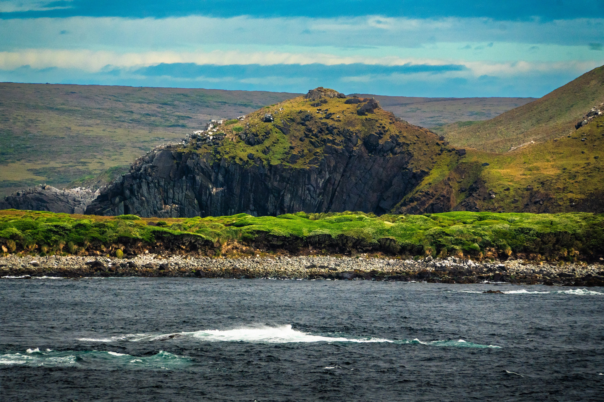
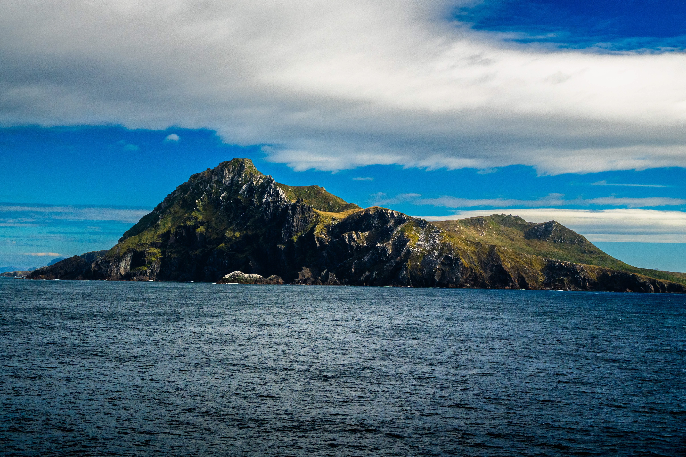
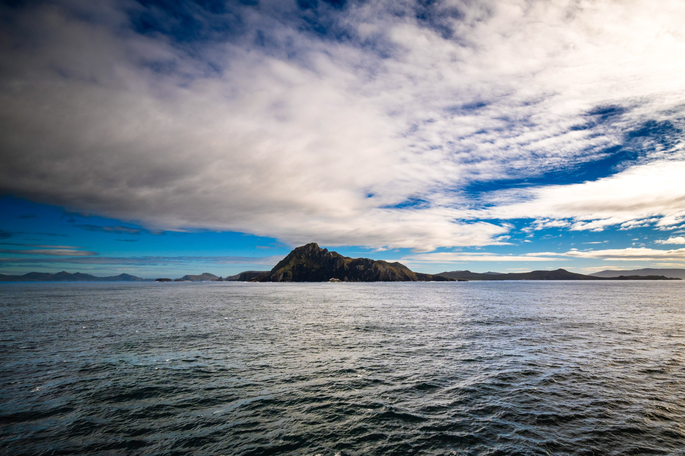
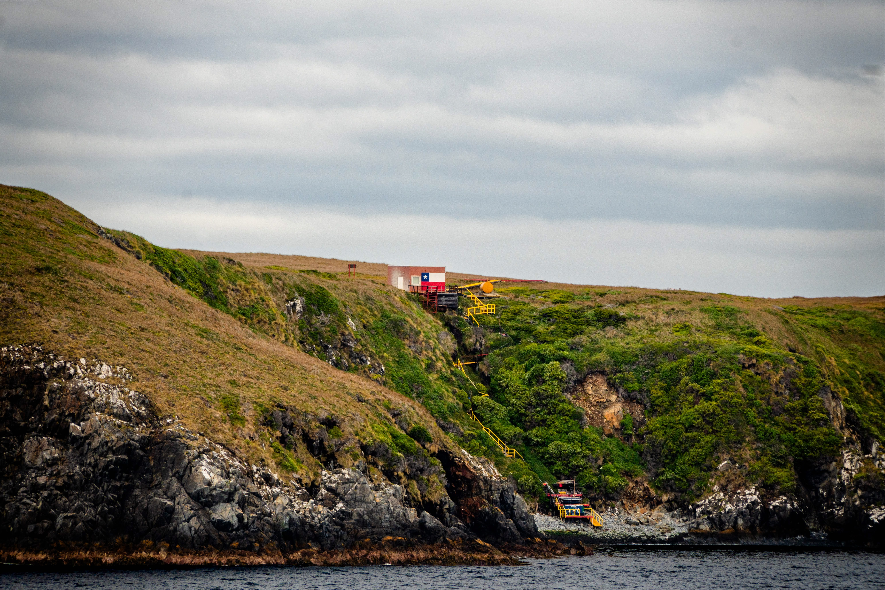

+++
date = '2026-02-20T12:00:00-03:00'
draft = false
title = 'Cape Horn'
description = "Rounding the southern tip of South America. Views of Cape Horn from the ship during a Patagonia cruise."
categories = ['Photography']
tags = ['chile', 'cape-horn', 'south-america', 'travel', 'photography', 'cruise', 'patagonia', 'ocean', 'landscape']
image = 'DSC02650-HDR-optimised.jpg'
[params]
  author = 'Matt Goodrich'
+++

Cape Horn — the southernmost headland of South America. One of those places you read about but never expect to actually see. We rounded the Horn mid-day, and the weather cooperated enough to get a clear look at the famous island.

<!--more-->

 
 
 
