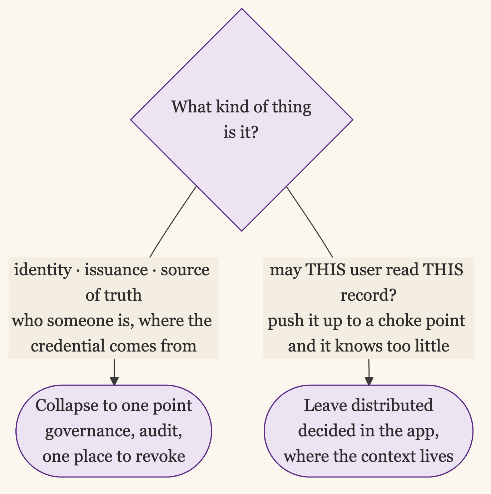

+++
date = '2026-07-01T00:01:00-07:00'
draft = false
title = 'Collapse the Surface, Then Defend It'
aliases = []
description = "Across secrets, logins, and access, the same move keeps working: collapse a scattered, ungoverned surface into one governed point, because you can rotate, audit, and revoke one thing but not a hundred. The catch is that the one point turns critical, so the discipline is to defend it and keep a way in for when it fails. It's the pattern under most of the rest."
categories = ['Security', 'Engineering', 'Leadership']
tags = ['Security', 'IAM', 'Identity', 'Architecture', 'Secrets Management', 'Access Management', 'Zero Trust', 'CISO']
image = 'header.png'
[params]
  author = 'Matt Goodrich'
+++

Put your secrets in one vault. Put your logins behind one identity provider. Run privileged access through one broker. Give your workloads one identity scheme instead of a hundred static keys. The advice arrives in different vocabularies from different corners of security, and underneath it is the same instruction every time: take a scattered, ungoverned surface and collapse it to a single point you can govern.

It took writing the same idea a dozen ways to notice it was one idea. Secrets, logins, access, machine identity: different sprawl, identical move. And the move has a second half that the first half pays for, which is the part most people skip.

## Why One Point Beats a Hundred

You can govern one thing. You cannot govern a hundred.

That is the whole reason the move works. A single point is something you can rotate, audit, reason about, and shut off. A hundred scattered points are none of those, because the cost of doing anything to all of them at once is too high to ever pay, so it never gets paid. The scattered version is less secure for a specific reason: the set is ungovernable. Each individual piece can be perfectly strong and the whole still rots, because nothing keeps the set honest.

Watch what consolidation does to the verbs. Offboarding across forty apps is a checklist you will get wrong; offboarding through one identity provider is a single switch. Rotating a credential that lives in twelve config files is a project nobody schedules; rotating it in one vault is a chore. Auditing who can reach production when access is scattered across consoles is a guess; auditing it through one broker's log is a query. What makes it secure is governability itself: a single point is the only kind of thing a person or a system can keep honest over time, and honest beats locally strong.

## The Same Move, Everywhere

Once you see it, the pattern is in nearly every good identity decision.

Secrets go in a vault. Instead of API keys in env files, in chat, in a dozen config repos, they live in [one place that scopes and rotates them](/posts/1password-service-account-claude-secrets/), and the win is one place to rotate and one place to revoke.

Logins go behind an IdP. [Single sign-on](/posts/one-front-door-one-place-to-revoke/) collapses apps-times-employees into one account per person, and the payoff is one place to cut someone off.

Privileged access goes through a broker. [An authorization broker](/posts/authorization-broker-models/) makes "no standing access" real by routing every elevation through one choke point that issues short-lived, scoped, audited grants.

Workload identity goes to one issuer. Instead of static keys copied onto every host, [a single identity scheme](/posts/workload-identity-that-crosses-boundaries/) hands out short-lived identities by attestation, so there is no scattered secret left to leak.

Ownership goes to one system of record. Service accounts and their owners live in [the same HR system that runs joiner-mover-leaver](/posts/non-human-identities/), so the lifecycle that governs people governs machines too.

Visibility goes to one graph. [Telemetry pulled into a single picture](/posts/telemetry-driven-access-reviews/) of who can reach what, and who actually uses it, is the only way to right-size access you cannot eyeball.

Even the emergency goes to one place. [Break-glass](/posts/break-glass-without-the-backdoor/) is a single controlled path in, not a scattering of backdoors each team cut for itself.

Seven different problems, one move: collapse the sprawl onto a point you can govern.

## The Shadow: One Point to Break

The move has a cost, and pretending it does not is how consolidation goes wrong. The single governed point you just built is also a single point of failure and the highest-value target you own.

Concentrate every login behind one identity provider, and a compromise of that provider is a compromise of everything behind it. Route all access through one broker, and the broker going down is everyone locked out, which is exactly the [problem break-glass exists for](/posts/break-glass-without-the-backdoor/). Put every secret in one vault, and that vault becomes the thing an attacker most wants to reach. The sprawl you collapsed was ungovernable, and it was also resilient in the dumb way a hundred separate things are: no single failure took all of them at once. You traded that accidental resilience for governability. The trade is right, and it is still a trade.

This is not hypothetical. When an identity provider has an outage, the whole company stops, because every app now sits behind the one thing that is down. When an IdP admin account gets phished, the attacker does not get one login, they get the ability to mint access to all of them. The blast radius is exactly as large as the consolidation that created it, which is why the answer is never to scatter the surface again. It is to make the one point genuinely hard to compromise and genuinely quick to recover.

## So You Defend the One Point

Here is the second half, the part the first half pays for. Because you collapsed everything onto one point, you can finally afford to defend that point the way it deserves, which you could never do for a hundred.

You cannot put hardware-backed, [phishing-resistant authentication](/posts/mfa-that-survives-phishing/) and [device trust](/posts/trust-the-user-then-the-machine/) on forty separate app logins. You can put it on the one IdP they all sit behind, and then they all have it. You cannot monitor and harden a hundred scattered access paths. You can instrument the one broker every elevation flows through. You cannot threat-model every config file holding a secret. You can threat-model the one vault. Consolidation is what makes strong defense affordable: the budget that was hopeless spread across a hundred mediocre points is more than enough for one excellent one.

And because the one point can fail, you build the exception on purpose. The [break-glass path](/posts/break-glass-without-the-backdoor/) for when the broker or the IdP is down gets designed with the same care as the thing it backs up. Collapse the surface, defend the point you created, and keep one disciplined way in for when it breaks. That is the full move, and most people stop after the first part.

## Treat the One Point Like Tier Zero

The moment a point becomes the thing everything else depends on, it becomes tier zero: the layer that has to be standing and trustworthy before anything else can be. It earns a higher standard than the systems behind it. Their worst day is an outage; its worst day is the whole company at once. So you protect it, keep it up, and rehearse getting it back with more care than anything it fronts.

**Protect it like the target it is.** It is the highest-value thing an attacker can reach, so the controls go past the ones you put on the apps behind it. Administration of the IdP, the vault, or the broker runs through its own hardened path: a separate set of admin identities that nothing else uses, hardware-bound phishing-resistant keys on those identities, no standing admin rights, and management access only from a known device, ideally a dedicated privileged workstation rather than the laptop that also reads email. The audit log of the point itself goes somewhere its own admins cannot edit, because the first thing a compromised admin does is rewrite history. The [break-glass path](/posts/break-glass-without-the-backdoor/) for the admin plane gets the same care as break-glass for everything else.

**Engineer it to stay up, because everything waits on it.** Once every login sits behind one IdP, nothing behind it can be more available than the IdP itself. When the IdP is down, every app behind it is down too, however reliable each one is on its own. So it earns a higher availability target than the services it fronts, redundant and multi-region in ways a single app never needs to be. The trap is the circular dependency. The thing everyone authenticates through cannot itself depend on something that requires authenticating through it, or a partial outage turns into a deadlock nobody can log in to fix. Map what the one point depends on and cut every loop that routes back through itself. Where you can, let the systems behind it ride a cached token or an offline check for a few minutes instead of hard-failing the instant the point blinks.

**Rehearse getting it back, on a clock.** A slow restore is its own blast radius: every minute the point is down, everything behind it is down too. The recovery path cannot depend on the thing being recovered. The vault's unseal keys do not live in the vault. The IdP's recovery admins do not sign in through the IdP. The broker's config restores without the broker already running. Custody of those recovery secrets is split across people and kept offline, and the restore gets rehearsed on a schedule, because a runbook nobody has run is a guess. Put a number on it: know the recovery-time objective for the one point, and test whether you hit it before an incident asks the question for you.

## What You Don't Collapse

The pattern has a limit, and missing it is its own failure mode. You centralize the control plane. You do not centralize everything.

What collapses well is identity, issuance, and the source of truth: who someone is, where their credential comes from, what the system of record says they own. What stays distributed is enforcement of the specific decision. Whether this user may read this particular record is a question only the application can answer, because [the object lives inside the application and the gateway in front of it cannot see whose it is](/posts/the-gateway-cant-see-the-object/). Push that decision up to a central choke point and you get either a bottleneck that knows too little or a god-object that knows too much.

Every generation re-learns this the hard way. The enterprise service bus that started as one place to route messages and became the one place all the business logic went to die. The API gateway asked to make authorization decisions it has no way to make, because the data the decision turns on lives three services away. Centralizing the plumbing works. Centralizing the judgment produces a single component that the whole system waits on and no team fully understands. Collapse the control plane, and leave the decisions where the context is.

This is the same boundary the [abstraction-at-the-boundary argument](/posts/mcp-at-the-boundary/) draws from the other side. Centralize where centralizing buys you governance, audit, and a single place to revoke. Keep distributed what has to be decided in context. The skill is knowing that identity and access want to be one place, and authorization of the individual object wants to be many. Collapse the first. Leave the second where it is.

## One Point, Defended

Underneath the vaults and brokers and identity providers is one move: take what is scattered and ungovernable, collapse it onto a point you can rotate, audit, and revoke, then spend the savings defending that point hard and planning for the day it fails.

A hundred doors you cannot watch protect no one. One door you guard well, with a known way through for when the lock jams, is worth more than all of them. Collapse the surface. Then defend it.
