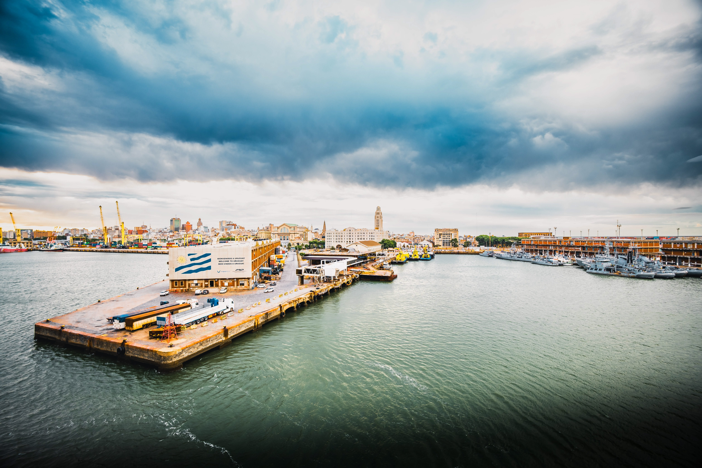
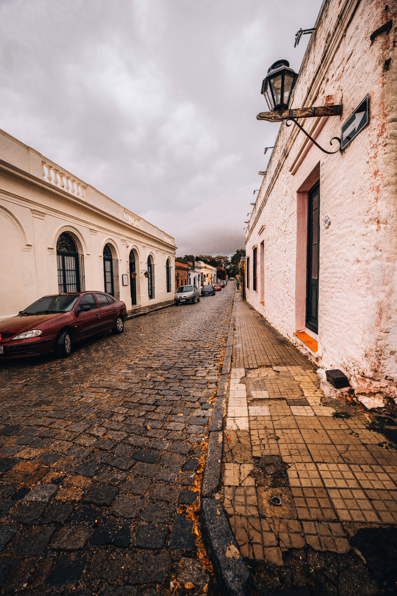
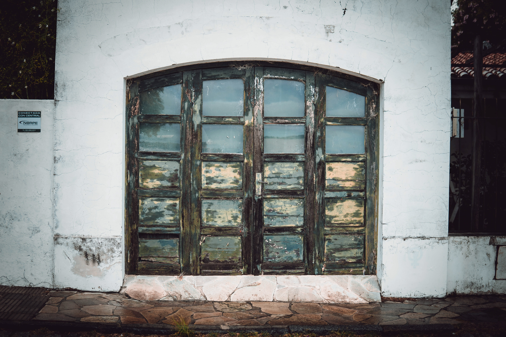
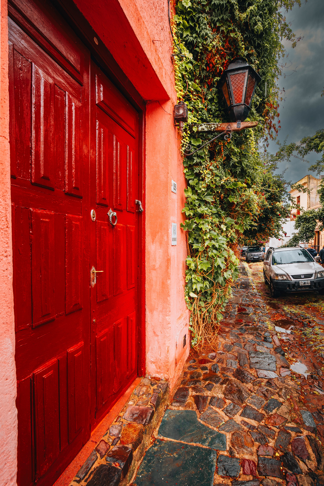
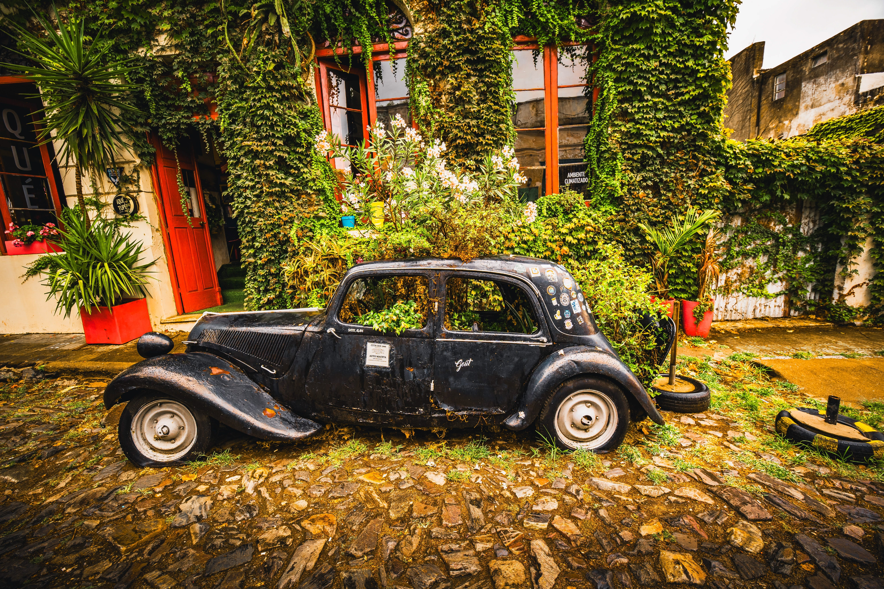
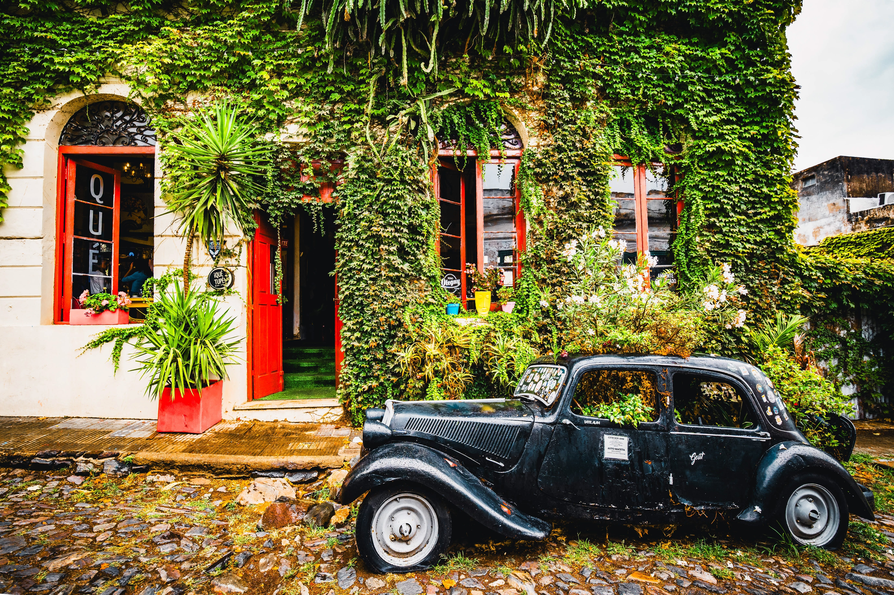
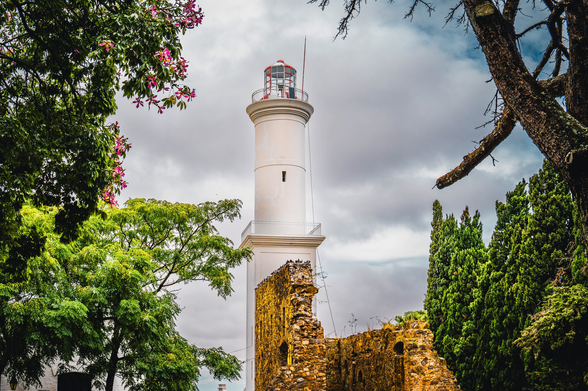
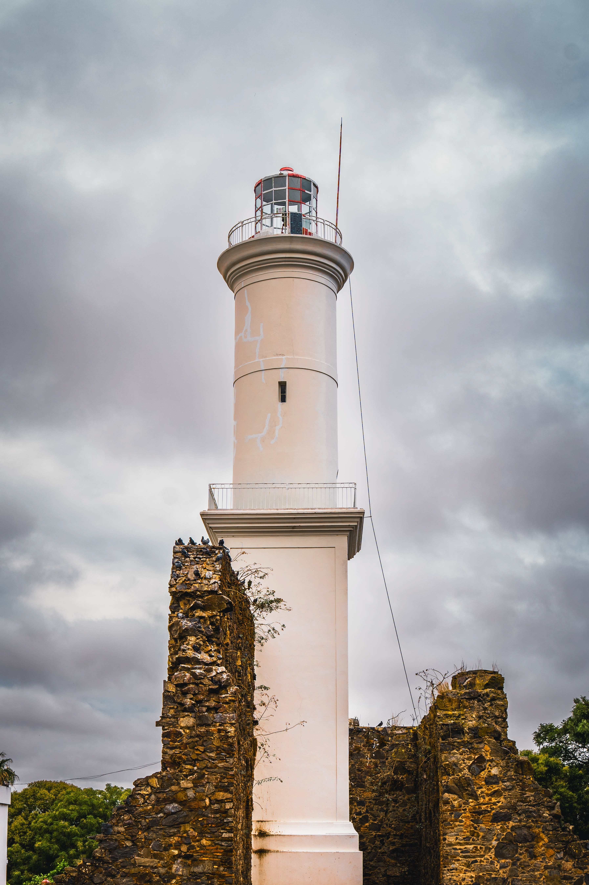
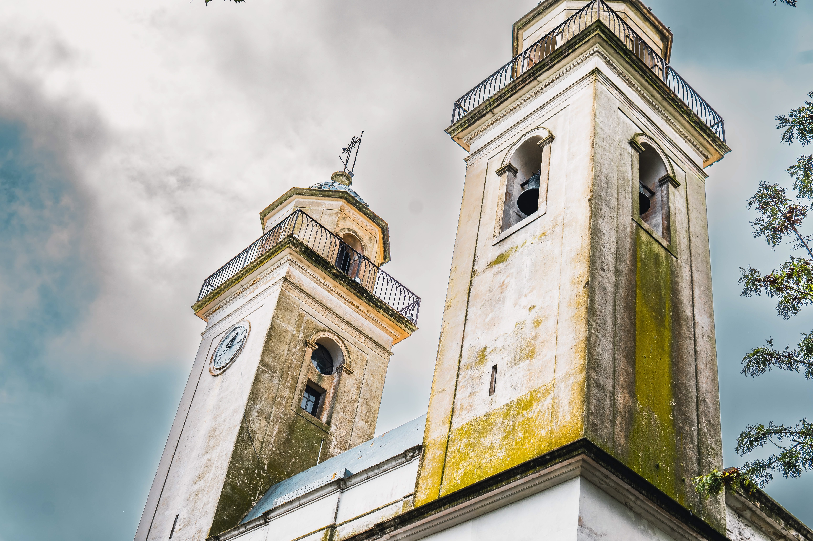

+++
date = '2026-02-15T10:00:00-03:00'
draft = false
title = 'Colonia del Sacramento'
description = "A day trip from Montevideo to one of Uruguay's oldest towns. Cobblestone streets, colonial architecture, and Rio de la Plata views during a Patagonia cruise stop."
categories = ['Photography']
tags = ['uruguay', 'colonia-del-sacramento', 'montevideo', 'south-america', 'travel', 'photography', 'cruise', 'patagonia', 'colonial', 'architecture']
image = 'DSC01981-optimised.jpg'
[params]
  author = 'Matt Goodrich'
+++

Our Patagonia cruise docked in Montevideo, and we took a tour out to Colonia del Sacramento—one of the oldest towns in Uruguay. The historic quarter is a UNESCO World Heritage Site, and it's easy to see why. Cobblestone streets, colonial-era buildings, and views across the Rio de la Plata toward Buenos Aires.

<!--more-->

 
 
 
 
 
