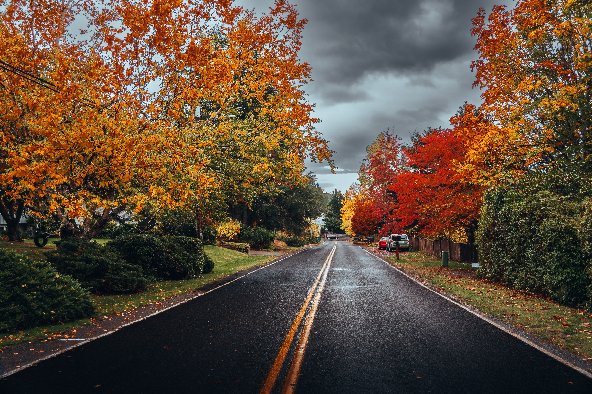
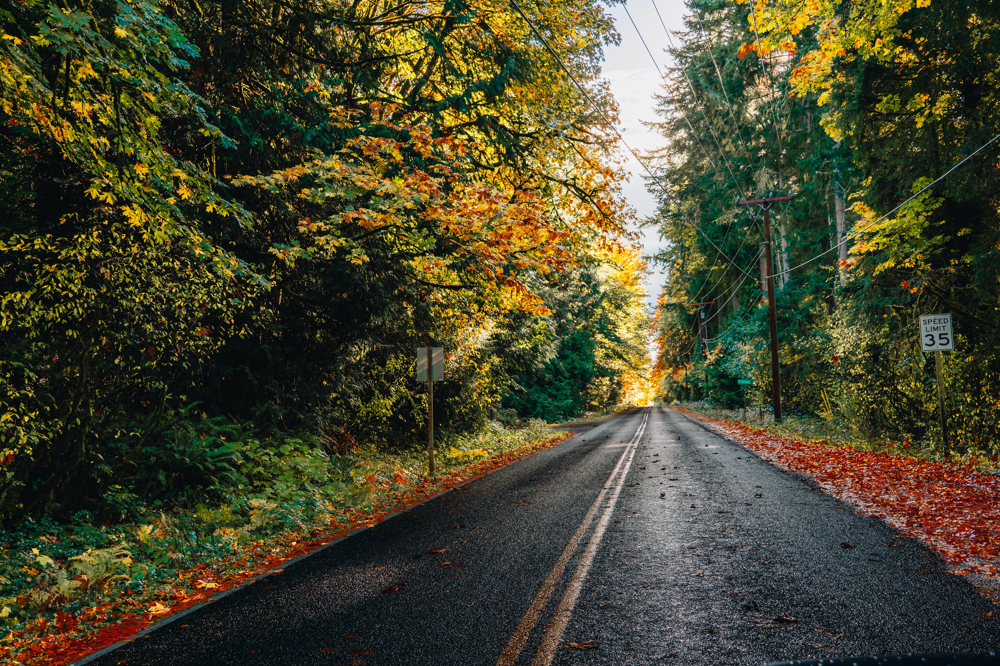
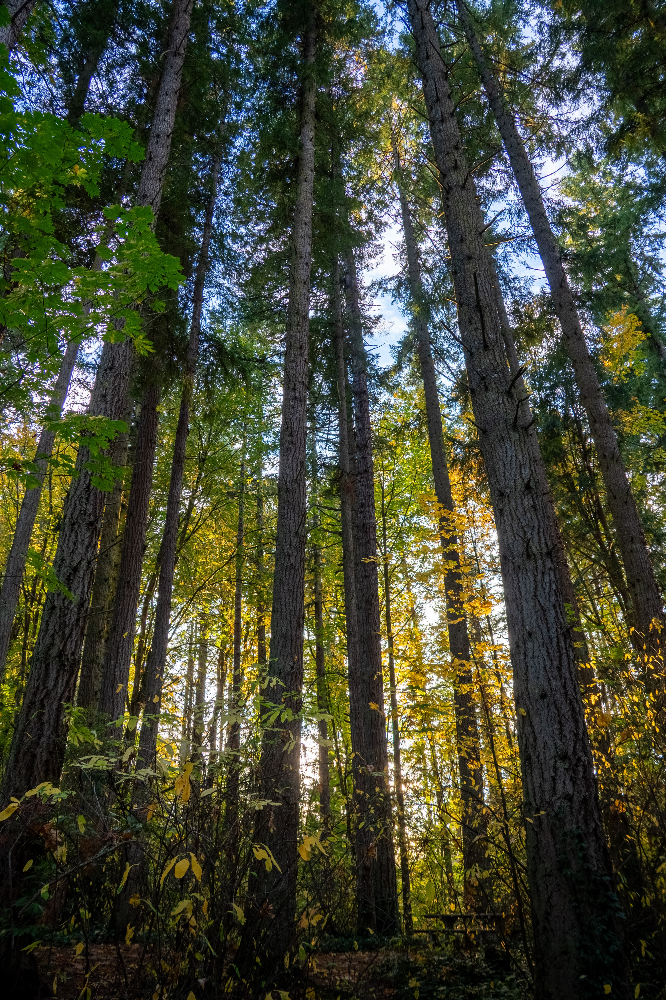

+++
date = '2025-11-14T21:30:36-08:00'
draft = false
title = 'Fall in the Pacific Northwest - 2025'
description = "Fall in the PNW hits different. I really noticed the colors this year, thanks to getting out more after our move to Bainbridge Island."
categories = ['Photography']
tags = ['pnw', 'pacific-northwest', 'fall', 'autumn', 'photography', 'washington-state', 'bainbridge-island']
image = 'DSC00208-HDR-optimised.jpg'
[params]
  author = 'Matt Goodrich'
+++

Fall in the PNW hits different. I just wish it lasted longer before the rain washes it all away.

I really noticed the fall colors this year—more than I have in a long time. It's pulled me back into photography, something I'd let slip over the past few years. Part of it is getting out of the house more: the move to Bainbridge Island, school drop-offs, shuttling kids to activities. Those small routines have me catching the light at different times of day, seeing the maples and alders turn in real time instead of just noticing one day that they're already gone.

The PNW gives you maybe three weeks of peak color if you're lucky. Then a storm rolls through and the trees are bare. But this year I've been ready with the camera, trying to actually capture it before it disappears.

<!--more-->

 
