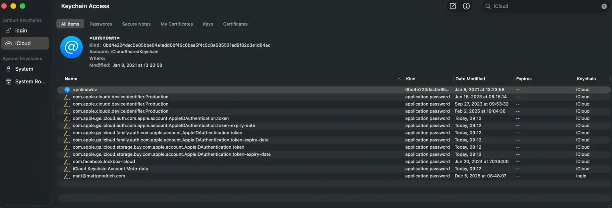

+++
date = '2025-12-29T07:52:06-08:00'
draft = false
title = 'Fixing iCloud Drive Sync Issues on macOS: A Troubleshooting Guide'
description = "If you've ever had files stuck uploading to iCloud Drive for days with no apparent progress, you're not alone. Here's how I diagnosed and resolved a stubborn sync issue that turned out to be caused by a corrupted keychain item."
categories = ['Software', 'Help desk']
tags = ['icloud', 'macos', 'troubleshooting', 'keychain', 'cloud-sync', 'issue']
image = 'iCloud-Post-Image.png'
[params]
  author = 'Matt Goodrich'
+++

If you've ever had files stuck uploading to iCloud Drive for days with no apparent progress, you're not alone. Here's how I diagnosed and resolved a stubborn sync issue that turned out to be caused by a corrupted keychain item.

## The Symptoms

- Files waiting to upload for several days with no progress
- iCloud Drive appeared connected and functional in System Settings
- No obvious errors in Finder

## Diagnosing the Problem

### Step 1: Check iCloud Drive Sync Status

macOS includes a built-in tool called `brctl` for inspecting iCloud Drive status. I had always wanted more visibility into what iCloud Drive Sync was doing, but I never decided to dig in until now.

```bash
brctl status
```

My output showed:

```
client:idle server:full-sync|fetched-recents|fetched-favorites|ever-full-sync sync:oob-sync-ack last-sync:2025-12-11 21:59:23
```

The key red flag: **`client:idle`** — the sync client thought it had nothing to do, despite files waiting to upload. The `last-sync` timestamp was also stale.

### Step 2: Check System Logs for Errors

To dig deeper, I searched the system logs for iCloud-related errors:

```bash
log show --predicate 'subsystem == "com.apple.clouddocs"' --last 1h | grep -i "error\|fail\|stuck"
```

This revealed a flood of errors:

- **Code 257** — Permission denied errors
```
2025-12-12 08:55:16.347986-0800  bird: (iCloudDriveCore) [com.apple.clouddocs:default personal] [ERROR] -[BRCXPCClient _setupAppLibrary:error:]_block_invoke: (passed to caller) error: Error Domain=NSCocoaErrorDomain Code=257 UserInfo={NSDescription=<private>}
```
- **Code 4099** — XPC connection failures across multiple system services
```
2025-12-12 08:55:19.985754-0800  brctl: (CloudDocs) [com.apple.clouddocs:default personal] [ERROR] Can't find services for <private>: Error Domain=NSCocoaErrorDomain Code=4099 UserInfo={NSDebugDescription=<private>, NSUnderlyingError=0xac3125050 {Error Domain=NSCocoaErrorDomain Code=4099 UserInfo={NSDebugDescription=<private>}}}
```
- **"failed to get ubiquityIdentityToken"** — The core iCloud identity couldn't be retrieved
```
2025-12-12 08:58:09.707758-0800  syspolicyd: (CloudDocs) [com.apple.clouddocs:default personal] [ERROR] error while getting ubiquityIdentityToken: Error Domain=NSCocoaErrorDomain Code=4099 UserInfo={NSDebugDescription=<private>}
```
- **""UNREACHABLE: failed to get container URL":"**
```
2025-12-12 08:55:16.430805-0800  brctl: (CloudDocs) [com.apple.clouddocs:default personal] [CRIT] UNREACHABLE: failed to get container URL for <private>
```
- **Code 256** — File/collection gathering errors
```
2025-12-12 08:55:26.574065-0800  brctl: (CloudDocs) [com.apple.clouddocs:default personal] [ERROR] <private> - collection <private> did encounter error Error Domain=NSCocoaErrorDomain Code=256 while gathering
```

These errors indicated a fundamental authentication problem, not just a sync glitch.

## The Root Cause

The error patterns pointed to corrupted keychain items. I opened **Keychain Access** and searched for "iCloud":

```
Applications → Utilities → Keychain Access
```



I found several suspicious items:

1. **An `<unknown>` entry from 2021** — A corrupted, nameless keychain item that was 4 years old
2. **Multiple stale device identifiers** — Three `com.apple.cloudd.deviceIdentifier.Production` entries spanning several years (should only have one current one)

The ancient `<unknown>` item was likely causing the Code 4099 XPC failures — the system was trying to read it and getting garbage data.

## The Fix

### Step 1: Remove Corrupted Keychain Items

In Keychain Access, with the iCloud keychain selected:

1. Delete the **`<unknown>`** item (corrupted entry with no proper name)
2. Delete any **older/duplicate** `deviceIdentifier.Production` entries, keeping only the most recent one

### Step 2: Restart iCloud Services

After cleaning up the keychain, restart the iCloud sync daemons:

```bash
killall bird
killall cloudd
```

These services restart automatically.

### Step 3: Verify the Fix

Check the sync status again:

```bash
brctl status
```

The output changed to:

```
client:needs-sync server:full-sync|fetched-recents|fetched-favorites|ever-full-sync sync:needs-sync-up|needs-sync-down|oob-sync-ack
```

The critical changes:
- **`client:needs-sync`** instead of `idle` — Now recognizes pending work
- **`needs-sync-up|needs-sync-down`** — Actively aware of items to upload and download

You can monitor real-time sync activity with:

```bash
brctl monitor
```

## Why This Happens

Corrupted keychain items often result from:

- **Migration from older Macs** — Keychain items carry over but can become orphaned
- **macOS upgrades** — Sometimes leave behind incompatible entries
- **Restoring from backup** — Can bring stale credentials
- **iCloud account changes** — Old tokens may not get cleaned up properly

## Other Things to Try

If cleaning up keychain items doesn't resolve your issue, here are additional steps in order of invasiveness:

### Reset CloudDocs Cache

```bash
killall bird
rm -rf ~/Library/Application\ Support/CloudDocs
rm -rf ~/Library/Caches/CloudKit
```

This forces a fresh sync state (your files re-download from iCloud).

### Check for MDM/Corporate Restrictions

If this is a work Mac, corporate policies might restrict iCloud:

```bash
profiles list -verbose | grep -i icloud
```

### Sign Out and Back Into iCloud

As a last resort, sign out completely:

1. System Settings → Apple ID → Sign Out
2. Choose to keep a copy of data locally when prompted
3. Restart
4. Sign back in

This rebuilds the entire iCloud identity from scratch.

## Useful Commands Reference

| Command | Purpose |
|---------|---------|
| `brctl status` | Check overall iCloud Drive sync status |
| `brctl monitor` | Watch real-time sync activity |
| `brctl log --wait --shorten` | View detailed sync logs |
| `killall bird` | Restart the iCloud sync daemon |
| `killall cloudd` | Restart the iCloud services daemon |

## Conclusion

iCloud sync issues are often frustrating because macOS provides little visible feedback when things go wrong. The `brctl` tool and system logs are invaluable for diagnosing these problems. In my case, a single corrupted keychain item from years ago was silently breaking the entire sync system — a reminder that cleaning up old credentials periodically can prevent mysterious issues down the road.
