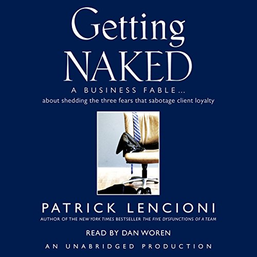

+++
date = '2024-01-02T12:00:00-07:00'
draft = false
title = 'The Power of Vulnerability: Lessons from Getting Naked'
aliases = ['/consulting/getting-naked/']
summary = "Six years after receiving 'Getting Naked' during Slalom onboarding, I finally read it. The three fears that sabotage client loyalty - embarrassment, feeling inferior, losing business - hit hard. Being vulnerable is terrifying, but it's also where growth happens."
genres = ['Book Review', 'Career Development']
tags = ['vulnerability', 'consulting', 'getting naked', 'business', 'communication', 'leadership']
[params]
  author = 'Matt Goodrich'
+++

**Being vulnerable is hard.**

**February 2018: Slalom onboarding.** Every new consultant received a copy of *Getting Naked: A Business Fable About Shedding the Three Fears that Sabotage Client Loyalty*. **At the time, I was foolishly proud of not reading books.** Six years later, I finally cracked it open.

**The three fears that sabotage client loyalty:**
1. **Fear of being embarrassed**
2. **Fear of feeling inferior**  
3. **Fear of losing the business**

**These hit me like a freight train.** Multiple consulting roles, same fears every time. 

**Day one out of university:** Crash course on IAM and PingFederate (thanks, Cody Cook). **Day two:** Fly to client site as "the expert." **All three fears consumed me** - first week, first month, first year, and throughout six years of consulting.

**Four years out of consulting, I realize these fears aren't consulting-specific.** They show up constantly in my current role. **Large group meetings where nobody speaks up, then private messages flood in afterward.** Speaking up in those moments - especially early career or with new teams - requires vulnerability. 

**I try to gauge knowledge levels before diving into topics, but I make assumptions.** When someone asks about something I thought was basic, I get humbled. **But those questions require vulnerability from the asker, and they help everyone in the room.**

**My consulting mindset for years: "I'm paid to be here because clients can't do what I do."** I tied my value to knowledge and capabilities. **Saying "I don't know" felt dangerous - it required vulnerability I wasn't ready for.**

**If I'd been more vulnerable earlier, I would have learned more about myself, clients, and my expertise.** There is growth in vulnerability.

**Looking back, I have countless stories (good and bad) that illustrate these lessons.** One thing is certain: **I wish I'd read this book when I first received it.** I would have understood real customer problems better, helped confused colleagues more effectively, and worked fewer hundred-hour weeks.