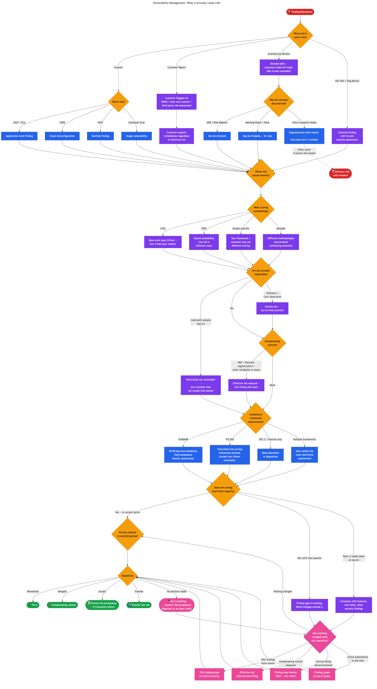

+++
date = '2026-02-25T00:00:00-08:00'
draft = false
title = "The Hardest Part of Security Isn't Finding the Problems"
description = "Security teams are great at finding problems. The real challenge is navigating the messy space between finding and fixing — where competing priorities, misaligned incentives, and invisible debt quietly compound."
categories = ['Security', 'Engineering']
tags = ['security', 'cybersecurity', 'vulnerability-management', 'engineering', 'product-management', 'technical-debt', 'compliance', 'risk-management', 'strategy', 'organizational-design']
image = 'header.png'
[params]
  author = 'Matt Goodrich'
+++

A CISO once said to me, "Vulnerability management is easy. It's find, then fix."

I understand the appeal of that framing. It's clean, linear, and fits on a slide. It's also so reductive that it obscures everything that makes vulnerability management — and security work more broadly — genuinely hard. Between "find" and "fix" is an enormous, messy space where almost all the real work happens, and where most security programs quietly struggle.

Having worked in engineering, product management, and security — all at Alteryx — I've had the unusual vantage point of sitting in three very different chairs around the same table. That experience has shaped how I think about why security work is so uniquely difficult to drive to completion, and why the solutions the industry keeps reaching for aren't solving the real problem.

## Security Teams Create Work. Everyone Else Has to Do It.

Here's the fundamental structural issue: security teams are primarily work creators, not work doers. We identify risk, translate it into findings, and drop them into the backlogs of teams that didn't ask for them. Those teams — engineering, IT, infrastructure, identity, even HR and legal — all have day jobs. They have planned work. They have commitments they're measured against.

I've seen this cycle from every angle. Engineering asks product for time to address technical debt — debt that was likely created trying to meet deadlines product set for the next release or user conference. Product can't just give up ten or fifteen percent of their engineering team's capacity to work on things that aren't delivering value to customers. Then security arrives with a pile of libraries that need upgrades, container image vulnerabilities, static analysis findings, open source license compliance issues, misconfigurations, and more — often with SLAs we have to meet contractually. Those same engineering teams are simultaneously designing and planning the next set of features, engaging the security team in architecture reviews where we might suggest a change that requires more work to do things the most secure way possible.

Inevitably someone asks: "Can we do it the less secure way to start, and come back later to do it the more secure way?"

Just like that, more debt was created.

This isn't just a security versus engineering versus product problem. It's a dynamic that exists between security and every team in the organization that is actually accountable for fixing or implementing something security has determined is necessary to reduce risk. All of those teams have their own priorities, their own planned work, and while some might have an easier time slotting things in — perhaps less direct customer pressure — it still can't be planned for well. Security work is, by nature, unplanned work for everyone except the security team.

The incentive structures make this worse. Product is measured on delivery velocity. Engineering is measured on shipping commitments. Security is measured on risk reduction. Nobody's OKRs are aligned, so the system produces exactly the outcome you'd predict: features ship, security work ages in the backlog, and everyone is frustrated.

## It's Not Just "Find Then Fix"

Back to that CISO's framing. "Find then fix" assumes that once you've found something, the path to resolution is straightforward. In practice, every finding kicks off a cascade of questions that vary based on context no single tool or team holds.

What did you actually find? Is the CVSS score representative of your actual exposure, or is it a generic base severity that doesn't account for your environment? Some organizations use CVSS. Others use EPSS to evaluate exploit probability, which can tell a very different story. Your customers may use yet another methodology entirely. Different scoring systems applied to the same vulnerability can produce conflicting severity ratings, and you may need to satisfy all of them.

Is the vulnerability even exploitable in your environment? Code path analysis might prove that you're not reachable — but that technical conclusion doesn't always close the loop. Customers who detect that you ship a library with a known CVE, whether through their own scanning, SBOM analysis, or third-party risk assessment, may require remediation regardless. From their perspective, it's a finding on their vendor risk assessment that needs to be closed. Telling them "we've done code path analysis and determined we're not affected" is a nuanced technical explanation that their GRC team may not have the capacity or inclination to evaluate. That finding with near-zero technical risk just became a sales and retention problem, and it lands on the security team's desk just the same.

Are there compensating controls in place? A WAF rule, network segmentation, or other mitigation might reduce the effective risk substantially — but the finding remains open, the SLA clock keeps ticking, and the ticket doesn't reflect any of that context.

What does your compliance framework require? FedRAMP prescribes hard remediation timelines — 30 days for highs, 90 days for moderates — and doesn't much care about your team's other priorities. PCI DSS at least allows organizations to build their own prescribed framework for risk scoring and re-evaluation. SOC 2 gives more discretion. And if you're subject to multiple frameworks, you need to satisfy the most restrictive requirement across all of them.

Does the owning team have capacity to fix it? Are they mid-sprint on a product launch? Is this competing with other security findings, technical debt, and feature work? Where does this rank relative to everything else they've been asked to do?

Every one of those questions changes the priority, the urgency, the disposition, and who needs to be involved. What the CISO described as "find then fix" is actually a complex decision tree with dozens of branches, and the inputs to those decisions come from different systems, different teams, and different frameworks — some of which contradict each other. It looks something like this:

That's not "find then fix." That's navigating a dynamic, context-dependent decision space where the right answer depends on information scattered across tools, teams, and institutional knowledge — and where the answer might be different tomorrow than it is today.

## Will We Ever Hit a Security Debt Ceiling?

All of this compounding complexity raises a question I keep coming back to: will we ever hit a security debt ceiling? Will product ever give the time needed for cleanup activities? Will engineering have to push remediation as part of their broader agenda to fix things, hoping it helps them go faster in the future?

I'd argue the ceiling exists, but it doesn't look like a clean technical breaking point. It manifests as incidents, failed audits, lost customer deals, or compliance violations. The ceiling is invisible until you hit it, which is exactly why it's so hard to get investment in paying it down. You can't point to a dashboard and say "we're at 87% of our security debt capacity." You just wake up one day to a breach, a failed pen test, or a prospect's security questionnaire that you can't answer honestly.

## Two Species of Security Debt

This problem is harder than most people realize because not all security debt is the same. There are really two fundamentally different species, and the industry only has tooling for one of them.

**Discovered debt** is the stuff your tools find — SAST findings, vulnerable libraries, misconfigurations, CVEs. This is the category the entire security tooling industry is built around. It's noisy, it's voluminous, but at least it's visible. It exists in a system somewhere. You can track it, measure it, report on it, and argue about SLAs for it. The magnitude of these findings varies — a tricky static analysis finding is a very different beast than a missing encryption implementation — but they're all at least known quantities.

**Decided debt** is something else entirely. These are the conscious choices made in design discussions, architecture reviews, sprint planning meetings, and hallway conversations to do things the less secure way now with the intent to come back later. Skipping end-to-end encryption to hit a launch date is not the same category of problem as a static analysis finding that's extra tricky to remediate. It's an architectural decision with long-term security implications — and no scanner will ever find it.

And here's the thing about decided debt — where does it live? Discovered debt has a home in Jira tickets linked to scanner output, tracked on dashboards, measured against SLAs. Decided debt is organizational dark matter. It might be in an Architecture Decision Record, if the team writes them. It might be in meeting notes, if someone took them. It might be in a Slack thread that has long since scrolled into oblivion. More often than not, it exists exclusively in the heads of the four people who were in the room for that architecture review, and when two of them leave the company, it's gone. The decision was made, the debt was created, and the institutional memory evaporated. The risk didn't go away — it just became invisible.

Does the debt exist if nobody else knows about it?

Your discovered debt might be two thousand findings across your tooling. Your decided debt could be an order of magnitude larger and you'd have no way of knowing, because nobody has been systematically tracking the security trade-offs made across every design review, every sprint planning session, every "let's just ship it" conversation across every team for years. Some of those decisions were probably fine. Some of them are time bombs that nobody remembers planting.

## The Tooling Isn't Solving the Real Problem

The industry's answer to all of this has been more and better detection. Shift left to find vulnerabilities sooner. Deploy posture management tools to catch what slips through. Every technology domain now has its own flavor — cloud security posture management, application security posture management, data security posture management. Each one adds another firehose of findings.

But here's the thing: the moment we find something with one of these tools, we're already in reactive territory. And even the proactive tools have limits. You can't create a blanket policy to block all public S3 bucket access if one of your five hundred buckets legitimately needs to be public. The complexity of real environments means that governance at a high level will always have exceptions, and exceptions require human judgment and context.

Meanwhile, customer visibility into your security posture is expanding. As more organizations adopt SBOMs as part of their procurement processes, libraries that would have been invisible to customers a few years ago are now transparently enumerable. The surface area for customer-driven findings — situations where you may not be technically vulnerable but your customer's risk process has flagged it — is growing rapidly. This is yet another input to the risk equation that no security scanner captures.

Finding issues was never the bottleneck. Getting them fixed was. And no amount of shifting left or adding another posture management dashboard changes the structural problem of security teams creating work for teams that have other priorities.

## A Static Queue in a Dynamic System

Here's what I think is the most underappreciated part of this whole problem: we manage security work as a static queue in a dynamic system.

When we find an issue, we file a ticket. That ticket carries a severity, a priority, a description, and an SLA. Then it sits in a backlog. We track it through metrics and dashboards until it's either resolved or past due. That's the entire lifecycle for most security findings.

But the world around that ticket doesn't stand still. Something that was critical when it was created — the number one priority for remediation — could genuinely be the seventh most important thing two weeks later. New vulnerabilities get discovered that are more severe. Compensating controls get deployed upstream that reduce the effective risk. The service it's in gets refactored or scheduled for decommission. The threat landscape shifts. A customer flags a different finding as a blocker for a deal renewal. None of that is reflected in the ticket.

The work, once it's in the backlog, is static. It should be dynamic.

Determining the current, real priority of a finding requires context that no single tool holds. Your CSPM knows about cloud misconfigurations. Your SAST tool knows about code vulnerabilities. Your SCA tool knows about library risk. Your CMDB knows what services exist and who owns them. Your threat intel feed knows what's being actively exploited. Your business stakeholders know which services matter most to revenue. Your sales team knows which customer just flagged a library in your SBOM. The complete picture is fragmented across systems, tools, and people — which makes evaluating all of the work in the system hard, and continuously re-evaluating all of it practically impossible.

This brings us full circle to the CISO's "find then fix." We've gotten exceptionally good at the finding. What we haven't built is the organizational capability — or the tooling — to navigate the decision space between finding and fixing at any kind of scale. Every finding enters a complex web of technical context, business context, compliance requirements, customer expectations, and capacity constraints. And once it's in the backlog, it fossilizes there, disconnected from a world that keeps moving around it.

The question isn't how do we find more issues. It's how do we make better decisions about the ones we've already found — and keep making better decisions as conditions change. In the next post, I'll explore what solving that problem actually looks like, and whether the answer might require a fundamentally different kind of tooling than what the industry has been building.
