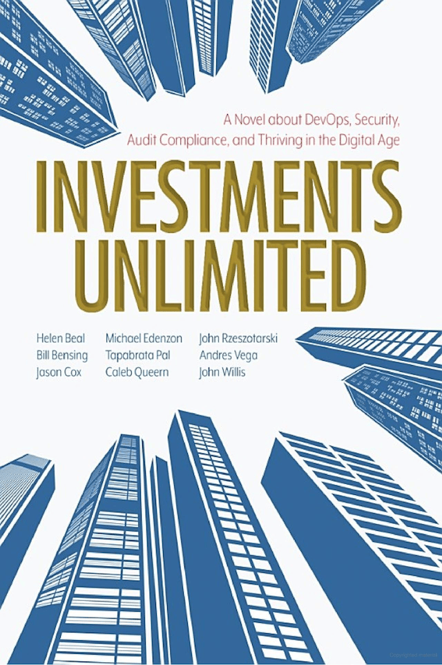

+++
date = '2022-11-07T12:00:00-07:00'
draft = false
title = 'Lessons from Investments Unlimited: The Importance of Automation and Transparency in Security'
aliases = ['/security/investments-unlimited/']
description = "Investments Unlimited hit close to home - a financial firm forced to fix their security posture discovers the same issues I face daily: outdated asset inventories, useless CABs, inconsistent pipelines. The message is clear: automate everything, don't block velocity, and dig beneath surface assumptions."
categories = ['Book Review', 'Security']
tags = ['security', 'devsecops', 'investments unlimited', 'automation', 'transparency']
[params]
  author = 'Matt Goodrich'
+++

Flying to Amsterdam for Alteryx Inspire EMEA, I needed a good audiobook. Travel means deep-dive listening time, and Cory Stoker's recommendation proved perfect timing. I finished it before takeoff, spent the flight reflecting, then... life happened. Finally getting around to writing about it.

The premise sounded like "The Phoenix Project for security" - and honestly, it hit much closer to home than Gene Kim's work. This book tackled issues I'm dealing with right now at Alteryx.

**The story:** A financial institution gets hammered by auditors for defect-ridden products and loose security practices. **Leadership assumes everything works fine** - processes are followed, developers do the right things, systems are tracked.

**Reality after investigation:** Asset inventories are outdated, CABs are universally seen as useless (even by CAB members), build systems are inconsistent across teams, pipeline policies vary wildly. **The usual enterprise software development nightmare.**

**Why this resonated: I'm living this at Alteryx.** Working on ISO27001 and SOC 2 Type II compliance across multiple product teams means I'm constantly reaching out to development teams, understanding their processes, identifying gaps, and figuring out how to fix them together.

**Coming from the engineering and product side myself, I'm acutely aware that security can be viewed as overhead.** Heavy processes, approval gates, and "security topic of the week" conversations aren't popular with teams focused on shipping features and minimizing technical debt.

**The book's message was crystal clear: automate everything possible, don't let security block velocity, and always dig beneath surface assumptions.** No silver bullets, just practical wisdom.

**Highly recommended for fellow Product Security, AppSec, and DevSecOps practitioners.** This one will hit close to home.