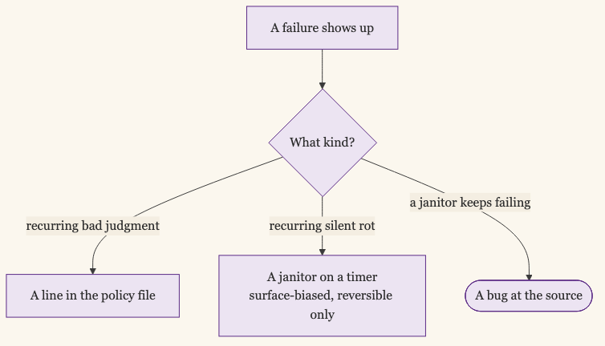

+++
date = '2026-07-21T05:11:49-07:00'
draft = false
title = 'Letting the Loop Merge: The Janitors That Keep It Honest'
aliases = []
description = "My last post ended where I finally trusted two agent runtimes to push, merge, and deploy on their own. This one is what that trust became: a written policy that lets the loop merge to main unreviewed, and a set of small reconcilers that each exist because one specific thing rotted once. The bottleneck moved again, from cutting the work to keeping an autonomous queue from rotting in the dark."
categories = ['Artificial Intelligence', 'Engineering', 'Tools']
tags = ['AI', 'Claude Code', 'Codex', 'Agents', 'Plane', 'Automation', 'Workflow', 'Self-Hosting']
image = 'header.png'
[params]
  author = 'Matt Goodrich'
+++

**Every recurring failure in the loop ends up as one of two things: a line in a policy file, or a small script that cleans up after it.** I ended [the last post](/posts/two-systems-for-handing-work-to-agents/) by calling the loop a solved problem, with the only hard part left being the cut: deciding what goes into an issue. That was true when I wrote it, and it still is. What it skipped is the part that got interesting: what it took to let the agents merge and deploy without me in the loop.

The trust I described was a feeling. Watching the runners be right, over and over, is what produced it. Since then I have done the unromantic thing and turned that feeling into architecture. There is now a written policy for how far the agents act alone, and a set of small janitors that keep an autonomous queue from rotting while I am not looking. The support cast in that last post was three scripts in a table. It is closer to eight now, and it is the part of the system I actually think about.

## The Trust Became a Policy

The rule is one sentence. Autonomous by default. Escalate only when risky.

It lives in a single file that every runner prompt and skill points at, so it cannot drift into five slightly different versions. For any task that is not flagged risky, the agent runs the whole loop and closes the issue itself: implement, run tests, review its own diff, commit, push the branch, open a PR, merge to main, post the receipt. No human in the middle. The gate for that auto-merge is narrow and mechanical: tests pass, the self-review came back approved, the diff is inside a safe size, and the spec is clear and self-consistent. Miss any one of those and it stops.


The important half of the policy is the definition of risky, because that is the only thing that reaches me. Ten categories: production effects, destructive or irreversible actions, security-sensitive code, changes to the engine's own guardrails, data migrations, ambiguous specs, a real verification gap, an explicit human-action label, cross-repo blast radius, and cost above a threshold. Everything else the loop owns end to end.

The line I come back to most is the one about doubt. "I wasn't sure" is not a reason to escalate. "This could do real, hard-to-undo harm and I can't verify it's safe" is. Uncertainty is the runner's normal working condition. If mild uncertainty routed to me, I would be the queue again, which is exactly the cost I built the thing to remove.

## The Engine Stops at Merge

The sharpest change since the last post is a distinction I did not have language for then. Merging to main is autonomous. Deployment is not the engine's concern at all.

I learned this by getting it wrong. The original pipeline treated a deploy as the third issue in every feature, and it gated the merge on the deploy being safe. The result was that every finished piece of product work stacked up waiting for a deploy decision. My "Agent Needs Input" column turned into a merge queue, 32 items deep, all of them done and none of them landed. The gate was protecting me from a risk that did not live where I had put the gate.

So I moved it. The engine's job now ends at merge on green: push, PR, gates, merge, receipt, regardless of what the repo's deploy config says. Whether that merge then reaches production is owned by something else. On my Unraid box that is Watchtower, and the real deploy toggle is a per-container label I flip by hand, outside the loop. The runners still read the deploy mode and write it into the record, but they never hold a merge for it and never deploy anything themselves.

The same move retired an old boundary I used to paste into issue bodies out of caution: no pushing to the remote, no opening PRs. That rule had once stranded 17 finished items that were not allowed to do the last step. It is gone now. Pushing and opening a PR are normal steps. Boundaries go into an issue only for the genuinely risky categories, not as a reflex.

## A Janitor for Every Rot

Once the loop merges on its own, a new failure mode appears: things rot quietly. An autonomous queue does not tell you when it is stuck, because the whole point is that nobody is watching it. So the support cast grew, and every member of it exists because one specific thing rotted once.

A PR sat behind main long enough that main moved and the PR could no longer merge cleanly. Now a cron proactively merges main into open PR heads before a review even picks them up.

The base-drift reconciler is representative of the set. It only touches a PR whose base is `main` and that GitHub already reports as drifted, and when it merges `main` forward it pushes the result without ever forcing:

```bash
# only main-based PRs that GitHub already flags as drifted
should_reconcile() {
  local base="$1" mss="$2"
  [ "$base" = "main" ] || return 1
  [ "$mss" = "DIRTY" ] || [ "$mss" = "CONFLICTING" ]
}

# in a throwaway worktree cut from origin/main, merge main forward:
reconcile_pr_from_base "$wt" "$base" "$head"
case $? in
  0) git -C "$wt" push origin "HEAD:refs/heads/$head" ;;  # clean: push, never --force
  1) log "PR-$number -> CONFLICT, leave it for a human" ;;
  *) log "PR-$number -> FATAL" ;;
esac
```

A mergeable PR got orphaned. Its issue closed through a path that forgot to file the review task, so the PR just sat there, green and ignored, for days. That actually happened to a Tend PR that was ready to merge for the better part of a week before I hand-filed the missing issue. Now a standing scan catches any PR in that state and files the review for it.

A PR stayed open too long with nobody noticing. Now an escalator posts one follow-up note on its review issue after a few hours, so age becomes visible instead of silent.

An agent marked an issue Done that never actually integrated. The runner returned success on exit code 0 without the work landing on main. There is a gate at the Done transition that prevents new ones now, and a backstop cron that reopens any that slip through, checking that the receipt's PR really is merged.

An issue looked like it needed a decision when its work had already shipped through a sibling PR on main. A surfacer flags those as candidates to cancel, so the "needs input" pile stays honest about what is genuinely open.

And underneath all of it, a digest posts everything that actually needs me to a Discord channel, so a human follow-up cannot get lost between the cracks of two runtimes and a tracker.

None of these are clever. Each is a couple hundred lines of shell on a timer, and I added every one of them after something rotted while I was not looking. The [full set is in the repo](https://github.com/mgoodric/plane-client/tree/main/docs/open-engine/janitors), redacted the same way the autonomy policy is.

## The Bias Toward Surfacing

Here is the argument against everything above. A mesh of janitors is standing surface area. Each one is code I now maintain, and a bad janitor is worse than none, because it corrupts the thing it was supposed to protect while I am not watching. An auto-canceller that is wrong deletes real work. A reconciler that force-pushes to fix drift can destroy a branch.

That risk shaped how the janitors are allowed to act. The one that spots superseded issues does not cancel them; it surfaces them for me to cancel, because a wrong cancel loses work and a wrong surface costs a glance. The one that catches false-Dones does not silently redo the work; it reopens the issue to review. The base-drift reconciler merges forward but never force-pushes. The bias is to make rot visible and leave the irreversible call to a person.

Some failures do not deserve a janitor at all. They deserve a sentence. One stale test that had been red on main for weeks was parking every unrelated issue that happened to run the same suite, each agent correctly refusing to proceed with a failing test, each one wrong about which failure mattered. The fix was a ruling: a test already failing on main, that your change does not touch, is not your blocker. Establish the baseline, prove you added no new failures, name the old one in your receipt, move on. Pass-count parity with main is the bar.

There is a third answer I did not expect. Sometimes a janitor is quietly telling you the source is broken. My base-drift reconciler started failing on PRs it should have fixed, two in a row, because the drift had a different cause: the branches had been cut from a stale checkout and carried a dozen already-merged commits, so there was nothing clean to rebase. The fix is one line in the runner: cut new branches from the current main, not from whatever the working tree happens to point at. When a janitor keeps failing the same way, the bug is usually upstream of the janitor.

## Policy Line or Janitor

That is the shape of the work now. A failure shows up. I decide whether it wants a policy line or a janitor. A recurring class of bad judgment becomes a line in the policy file. A recurring class of silent rot becomes a small script on a timer. Most things are one or the other, and knowing which is most of the skill. Once in a while it is neither, and a janitor that keeps failing is pointing at a bug I should have fixed at the source.



The last post said the bottleneck had moved from running the loop to cutting the work. It moved again. I do not spend much time on the cut anymore either; the breakdown discipline is mostly muscle memory now. What I spend time on is the second-order question. The loop merges on its own. The mesh keeps it honest. My job is deciding which of the failures I see this week is worth a new janitor, and which is really a missing sentence in a policy I already have.

I used to maintain a queue. Then I decided what went in it. Now I decide how the thing that empties it is allowed to fail. Each of those is a stranger problem than the one before it.
