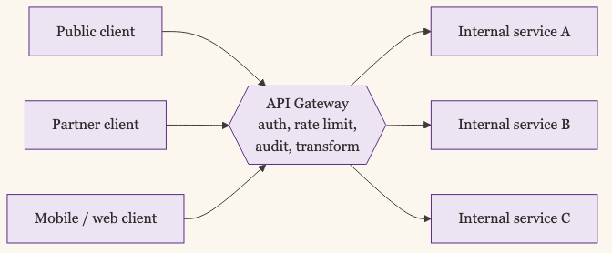
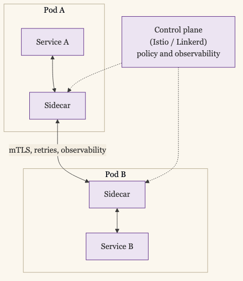
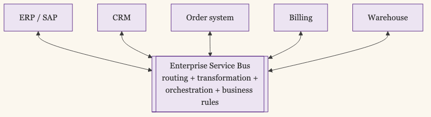
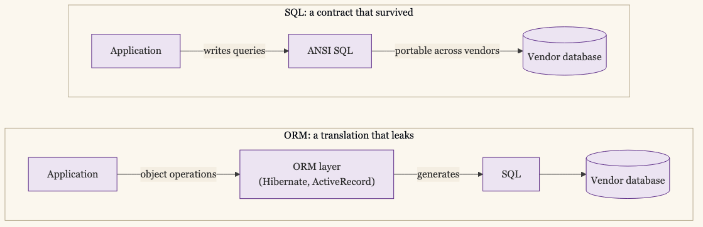
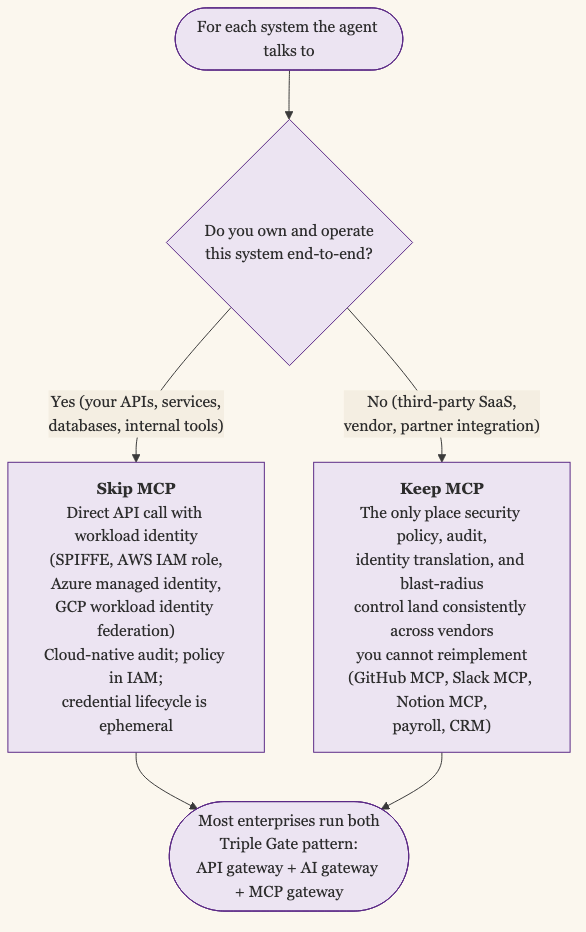

+++
date = '2026-05-29T12:00:00-07:00'
draft = false
title = 'MCP Earns Its Keep at the Boundary'
aliases = []
description = "Articles claiming that MCP is going away in favor of direct API calls with workload identity are half right. For systems you own, the direct call is often cleaner. For third-party services, MCP is the only surface where security policy, audit, and blast-radius control can live."
categories = ['Security', 'AI', 'Engineering']
tags = ['Security', 'AI', 'AI Agents', 'MCP', 'A2A', 'Architecture', 'IAM', 'API Gateway', 'Abstraction', 'CISO', 'Workload Identity']
image = 'header.png'
[params]
  author = 'Matt Goodrich'
+++

**The articles arguing that MCP is going away in favor of direct API calls with workload identity are half right. The half that's right is the half that has been right about every abstraction layer for the last twenty years: inside the trust boundary you control end-to-end, the abstraction usually costs more than it returns.**

The half that's wrong is the half that treats MCP like it lives only on one side of that boundary. Almost nothing important in security architecture lives entirely inside the boundary you own. The interesting work happens at the boundary you cannot reimplement, against the systems whose APIs you do not control, where the only enforcement surface you get is the one your tooling brings with it. That has been true since SOAP. It is true now. It is the reason the published "MCP is going away" case is narrower than the framing suggests.

I argued in [MCP Authorization When the User Isn't Clicking](/posts/mcp-headless-authorization/) that direct API with workload identity was the right answer for single-cloud blast radius and a small set of well-known APIs. This post is the question that immediately follows. What about everything else? Where does MCP earn its keep, and where does it become the 2026 version of an ESB?

## We've Been Here Before, Four Times

The argument that an abstraction layer between your application and a backend system is overhead waiting to be removed has been made about every abstraction layer the industry has built since the mid-2000s. The lineage is worth walking, because the conditions under which each one was right are the same conditions that apply to MCP today.

**API gateways (Apigee, Kong, AWS API Gateway, 2004 onwards).** The original case was centralization of authentication, rate limiting, request transformation, audit logging, and security policy at the perimeter of an API surface. Two decades in, the practitioner consensus is settled: gateways earn their keep on north-south traffic, where you do not own both ends. They become cruft on east-west traffic, where they become the place uncoordinated teams hide coupling. Sam Newman's [*Building Microservices*](https://samnewman.io/books/building_microservices_2nd_edition/) states it directly: "Putting smarts in the pipes is problematic — logic is preferred in the clients… a shared proxy layer can slow down the process of making and deploying changes." Gateways won at the perimeter. They lost in the mesh.

**Service mesh (Istio, Linkerd, Consul Connect, 2017 onwards).** The original case was zero-trust service-to-service mTLS, observability, traffic shaping, and policy as infrastructure, pulled out of every service into a sidecar. By 2024, sidecar mesh adoption was in decline, dropping from 50% to 42% in one year, and Istio Ambient Mode shipped specifically to move the abstraction out of the pod. The mesh community did not kill the abstraction. They killed the implementation cost. The lesson is precise: a control-plane abstraction is worth its operational tax only when cross-cutting concerns genuinely need to be centralized. Where they don't, the abstraction's cost shows up first and most painfully.

**Enterprise Service Bus (TIBCO, IBM Integration Bus, Mulesoft, 2005-2012).** The original case was a central smart bus doing routing, transformation, orchestration, and policy for any-to-any integration. The published retrospective from [Fowler and Lewis's 2014 *Microservices* article](https://martinfowler.com/articles/microservices.html) is the foundational repudiation: "we have seen so many botched implementations of service orientation, from the tendency to hide complexity away in ESBs, to failed multi-year initiatives that cost millions and deliver no value, to centralised governance models that actively inhibit change." The counter-pattern they coined, *smart endpoints and dumb pipes*, was a direct inversion. Jim Webber's [*Guerrilla SOA*](https://www.infoq.com/presentations/webber-guerilla-soa/) (InfoQ, 2007) catalogs the failure modes: coupling, the bus accumulating business rules, vendor lock-in, single point of failure. The ESB became the canonical example of an abstraction that absorbed too much domain knowledge to remain neutral.

**ORMs and ANSI SQL (1986 onwards, still settling).** ANSI SQL survived forty years on a clear deal: the lowest-common-denominator surface is acceptable enough, and the vendor independence payoff is real enough, that most shops accept it and dip into vendor extensions only where the payoff demands it. ORMs ran the same deal and got punished for it. Joel Spolsky's [*Law of Leaky Abstractions*](https://www.joelonsoftware.com/2002/11/11/the-law-of-leaky-abstractions/) (2002) and Ted Neward's [*The Vietnam of Computer Science*](https://blog.codinghorror.com/object-relational-mapping-is-the-vietnam-of-computer-science/) (2004) named the failure mode. ORMs win on stable schemas and CRUD-shaped workloads. They lose on high-performance OLTP and analytical queries. The teams running Stack Overflow, Shopify, and GitHub all dropped to raw SQL on the hot paths. SQL survived because it was a contract. ORMs struggled because they were a translation.

The cross-cutting principle each of these lineages independently arrived at is the one that matters for MCP: **an abstraction earns its keep at the boundaries the team does not own, and becomes theater at the boundaries the team does own.** Gateways at the edge, not in the mesh. Mesh sidecars where centralization is paid for, not where it isn't. The bus is the wrong place for business rules. The ORM is the wrong tool over your own schema.

MCP is the next entry in this catalog, and the test is the same.

## What MCP Actually Buys You as a Security Layer

Strip out the protocol details and what MCP gives a security architect is four specific capabilities, each of which has a clean analog in the lineage above.

**A single audit surface for tool calls.** Every call into the MCP server can be logged in a uniform shape: caller identity, tool name, arguments, response status, timing. Without MCP, the audit trail is scattered across whatever logs the underlying API happens to write, in whatever format that API happens to write them. With MCP, the audit shape is yours.

**A central policy enforcement point.** Authorization decisions, rate limiting, output filtering, redaction of PII or secrets in responses, and structural denial of dangerous tool combinations all live in one place. Without MCP, each of those concerns has to be re-implemented at every API the agent can call, or punted to the API itself, which means relying on the vendor's interpretation.

**Identity translation.** The agent's identity primitive (workload identity, OAuth client credentials, IdP-issued JWT) is translated by the MCP layer into whatever credential the downstream API expects. The agent never holds the downstream credential. Without MCP, the agent has to hold every credential for every API, with all the credential-rotation and blast-radius cost that implies.

**Blast-radius reduction.** A compromised agent that holds an MCP token can take only the actions that token's scope allows. A compromised agent that holds raw API credentials for ten downstream systems can take any action those credentials permit. The MCP layer is the choke point where scope is enforced.

Those four capabilities are the case for MCP. They are also the case for an API gateway in 2008, a service mesh in 2018, an ESB in 2005, and ANSI SQL in 1986. They are real. They are not new.

## What the "Skip MCP" Argument Actually Says

The published case for skipping MCP, as of mid-2026, is more specific than the framing "MCP is going away." It comes from three distinguishable positions.

**[Perplexity's defection](https://awesomeagents.ai/news/perplexity-agent-api-mcp-shift/).** CTO Denis Yarats at Ask 2026 publicly described Perplexity's move away from MCP toward direct APIs and CLIs, citing two concrete problems: MCP tool descriptors burn context tokens at every call, and the OAuth authentication friction was an operational tax. This is the flagship "we tried MCP and moved off" story. It is real and it is specific. It is also one company optimizing for a cost profile (model context tokens) that does not apply to every deployment.

**The structural critique.** The most-cited Hacker News thread on the topic, [*MCP was the wrong abstraction for AI agents*](https://news.ycombinator.com/item?id=45868088), argues that routing tool output through the LLM as tokens is structurally wasteful. The argument points toward a *successor protocol*, not toward direct APIs. The HN argument is "MCP is the wrong shape," not "replace MCP with raw calls."

**The "stable production pipeline" argument.** Practitioner essays from Improving ([*When MCP Is Not The Right Choice*](https://www.improving.com/thoughts/when-mcp-is-not-the-right-choice/)) and BSWEN ([*MCP vs Direct API*](https://docs.bswen.com/blog/2026-04-24-mcp-vs-direct-api/)) make a narrower case: where the tool surface is well-defined, stable, and runs at production scale, direct API calls are simpler, faster, and cheaper than the MCP layer in front of them. This is a real argument. It is also the same argument that says don't put an API gateway in front of your own service when both sides are yours.

What does *not* support the broader framing is the hyperscaler position. [AWS Bedrock AgentCore's published architecture](https://docs.aws.amazon.com/bedrock-agentcore/latest/devguide/runtime-oauth.html) recommends MCP in front of AgentCore Identity for accessing AWS services. AWS's own position is *MCP-in-front, workload identity behind.* [Microsoft Foundry Agent Service](https://learn.microsoft.com/en-us/azure/foundry/agents/how-to/ai-gateway) recommends the AI gateway URL rather than the direct MCP endpoint. Google's [Gemini Enterprise Agent Platform](https://docs.cloud.google.com/gemini-enterprise-agent-platform) centralizes policy at an Agent Gateway. [Cloudflare Agents](https://developers.cloudflare.com/agents/model-context-protocol/authorization/) is MCP-native by design. The four largest cloud platforms running agents do not, in their own documentation, advise direct API calls without an MCP-shaped layer in front. They advise the abstraction.

There is also no Gartner, Forrester, or RedMonk position arguing the abstraction itself is obsolete. The published "MCP is going away" case is real but is much narrower than the framing implies.

## Where MCP Becomes the ESB Again

The post would oversell if it stopped at "use MCP." There are specific conditions under which MCP is the wrong abstraction, and the lineage above is the lens that surfaces them.

**When MCP carries domain logic.** The MCP server that knows how to format invoices, route customer-tier-specific escalations, or apply business rules is the 2026 version of IBM Integration Bus. Pipes carry. Endpoints decide. The moment your MCP layer starts encoding policy that belongs to the application, you are repeating the SOA mistake.

**When MCP sits between your own agent and your own service.** The east-west traffic problem the API gateway community settled on applies directly. If you control both sides of the call, the abstraction is overhead. The audit, policy, and identity-translation benefits are achievable through workload identity, IAM, and your own service mesh. Inside the trust boundary you own, MCP is a hop you do not need. The same boundary test applies to A2A and other agent-to-agent communication frameworks emerging in 2026; they are abstractions that earn their keep at the boundary they span, not within trust boundaries you fully control. I cover A2A specifically in [Every Agent Protocol Earns Its Keep at a Boundary](/posts/agent-communication-stack/).

**When the per-vendor implementation re-creates lock-in.** MCP-the-protocol is open. MCP-the-implementation is not. Each vendor's MCP server has its own auth quirks, its own session model, its own scope vocabulary, its own discovery shape. The protocol portability promise lives at the standard layer. The lock-in cost lives at the server layer. This is the same trick SQL pulled off and ORMs did not: portability at the contract is not portability at the implementation.

**When the abstraction is leaky in ways that matter.** MCP exposes a generic tool surface. The vendor's actual API surface is richer. The ORM problem applies: if you frequently need the vendor-specific capability and MCP cannot expose it, you are paying the abstraction's cost for the 80% case and bypassing it for the 20% that matters, which means the abstraction is in the way.

These are the conditions under which the "skip MCP" argument is right. They are not the same conditions as "MCP is going away." They are the conditions under which the lineage above tells us *any* abstraction becomes theater.

## The Boundary Test

The decision criterion that survives all four lineages is the same one that applies to MCP, and it is the one that matters for the architect's answer.

**For systems you own end-to-end.** Your APIs, your services, your databases, your internal tools all qualify. Skip MCP. Use workload identity (SPIFFE, AWS IAM role, Azure managed identity, GCP workload identity federation). Authenticate the agent to the API directly. The audit trail is cloud-native, the policy is in your IAM, the credential lifecycle is ephemeral, and the abstraction cost is paid in operational simplicity. This is the case where direct API with workload identity is genuinely cleaner, and the case Perplexity, Improving, and BSWEN are making is correct.

**For systems you do not own and cannot reimplement.** Third-party SaaS APIs, vendor services, partner integrations, the GitHub MCP, the Slack MCP, the Notion MCP, your payroll system, your CRM. Keep MCP. It is the only enforcement surface where security policy, audit, identity translation, and blast-radius control can be made consistent across vendors. The vendor's own audit log is whatever the vendor decided it should be. The vendor's own policy enforcement is whatever the vendor decided it should be. The MCP layer in front is yours, and that is the only place the cross-cutting concerns are uniformly applied.

**For the hybrid case, which is most enterprises.** Run the pattern the practitioner consensus is converging on: an API gateway for REST/GraphQL traffic, an AI gateway for LLM tokens, and an MCP gateway in front of the MCP servers for the third-party integrations that need them. [Solo.io](https://www.solo.io/blog/mcp-authorization-is-a-non-starter-for-enterprise), [Strata](https://www.strata.io/resources/news/strata-identity-introduces-ai-identity-gateway-and-validation-sandbox/), [Aurascape](https://aurascape.ai/secure-agentic-ai/), Traefik, and the [*Three Gates* essay](https://mcpproxy.app/blog/2026-03-22-three-gates-ai-infrastructure/) all describe variations of this pattern. It is not MCP-or-direct-API. It is MCP at the boundary where it earns its keep, direct API where MCP would be theater, and the gateways in between to make the seam manageable.

The decision is not about MCP. The decision is about ownership.

## An Old Pattern Under New Conditions

The case for MCP is the case for ANSI SQL in 1986, for API gateways in 2008, for service mesh in 2018, and for every abstraction layer that survived its hype cycle. The conditions are the same. Vendor independence matters where you cannot reimplement the vendor. Centralized policy matters where the cross-cutting concerns genuinely cross system boundaries. Blast-radius reduction is the operational version of both, applied at the agent's call site.

The case for skipping MCP is also the case for skipping the API gateway between your own services, for skipping the service mesh in a single-team monolith, for skipping the ORM on hot OLTP paths, and for skipping the ESB inside the trust boundary it cannot make trustworthy. Inside the boundary you own, the abstraction is paid for and not used.

The "MCP is going away" claim, read carefully, says the same thing the "ESBs are dying" claim said in 2011. ESBs did not die. They retreated to the boundary they had always been correct at, and the abstraction inside the trust boundary was replaced by smart endpoints and dumb pipes. MCP is on the same arc, and it will land in the same place. Keep it at the boundary you do not own. Skip it where you do. The pattern is twenty years old. The conditions are new only in the sense that the caller is now an agent, and the caller has never been the part the abstraction was for.
