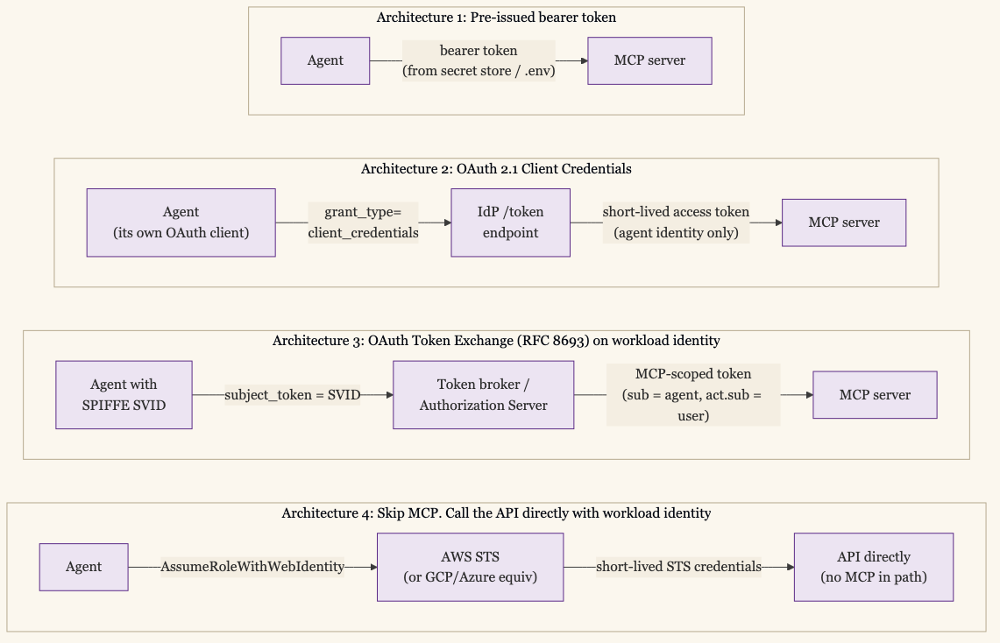
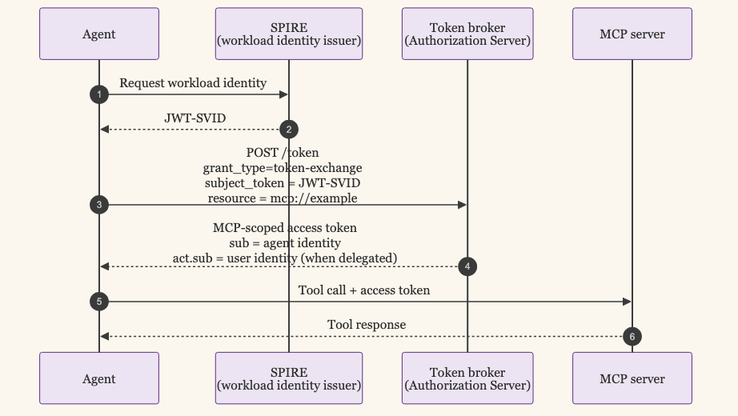
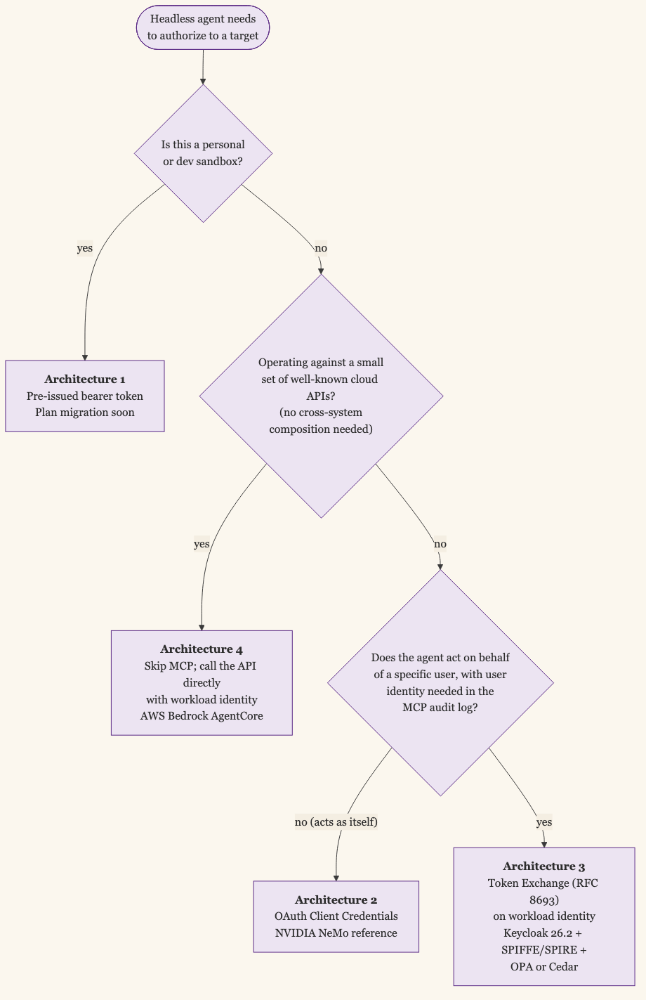

+++
date = '2026-05-28T12:00:00-07:00'
draft = false
title = "MCP Authorization When the User Isn't Clicking"
aliases = []
description = "Desktop AI clients authorize themselves to MCP servers by sending the user through a browser-based OAuth flow. Headless agents do not click. The transition from interactive OAuth to a non-interactive caller has at least four credible architectures, and the choice between them is one of the more consequential decisions in an agent rollout."
categories = ['Security', 'AI', 'Engineering']
tags = ['Security', 'AI', 'AI Agents', 'MCP', 'OAuth', 'Workload Identity', 'IAM', 'SPIFFE', 'Architecture', 'CISO', 'Authorization']
image = 'header.png'
[params]
  author = 'Matt Goodrich'
+++

**The MCP authorization spec was written for an AI client with a browser and a user who can click through consent. When the agent runs headless, that whole flow is gone, and the practical reality has been substituted at every production deployment I have looked at.**

The current [MCP authorization spec, revision 2025-11-25](https://modelcontextprotocol.io/specification/2025-11-25/basic/authorization), mandates [OAuth 2.1](https://datatracker.ietf.org/doc/draft-ietf-oauth-v2-1/) with PKCE, [RFC 9728](https://www.rfc-editor.org/rfc/rfc9728) Protected Resource Metadata for discovery, and [RFC 8707](https://www.rfc-editor.org/rfc/rfc8707) Resource Indicators on both authorization and token requests. That stack works cleanly when there is a human in front of a desktop AI client, because PKCE assumes a browser to redirect to, and consent assumes someone to click. As soon as the agent moves into a CI runner, a Kubernetes pod, or a Worker, the consent moment vanishes. The spec re-introduced the Client Credentials grant in November 2025 ([SEP-1046](https://modelcontextprotocol.io/seps)) to acknowledge this, but it leaves most of the harder questions undefined. What about an agent acting on a specific user's behalf in a headless context? What about multi-hop delegation across MCP servers? What about workload identity as the authentication primitive?

This is the architect's question, and after looking at the spec and what is actually shipping in production, there are four credible architectures, none of which look the same. I argued in [Agents Need Capabilities, Not Roles](/posts/agents-need-capabilities-not-roles/) that the agent's permission belongs to the action, not the identity, and in [Agent Identities Are Service Accounts That Improvise](/posts/service-accounts-that-improvise/) that the identity primitive itself has to change. This post is the protocol layer beneath both of those: how the agent's identity gets onto the wire when it calls an MCP server, and what to do when the OAuth dance the spec describes is unavailable.

## What the Spec Actually Says

The November 2025 spec update is the version worth reading. Three pieces of it matter for the headless case.

First, the spec mandates **OAuth 2.1 with PKCE (S256 when capable)** and treats the MCP server as the OAuth resource server. Discovery happens via **RFC 9728 Protected Resource Metadata** at a well-known URL. Audience binding uses **RFC 8707 Resource Indicators** so the token issued for `mcp://server-a` cannot be replayed against `mcp://server-b`.

Second, the spec re-introduced the **Client Credentials grant** as SEP-1046 in November 2025 after removing it in the June 2025 revision. The example request is the standard machine-to-machine shape: `grant_type=client_credentials`, with a `scope` parameter naming MCP capabilities like `tools:execute`. The token represents the client (the agent), not a user.

Third, **Dynamic Client Registration ([RFC 7591](https://www.rfc-editor.org/rfc/rfc7591)) was downgraded from SHOULD to MAY** and is now flagged "for backwards compatibility." Enterprises are pushed toward pre-registered clients through the Enterprise-Managed Authorization extension, which builds on [ID-JAG](https://datatracker.ietf.org/doc/draft-ietf-oauth-identity-assertion-authz-grant/) (Identity Assertion JWT Authorization Grant, also called cross-app access): an IETF draft that lets an IdP-issued identity assertion be exchanged for an MCP-scoped access token without re-prompting the user. This is a real shift: the spec is moving away from the desktop-friendly "any client can register itself" model toward an enterprise-friendly "the IdP knows every client in advance" model.

What the spec does *not* solve for the headless case is the harder set of questions. On-behalf-of delegation when the user is not present in the request flow is not standardized ([RFC 8693](https://www.rfc-editor.org/rfc/rfc8693) Token Exchange is mentioned around audience binding in §7.3 but is not mandated as a delegation pattern). Multi-hop delegation across agent-to-agent chains has no normative answer. Workload identity as the primary authentication primitive is left to the implementer. Each of those gaps shows up as an active issue in MCP gateway projects: [stacklok/toolhive #5194](https://github.com/stacklok/toolhive/issues/5194), [PrefectHQ/fastmcp #1985](https://github.com/PrefectHQ/fastmcp/issues/1985), and [IBM/mcp-context-forge #3385](https://github.com/IBM/mcp-context-forge/issues/3385) all ask for RFC 8693 support. The community is asking the spec to do more, and the spec has not yet caught up.

## What Production Actually Does

The reality on the ground is messier than the spec, and the gap between them is where the architecture decisions live.

The dominant pattern in production today is **pre-issued long-lived bearer tokens in environment variables**. The GitHub MCP Server documents a `GITHUB_PERSONAL_ACCESS_TOKEN` or a GitHub App installation token. The Notion MCP server takes an internal integration secret in the `Authorization` header. Slack MCP servers accept `xoxp`, `xoxb`, or `xoxc/xoxd` tokens depending on the implementation. Claude Code agents running in GitHub Actions read `ANTHROPIC_API_KEY` from Actions Secrets and pass MCP credentials as environment variables in `.mcp.json`. None of this is OAuth in the runtime sense. All of it is "secrets injected at deploy time."

This works, and it has the failure modes you would expect. Tokens get leaked into git history. Tokens do not rotate. The audit log at the MCP server sees the agent's identity but cannot attribute back to a specific user invocation. The MCP server-to-server boundary is one shared bearer per integration, not one identity per agent instance. The CSA's [*State of NHI and AI Security*](https://cloudsecurityalliance.org/artifacts/state-of-nhi-and-ai-security-survey-report) survey already flagged this pattern as the dominant failure mode for non-human identity broadly; MCP made it more common.

The pattern below the dominant one is **OAuth 2.1 Client Credentials** for service-to-service. [NVIDIA's NeMo Agent Toolkit](https://docs.nvidia.com/nemo/agent-toolkit/latest/components/auth/mcp-auth/mcp-service-account-auth.html) documents this explicitly, with token caching and refresh built into the toolkit. [Aembit](https://aembit.io/blog/mcp-oauth-2-1-pkce-and-the-future-of-ai-authorization/) and [Scalekit](https://www.scalekit.com/blog/oauth-2-1-mcp-secure-ai-integrations) both publish guidance for it. Where it fits, it works: the agent has its own registered client at the IdP, gets a short-lived access token, attaches it to the MCP server call, and refreshes on expiry. Where it falls down is the on-behalf-of case, because the token represents the agent's identity and not the user the agent is acting for. If you need attribution back to the user, Client Credentials alone is the wrong primitive.

The third pattern, increasingly common at enterprise scale, is a **gateway in front of MCP**. [Strata's AI Identity Gateway](https://www.strata.io/resources/news/strata-identity-introduces-ai-identity-gateway-and-validation-sandbox/) (GA November 2025), [Databricks Unity AI Gateway](https://www.databricks.com/blog/ai-gateway-how-connect-agents-external-mcps-securely), [Cloudflare's workers-oauth-provider](https://github.com/cloudflare/workers-oauth-provider), [Solo.io's agentgateway](https://github.com/agentgateway/agentgateway), and [Teleport's Machine and Workload Identity with MCP Access](https://goteleport.com/docs/machine-workload-identity/access-guides/mcp/) all instantiate this pattern. The agent authenticates to the gateway with whatever primitive the gateway accepts (workload identity, SPIFFE SVID, OAuth client credentials, IdP-issued JWT). The gateway mints an MCP-scoped token, attaches it to the call, and writes the call to an append-only audit log. The MCP server itself sees a gateway-issued token. It does not see the agent's workload identity directly. That last fact matters more than it looks.

## Four Architectures, Named

Pull the patterns out of the production survey and four credible architectures emerge. They are not mutually exclusive. Most production stacks combine two of them.

**Architecture 1: Pre-issued long-lived bearer token.** The agent loads a token from a secret store at startup and presents it on every MCP call. The MCP server validates the token against its own client database. This is the GitHub-PAT-in-`.mcp.json` shape. Operationally cheap; security-wise this is the least defensible option. There is no rotation, no per-call attribution to a user, no audit chain back to whoever caused the agent to run. Use this for a personal-developer-sandbox MCP server, not for an enterprise deployment.

**Architecture 2: OAuth 2.1 Client Credentials grant.** The agent has its own OAuth client at the IdP, gets a short-lived access token via `grant_type=client_credentials`, and presents it to the MCP server. The MCP server validates against the IdP. This is the SEP-1046 path and the NVIDIA NeMo pattern. Operationally clean for *the agent acting as itself*; broken for *the agent acting on a specific user's behalf*, because the token does not carry the user identity. Use this when the agent's authority is its own, separate from any user's.

**Architecture 3: OAuth Token Exchange (RFC 8693) on workload identity.** The agent authenticates with a workload identity (SPIFFE SVID, Kubernetes service account token, AWS IAM role) and presents it to a token broker. The broker performs an RFC 8693 token exchange, returning an MCP-scoped access token with the agent's identity in `sub` and the original user identity in `act.sub` when user delegation is in play. The agent attaches the MCP-scoped token to the call. This is what Solo.io's agentgateway, Strata's AI Identity Gateway, and Teleport's MCP Access proxy actually do under the hood. [Christian Posta's published reference architecture](https://blog.christianposta.com/authenticating-mcp-oauth-clients-with-spiffe/) wires SPIFFE JWT-SVIDs into Keycloak via a `client_assertion_type=urn:ietf:params:oauth:client-assertion-type:spiffe-svid-jwt` extension, with Keycloak as the token broker. [Keycloak 26.2](https://www.keycloak.org/2025/05/standard-token-exchange-kc-26-2) (May 2025) was the first major authorization server to ship RFC 8693 as a non-experimental feature; everyone else is catching up. This is the architecture the standards community is converging on. It is also the architecture with the most moving parts.

**Architecture 4: Skip MCP. Call the API directly with workload identity.** The agent authenticates to the underlying API (AWS, GCP, Azure, GitHub, the application's own auth endpoint) using whatever workload identity primitive that API supports. [AWS Bedrock AgentCore](https://docs.aws.amazon.com/bedrock-agentcore/latest/devguide/runtime-oauth.html) documents the cleanest version: the agent assumes an IAM role via STS Web Identity Federation, gets short-lived credentials (15 minutes is the practitioner default), and calls the API directly. No MCP server in the path. [Solo.io's published critique](https://www.solo.io/blog/mcp-authorization-is-a-non-starter-for-enterprise) of MCP authorization makes this case strongly: enterprises do not treat backend systems as authorization servers, which is what the MCP spec implicitly requires them to do. For single-cloud blast radius and a small set of well-known APIs, this is genuinely the simplest answer. The cost is that you have given up the cross-system composition MCP was designed to enable.

The most complex of the four is Architecture 3. The token-exchange flow it depends on looks like this:

Most enterprise production stacks I have seen run a hybrid: Architecture 3 for cross-system tool composition where it earns its keep, Architecture 4 for the cloud-native APIs where MCP adds no value, Architecture 2 for genuinely agent-owned operations, and Architecture 1 still showing up in the corners nobody has audited yet.

## The Tradeoff Table

| Dimension | Arch 1: Pre-issued | Arch 2: Client Credentials | Arch 3: Token Exchange on SPIFFE | Arch 4: Skip MCP |
|---|---|---|---|---|
| Credential lifecycle | Long-lived, manually rotated | Short-lived, IdP-rotated | Short-lived, broker-rotated per call | Short-lived STS, no OAuth refresh |
| Audit attribution | Agent only; no per-user trace | Agent only; user not in token | Agent + user via `sub` and `act.sub` | Scattered across CloudTrail-equivalent |
| Blast radius on leak | Full token authority until revoked | Token-lifetime scope | Single tool call scope | IAM role boundary |
| Operational complexity | One secret, one config line | OAuth client at IdP, refresh logic | Broker + AS + MCP server + policy | One IAM principal |
| Multi-hop delegation | Not supported | Not supported in user-OBO sense | Nested `act` chains per draft-oauth-ai-agents | Weak; STS chaining drops attribution |
| Standards maturity | Not OAuth at all | OAuth 2.1 mature, MCP spec 2025-11-25 | RFC 8693 mature; MCP integration emerging | IAM/STS battle-tested; no MCP semantics |
| Where it fits | Personal/sandbox use | Agent acts as itself | Cross-system enterprise composition | Single-cloud, well-known APIs |

Read the rows top to bottom rather than the columns left to right. Pre-issued tokens lose every comparison except "cheapest to start." Client Credentials wins the standards-maturity column but loses attribution. Token Exchange on SPIFFE wins attribution and blast-radius but loses operational simplicity. Direct API wins simplicity and battle-testing but loses the composition story. No architecture wins every dimension, which is why the production answer is hybrid.

## Where the Spec Is Still Behind the Practice

Worth being explicit about where the answer is not yet settled, because the post would oversell otherwise.

**RFC 8693 is not mandated by the MCP spec.** The spec mentions token exchange around audience binding but does not normalize it as the headless-delegation pattern. The community is asking for this; the spec is not there yet. Open issues in IBM's mcp-context-forge, Stacklok's toolhive, and PrefectHQ's fastmcp all track the same gap. Production implementations route around the spec, which means each implementation is its own contract.

**The on-behalf-of draft does not use RFC 8693.** The IETF [*draft-oauth-ai-agents-on-behalf-of-user-02*](https://datatracker.ietf.org/doc/html/draft-oauth-ai-agents-on-behalf-of-user-02) (August 2025) explicitly declines to use RFC 8693 because the draft authors view Token Exchange as "primarily designed for server-side communication or impersonation scenarios" without support for "obtaining explicit user consent for an agent via the front channel." The draft borrows the `act` claim from 8693 but defines a different flow. Practitioners building token brokers today face a real interoperability question: implement what RFC 8693 says, or implement what the draft will eventually say.

**SPIFFE was not designed for non-deterministic workloads.** The Kubernetes-implementation default treats all replicas of an agent identity as identical. Two replicas can produce wildly different behavior on the same inputs. The identity layer cannot currently distinguish them, which means the audit trail for a misbehaving agent points at the workload identity but not at the specific instance that drifted.

**The gateway is doing the work the spec implies the MCP server should do.** Strata, Solo.io's agentgateway, Teleport, Cloudflare's workers-oauth-provider, Databricks Unity AI Gateway: all of them intercept the call and translate the agent's authentication primitive into something the MCP server understands. The MCP spec assumes the MCP server is the resource server in OAuth terms. In production, the gateway is the resource server, and the MCP server is downstream of it. That is a structural difference the spec has not absorbed.

The honest read is that the November 2025 spec named the machine-to-machine case but did not solve the user-delegated-headless-agent case. The four architectures above route around the spec, not through it.

## Where This Lands for the Architect

The architect's answer is contingent on three questions.

If the agent acts as itself with no user identity in the chain, Architecture 2 (OAuth Client Credentials) is the cleanest. It is the spec-blessed path, and the operational complexity is moderate. NVIDIA's published pattern is a reasonable reference.

If the agent acts on behalf of a specific user, and you need that user identity to land in the MCP server's audit log, Architecture 3 (Token Exchange on workload identity) is the path. Be honest that you are building on a spec that is still settling. The components exist (Keycloak 26.2 for the AS, SPIFFE/SPIRE for the workload identity, OPA or Cedar for the policy decision). The integration is yours to wire.

If the agent is operating against a small set of well-known cloud APIs and the cross-system composition story does not matter to your use case, Architecture 4 (skip MCP) is the right answer. AWS Bedrock AgentCore is the closest production-ready reference. The cost is that you have given up the abstraction; the benefit is that you have given up most of the moving parts.

Architecture 1 belongs in a personal sandbox and nowhere else. If pre-issued bearer tokens in `.mcp.json` are the dominant pattern in your environment today, that is the work to do first, regardless of which of the other three you eventually pick.

The MCP authorization spec will keep moving, and it is moving in the direction practitioners are already operating, which is the right direction. But the spec is behind the practice by twelve to eighteen months. The architect's job is to pick an architecture that survives the next two spec revisions without a rewrite. Architecture 3 with a gateway in front of the MCP server is the bet I would make today.
