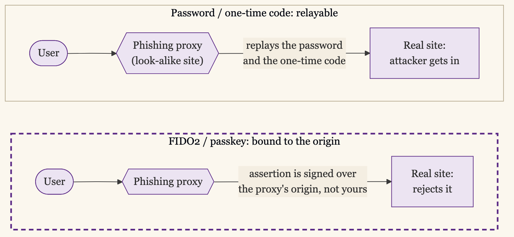

+++
date = '2026-06-22T00:01:00-07:00'
draft = false
title = 'The Only MFA That Survives Phishing'
aliases = []
description = "Passwords and one-time codes both fall to a convincing fake login page. FIDO2 security keys and passkeys don't, because the browser checks the site's identity before it releases the credential. Here's how the pieces fit, what each one costs to roll out, and why account recovery is the part that decides whether it sticks."
categories = ['Security', 'Engineering']
tags = ['Security', 'IAM', 'Identity', 'FIDO2', 'Passkeys', 'Passwordless', 'MFA', 'WebAuthn', 'YubiKey', 'CISO']
image = 'header.png'
[params]
  author = 'Matt Goodrich'
+++

A phishing page can copy your login screen perfectly. The logo, the fonts, a URL one character off from the real one. You type your password, you approve the push notification on your phone, and the attacker is in, because everything you did on the fake page worked exactly as well there as it would have on the real one. The second factor did not help. It just rode along with the first one into the wrong hands.

A FIDO2 credential breaks that. When you register a security key or a passkey, the credential is bound to the real site's origin, and the browser will only release it to that origin. Land on the look-alike domain and the authenticator has nothing to hand over, because it holds no credential for that origin and cannot mint one on the spot. The user never has to notice the wrong URL. The wrong URL is the whole defense.

That property, and not the absence of a password, is the reason to do this. [CISA tells federal agencies to move to phishing-resistant MFA](https://www.cisa.gov/sites/default/files/publications/fact-sheet-implementing-phishing-resistant-mfa-508c.pdf) for the same reason: the common second factors, SMS codes, authenticator apps, push approvals, all survive a man-in-the-middle phishing kit, and FIDO2 does not.

## What Phishing-Resistant Actually Means

Three properties have to hold together, and only FIDO2 gives you all three.

The credential is **bound to an origin**. A [WebAuthn](https://www.w3.org/TR/webauthn-2/) credential is registered against a specific relying party, `login.yourcompany.com`, and the browser enforces that scope. A real-time phishing proxy like Evilginx can sit between you and the real site and relay your password and your TOTP code, because those are just strings the proxy can pass along. It cannot relay a WebAuthn assertion, because the assertion is signed over the origin the browser actually connected to, which is the proxy's domain, not yours. The signature is worthless anywhere else.

The private key **never leaves the authenticator**. Registration generates a key pair on the security key or in the device's secure element, and the private half stays there. The server only ever sees a public key and signatures. There is no shared secret sitting in a database to steal, and no seed to copy. A TOTP secret, by contrast, exists in two places, and either copy leaks the whole factor.

Authentication is a **challenge-response**, not a replay. The server sends a random challenge, the authenticator signs it, and the signature is good once. Capture it and you have nothing reusable.

Strip those three down and the point is simple: every common factor before FIDO2 is a secret you can copy or a code you can relay. A FIDO2 assertion is neither.

## One Standard, Two Form Factors

The vocabulary trips people up, so it is worth being precise. [FIDO2](https://fidoalliance.org/fido2/) is two specifications working together. WebAuthn is the W3C API the browser and the server speak. CTAP is the protocol the browser speaks to the authenticator. You mostly care about where the authenticator lives.

A **roaming authenticator** is a separate object you carry, a security key you plug into USB or tap over NFC. A **platform authenticator** is built into the device, the Secure Enclave on a Mac or iPhone, the TPM on a Windows laptop, the secure element on an Android phone.

A **passkey** is the consumer-facing name for a WebAuthn credential, usually a discoverable one: it can stand in for the username and the password together, so the same tap that proves you also identifies you. That is where passwordless comes from. If the credential identifies you and proves you in one step, there is no password left to phish. The [passkeys.dev](https://passkeys.dev/) guides are the clearest reference if you want the developer-level detail.

What decides your rollout is whether the credential stays on one piece of hardware or follows your account everywhere. That matters more than whether the authenticator is roaming or built in.

## Device-Bound vs Synced

This is the fault line. Every passwordless decision comes back to it.

A **device-bound** credential lives on exactly one piece of hardware and cannot be copied off it. A YubiKey is the clean example: the private key is generated on the key's secure element and is extraction-resistant by design. Lose the key and the credential is gone with it, which is the point and the problem at once.

A **synced** credential follows your platform account. A passkey created on your iPhone syncs through iCloud Keychain to your iPad and your Mac; a passkey created in Chrome syncs through your Google account; a third-party manager like 1Password syncs across everything you sign it into. The same phishing-resistant assertion comes out the other end. What changed is that the private key now lives in a cloud you can recover from, and reach every device you own, instead of in one secure element you can drop in a parking lot.

| | Device-bound hardware key | Synced passkey |
|---|---|---|
| Example | YubiKey 5, FIPS keys, Feitian | iCloud Keychain, Google Password Manager, 1Password |
| Where the private key lives | The key's secure element, never leaves | The platform or manager's cloud, synced to your devices |
| Reach | One key in one pocket; lose it and you are locked out | Every device signed into the account |
| Recovery | A second key, or a documented offline path | The account's own recovery flow |
| Assurance | Highest: extraction-resistant, attestable | High against phishing; the account recovery is the weak point |
| Best for | Admins, break-glass, high-assurance roles | The whole workforce getting off passwords |

Both are phishing-resistant. The browser does the origin check either way. The difference is what an attacker has to compromise to steal the credential, and what you have to compromise to recover it when a user is stuck. Device-bound moves both of those to physical hardware. Synced moves both of them to the platform account.

## Roll It Out by Blast Radius

The order is the same one the zero-trust sequence implies: identity-first, and the highest-value identities first. Do not try to convert everyone at once.

Before the phasing, one prerequisite. This whole approach assumes you can enforce the factor in one place and have it apply everywhere, and that place is [single sign-on](/posts/one-front-door-one-place-to-revoke/). SSO is what lets you require a phishing-resistant factor once, at the identity provider, and cover every application behind it. Without it you are turning MFA on app by app, a rollout that never finishes. Treat SSO as table stakes for this work: the apps behind the IdP are the ones this protects, and the apps still in front of it are a separate problem to solve first.

**Pilot with the people who can debug it.** IT and security enroll first, register two authenticators each, and hit the rough edges before anyone else does. You will find a legacy app that cannot do WebAuthn and a VPN client that swallows the NFC tap. Better you find them than the CFO.

**Admins next, on hardware keys.** The accounts whose compromise is worst get the strongest factor, device-bound, and they get it before the broad rollout, not after. This is also where [break-glass](/posts/break-glass-without-the-backdoor/) meets passwordless: your emergency accounts are exactly the ones that should sit behind a hardware key in a safe, not a synced passkey on someone's personal phone.

**Crown-jewel apps, by policy.** Turn on a conditional access rule that requires phishing-resistant authentication for the systems whose compromise would hurt most, the IdP admin console, the production cloud, the financial systems, before you try to cover everything. Every major IdP supports this. [Entra ID](https://learn.microsoft.com/en-us/entra/identity/authentication/concept-authentication-passwordless), Okta, Google Workspace, and Ping all let you require a FIDO2 or passkey factor for a named set of apps and leave the rest alone while you migrate.

**The workforce, on synced passkeys.** This is where reach matters more than maximum assurance, and where buying a thousand hardware keys would stall the program. Let people enroll a platform passkey on the device they already carry, require it for SSO, and you have moved the bulk of your logins off phishable factors without a logistics project.

Then turn the password off where you can, not before. Passwordless is the destination, and you reach it once the phishing-resistant factor is enrolled and proven for a population, not on the day you announce the project.

## The Recovery Path Is Where Rollouts Underbuild

Here is the part that decides whether any of this holds, and the part most rollouts underbuild. A phishing-resistant factor is only as strong as its recovery path. A phishable recovery is an unlocked window beside a strong front door.

The failure looks like this. You deploy security keys, you feel covered, and then the "I lost my key" flow quietly drops to an SMS code or an email magic link, because someone had to make recovery work and that was the easy way. Now an attacker skips the key entirely and phishes the fallback, and you have spent real money to relocate the vulnerability, not remove it.

Two things fix it.

**Make sure nobody has exactly one authenticator.** The single highest-value recovery improvement is enrolling a second factor at registration time: a backup security key in a drawer, or a hardware key plus a platform passkey. Most lockouts never reach the help desk if the user simply has a second way in. Issue keys in pairs and register both on day one.

**Make the human recovery path identity-proof, not convenient.** When someone genuinely loses everything, the reset has to re-establish who they are at the same assurance as the factor it is replacing. A help-desk agent resetting MFA on the strength of a phone call is the new attack surface, and it is not hypothetical: the [2023 Scattered Spider intrusions](https://www.cisa.gov/news-events/cybersecurity-advisories/aa23-320a) into large enterprises ran straight through help-desk MFA resets. The reset path for a privileged account should require in-person verification, a manager confirmation, a video check against a government ID, or a pre-issued offline recovery code held in a safe. It should be slow on purpose. The accounts with the most blast radius get the most painful recovery, and that is correct.

Concretely, the recovery path scales with what the account can reach:

| Account tier | How they recover |
|---|---|
| Regular user | The second authenticator they enrolled at signup; if both are gone, a manager-attested self-service reset |
| Sensitive user (production, finance) | A help-desk reset gated on manager confirmation and a live video check against a government ID, never a phone call alone |
| Admin or privileged | In-person verification, or a pre-issued offline recovery code from a safe, with two people required to use it |
| Break-glass or root | No help-desk path at all: the documented offline break-glass procedure, sealed codes and a hardware key in a safe |

## Attestation Lets You Refuse the Wrong Authenticator

If you need to know exactly what kind of authenticator a user enrolled, FIDO2 supports [attestation](https://developers.yubico.com/U2F/Attestation_and_Metadata/): at registration the authenticator presents a signed statement identifying its make and model through an identifier called an AAGUID. With attestation policy on, you can require that admins enroll only [FIPS-validated keys](https://www.yubico.com/products/yubikey-fips/), or block consumer authenticators you have not vetted, or insist that high-assurance roles use device-bound keys rather than synced passkeys.

The cost is real, so spend it deliberately. Attestation adds enrollment friction and management overhead, and it cuts directly against synced passkeys, which by design do not attest to a single device the way a hardware key does. Most organizations should turn it on for the admin and high-assurance population, where knowing the exact authenticator matters, and leave it off for the general workforce, where the win is getting everyone onto any phishing-resistant credential and attestation would only slow that down. Match the assurance level you enforce to the [NIST 800-63B](https://pages.nist.gov/800-63-3/sp800-63b.html) tier the role actually needs, not the highest one you can imagine.

## Synced Passkeys Trade Assurance for Reach

The purist position is that only device-bound hardware keys are real security, and that synced passkeys are a consumer convenience that smuggles your credentials into Apple's or Google's cloud. The concern is not wrong on the facts. A synced passkey is exactly as recoverable as the account it syncs through, and that account's recovery is now part of your attack surface. For an admin or a break-glass identity, that is a good reason to stay device-bound.

For everyone else it is the wrong tradeoff to optimize. The realistic alternative to a synced passkey is the password and the SMS code you have right now, not a hardware key for all ten thousand employees, and those fall to the phishing kit you are being hit with this quarter. A synced passkey closes that hole for the whole workforce at the cost of a logistics project you will never finish if you insist on hardware. The phishing-resistant property holds either way. Reserve the extraction-resistant, attestable hardware for the accounts where the cloud-recovery risk genuinely outweighs the reach, and let synced passkeys carry the masses off passwords. A strong factor everyone uses beats a stronger factor half the company never enrolls.

## What It Costs

The hardware is the cheap part. A [security key](https://www.yubico.com/products/security-key/) runs roughly $25 to $50, a FIPS model more, and two per admin is the number that matters once you account for the backup. The hardware does not have to be a closed product, either: [SoloKeys](https://solokeys.com/) and [Nitrokey](https://www.nitrokey.com/) are open-source FIDO2 keys, and open-source identity providers like [Keycloak](https://www.keycloak.org/) and [Authentik](https://goauthentik.io/) support passkeys natively, so the IdP side need not be commercial. The expense that surprises people is operational: shipping keys to remote staff, replacing lost ones, and standing up the identity-proofed recovery desk that the whole design depends on. Synced passkeys avoid most of that, which is the other half of why they carry the broad rollout.

The long tail is the legacy app that cannot speak WebAuthn. Anything behind your SSO inherits the phishing-resistant login for free, because the phishing-resistant step happens at the IdP. The problem is the system that cannot federate at all, the old on-prem console, the vendor portal with its own password. Those do not get fixed by this project. They get an inventory, a compensating control, and a place on the list of things to retire, and you should name them out loud rather than let the rollout imply a coverage you did not reach.

## The Frameworks Haven't Caught Up

One friction is not technical. Many compliance frameworks, and the auditor checklists built on them, still assume a password. They mandate length, complexity, and rotation rules that mean nothing once there is no password, and they define multi-factor as a password plus a second thing, which a single passkey gesture does not obviously match, even though a FIDO2 authenticator with a PIN or a biometric is genuinely two factors and a stronger pairing than most. NIST's 800-63B has caught up, recognizing phishing-resistant authenticators and dropping mandatory password rotation, but PCI DSS, a lot of HIPAA control mappings, and plenty of SOC 2 checklists have not. The failure mode is letting that lag talk you into keeping a weaker password fallback alive purely to satisfy a control, which reopens the hole you just closed. Map the passkey to the requirement's intent, document why it meets or exceeds it, and do not weaken the security to fit an outdated checkbox.

## Start Where the Phishing Lands

Passwordless is the headline. The security value is the phishing resistance, and you get that the moment the FIDO2 factor is enrolled, whether or not you have switched the password off yet. The order that works is the order of blast radius: admins and break-glass on hardware keys first, crown-jewel apps behind a conditional access rule next, the workforce on synced passkeys after that, and an honest recovery path under all of it.

The credential an attacker cannot phish is the rare control they cannot talk their way around. Start where the phishing lands.
