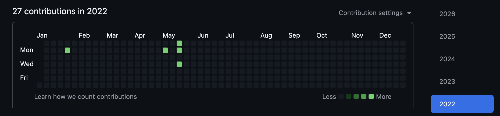
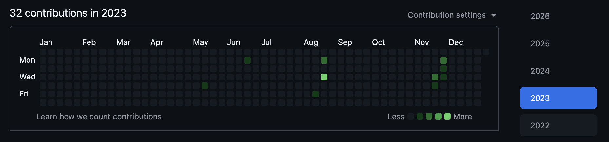
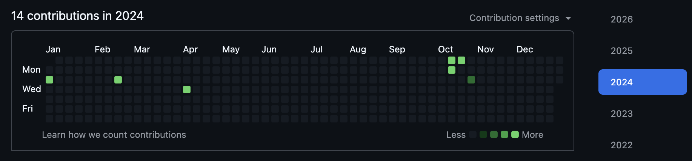
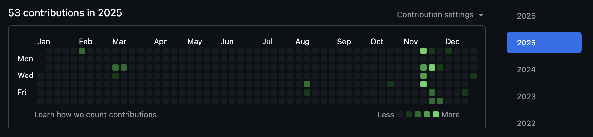
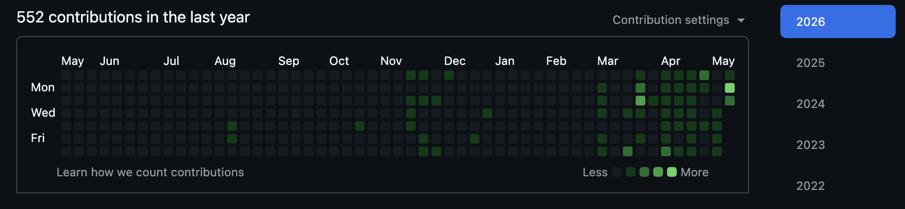

+++
date = '2026-05-12T12:00:00-07:00'
draft = false
title = "Agents Don't Travel Well"
aliases = []
description = "Agents don't survive flights, hotel WiFi, or closed laptop lids. They survive a Mac Studio at home, a Cloudflare Tunnel, and tmux. This is the workspace I built once running sessions became the work."
categories = ['Productivity', 'Tools', 'Software', 'Artificial Intelligence']
tags = ['AI', 'Claude Code', 'tmux', 'Cloudflare', 'Developer Tools', 'Workflow', 'Productivity']
image = 'header.png'
[params]
  author = 'Matt Goodrich'
+++

**AI just hits different.**

A lot of us in security have drifted further and further from our deep technical roots. For many of my peers, and for me, that meant writing real code early in our careers, then watching it become something other people did while we became "the security person who used to write code." I've lost count of practitioners who have told me some version of *"I'm writing more code right now than I have in the past several years combined."* I am one of them.

Here's mine, year by year:







I have no shame in saying AI writes better code than I do. Some people in security aren't ready to say that yet. I am. In the last week I've shipped more working code on a personal project (one I plan to write about soon) than I could have produced manually in months, maybe years. Lines of code isn't the metric. The metric is that I can stand up a real, good-looking, useful app and start iterating on it the same day the idea hits me. That used to take a quarter. Now it takes a weekend.

What's actually changed is the *excitement*. I'm building things I've thought about for years, and things a conversation sparked three days ago that I just want to see how far I can push. Once you're moving at that pace, every interruption is expensive — and the workspace that worked fine when you were writing a few hundred lines a week is suddenly the thing fighting you. That's what drove me to the setup I'm about to describe.

My personal daily driver is a fully-loaded M3 Max MacBook Pro with 128GB of RAM. It's a beast — there's almost nothing I throw at it that it can't handle. But "beast" is the wrong bar when the work is *running agents*. Working remotely, working from different spots in the house, ducking out for school drop-off or pickup — the laptop comes with me. And if I have agents running, the laptop coming with me is a problem.

I've literally caught myself in bed at night thinking *"I don't have any agents working on anything right now — what should I kick off before I go to sleep?"* Which is, let's be honest, a little unhealthy. But it's also the tell. **The work is the running session now.** The agent has loaded files, made decisions, started down a path. Lose that and you're not picking up where you left off — you're starting over. Closing the lid is a cost. Driving to school is a cost. Getting on a plane is a cost. Anything that interrupts the agent is a tax on the thing I'm most excited about doing.

So I needed two things. Long-running sessions that survive every kind of interruption a normal day produces. And a way to reach them from anywhere with an internet connection without leaning on a VPN. (I learned the VPN half the hard way recently — cruise ships block most of them.)

The answer wasn't a better laptop. The answer was to stop putting the important work on the laptop at all. What I have now is one workspace, on a Mac Studio at home, that I reach from anywhere. Three pieces make it work: a Cloudflare Tunnel, tmux, and the discipline of treating the laptop as a thin client, not a workstation.

## The Setup

1. **Mac Studio at home as the always-on host.** M3 Ultra, 96GB unified memory, plugged in, never sleeps. Runs the local models, the agents, and the long-running jobs.
2. **Cloudflare Tunnel for secure access.** No port forwards, no public IP, no NAT punching. The Mac dials out to Cloudflare. My clients dial in.
3. **tmux as the workspace.** One named session, one window per project. SSH in, attach, everything is exactly where I left it.

Mac Studio is the compute. Cloudflare is the front door. tmux is the workspace. Everything else is a thin client.

## Why a Cloudflare Tunnel

I've used Tailscale. I've used a plain VPN. I've port-forwarded with dynamic DNS. They all work until they don't. The reason I landed on a Cloudflare Tunnel is that it removes the parts of the other options that fail.

Nothing on my home network is exposed. The Mac Studio runs `cloudflared` as a service. It dials *out* to Cloudflare and holds an open connection. Inbound traffic comes in via Cloudflare's edge and rides that outbound connection back. My router never accepts a single inbound packet from the public internet.

Setup on the Mac Studio is short:

```bash
brew install cloudflared
cloudflared tunnel login
cloudflared tunnel create ai-workspace
# Configure ~/.cloudflared/config.yml with an ingress rule
# mapping ssh.mydomain.com -> ssh://localhost:22
cloudflared service install
```

On the client, just an SSH config entry:

```ssh
Host studio
  HostName ssh.mydomain.com
  User yourusername
  ProxyCommand cloudflared access ssh --hostname %h
```

After that, `ssh studio` works from anywhere. Same on hotel WiFi as it is at home.

The other thing I like: authentication happens at the Cloudflare edge, before traffic ever reaches the Mac. And the policy matters — "Cloudflare Access enabled" without specifics can mean anything from a real identity check down to "anyone with the right email address gets a one-time code." I gate on a specific identity provider plus an MFA factor stronger than email codes, with the identities explicitly allowlisted rather than wildcarded. That class of policy is what makes the edge-auth claim hold up; defaults alone don't. Defense in depth, without me having to maintain a second layer of auth on the Mac itself.

## tmux: One Pane Per Project

Once I'm SSH'd in, tmux is the workspace.

One named session called `work`. One window per active project. Two or three panes per window — usually one for Claude Code, one for a shell where I run commands, sometimes a third for tailing logs.

Roughly:

```
session: work
├── window: mattgoodrich.com
├── window: claude-chats
└── window: zsh
```

Switching projects is one key combo. The agent in `mattgoodrich.com` is still where I left it when I jump back from `claude-chats`. No new SSH session, no new shell, no rebuilding context.

I don't have a fancy tmux config. Named windows. A status bar I can read. Sane keybindings. The deeper rabbit hole is there if you want it, but I've found the marginal value of every tweak past those basics drops fast.

The important part is that tmux keeps running on the Mac Studio. The SSH connection can drop. The laptop can close. The WiFi can flake. None of that touches the session. I `ssh studio && tmux attach` and everything is right where it was.

## What This Buys Me

### One place to manage context

All my AI work is on one screen. Not "all my AI work on this machine." All of it. If an agent is running, it's running here. If a job is in flight, it's in flight here. If I want to check last night's run, I switch to that window.

I used to spend more time than I'd admit thinking "wait, was that on the Mac or the MacBook." That's gone. There's one place. The thing is either there or it isn't.

### Same session from any device

The Mac Studio is the compute. Whatever I'm holding is just a window. MacBook on a plane, iPad in a coffee shop with a Bluetooth keyboard, phone in a pinch with Termius — same session, same state, same windows.

The clients don't need to be powerful. They don't need the local models. They don't even need the project source. They just need an SSH client.

### Resumable everything

This is the one I value most. Close the laptop in the middle of a Claude Code session — the agent keeps going. Get on a plane and lose connectivity for four hours — when I reconnect, the session is exactly where it was. Hotel WiFi drops the SSH connection — tmux doesn't care.

For regular coding this matters less because the work is the files. For AI work, the running state *is* the work. tmux is what makes that state durable across every kind of interruption a normal day produces.

## What I Haven't Solved

The setup is good. It also has edges I work around rather than fix.

### Artifacts have to land somewhere synced

Anything an agent produces — an image, a generated config, a PDF — lives on the Mac Studio's filesystem. If I want it outside the terminal, it has to land somewhere that syncs or is otherwise reachable from the client. Code goes into a Git repo, which is the cleanest path. Notes go into Obsidian with Sync turned on. Everything else lands in iCloud Drive, Google Drive, or Dropbox — pick your sync of choice. None of this is hard, but it's a habit you have to build. The first time you produce something cool and realize it's stuck on a machine sitting in your office at home, you remember to wire it up next time.

### Some macOS dialogs still want a hand on the Mac

It's rare, but every so often a system or permissions dialog needs me to click "Allow" on the actual Mac Studio. Rebooting after an OS update is the most common culprit. The fix is VNC over the same SSH connection — forward the Screen Sharing port to the client, connect with a viewer, and click whatever needs clicking. Same Cloudflare Tunnel, same auth, just a different local port.

```bash
ssh -L 5900:localhost:5900 studio
# Screen Sharing must be enabled on the Mac Studio
# Then point any VNC viewer at localhost:5900
```

Two things to keep in your threat model when you do this. First, the same Cloudflare Access policy that gates SSH also gates this VNC path — an SSH-key compromise grants screen access too, with no second factor in between. Second, I leave Screen Sharing turned off by default and only flip it on for the few minutes I actually need it. Together those keep the VNC surface small and well-gated, but it's a place where defense-in-depth is thinner than the rest of the setup, and worth being deliberate about.

### Pasting screenshots into the remote session

This is the one I haven't cracked. Copy an image to my laptop's clipboard, switch to my tmux session on the Mac Studio, hit paste — nothing lands. The clipboard lives on the client. The session lives on the server. The bridge doesn't exist, at least not in any form I've gotten clean. The workaround is dropping the file into a synced folder and pasting the path, which works for one screenshot and falls apart when I want to drop ten into a conversation. It's my biggest day-to-day gripe with the setup, and I haven't seriously gone looking for a fix yet. If you've solved this, please find me.

## What's Next

A couple of things I'm watching.

The Mac Studio is a single point of failure for availability. If it goes down, the workspace is down. So far it's been reliable enough that I haven't built a standby.

The same centralization that gives me one place to manage availability also concentrates *confidentiality*. Every agent, every loaded context, every credential the agents can reach lives on the same host. So my threat model for that machine is closer to "production server" than "personal Mac" — patching cadence, audit logging, account separation, and least-privilege all get treatment I'd never bother applying to the laptop. The single-host architecture is the right tradeoff for me. It's also a tradeoff I had to be deliberate about, not a default I drifted into.

The honest answer on multi-machine is that 95% of what I do fits comfortably on one Mac Studio, and the other 5% is rare enough that I just deal with it. The setup does what I wanted: one place, reachable from anywhere, always there when I come back.

## The Questions That Came Back

A coworker read this and came back with three questions. They're the ones I'd ask too, so here they are with answers.

**Are the agents running under your primary user with full keychain access, or isolated per agent with separate accounts, separate keychains, or some kind of per-session credential scoping?**

Single primary macOS user — I don't have separate accounts per agent. The isolation happens one layer up, via 1Password. The agents authenticate using a service account token that's scoped to a *single dedicated vault* called "Claude" — that vault contains only the secrets I've explicitly whitelisted for AI use (a handful of API keys, nothing else). My personal vault, family shared vault, and any other 1Password content is unreachable by the service account.

At process start, `op run` injects the resolved secrets into environment variables for the lifetime of the run — they don't live on disk and they don't live in my system keychain. The keychain holds exactly one thing for this flow: the service account token itself, which is the bootstrap secret. I wrote up the full pattern in [Stop Putting Secrets in .env Files](/posts/1password-service-account-claude-secrets/) — same model, more detail.

What I don't have, and have thought about, is true per-agent isolation at the macOS user level. That's a real next step if my threat model changes, but for one operator on one box, vault scoping plus short-lived process-scoped credentials has been the right cut for me so far.

**If the Mac Studio gets compromised, what actually is leaked?**

Honest enumeration — this is exactly the threat-model exercise I run on it periodically:

- Anything in the "Claude" 1Password vault — the API keys I've explicitly whitelisted for AI use. By design, this is the *only* 1Password content reachable from the box.
- Whatever the running agent sessions have loaded — files Claude Code has been reading, chat context, in-flight tool outputs. Memory-resident, but very real.
- Local source for the projects in `~/Development` — personal AI work, blog source, side projects. None of it has production credentials in it (that's the point of the 1Password setup), but it's still my code.
- SSH keys for Git remotes and system-level tokens (Cloudflare Tunnel creds, LaunchAgent configs, the bot and MCP server tokens that run as services on the box).
- Mackup-synced app settings (preferences, not credentials — but worth listing).

What's *not* on it because I keep it that way: personal logins outside the Claude vault, family shared vault contents, any work credentials. The blast radius is real but bounded — and it's bounded by *discipline* (keeping non-AI creds out of that vault), not by something I can fully delegate to a control.

The thing I treat as production-grade for this reason: patching cadence, audit logging on the box, and a short list of LaunchAgents I actually want running. Not perfect. Better than the laptop, by a long way.

**How do you turn on Screen Sharing remotely if it's off by default?**

SSH is always on — that's the Cloudflare Tunnel path. Screen Sharing is off until I need it. So when I need to click something on the actual desktop, I SSH in first and toggle the screensharing daemon from the shell:

```bash
# enable
sudo launchctl load -w /System/Library/LaunchDaemons/com.apple.screensharing.plist

# ...forward the port and connect a VNC viewer:
# (from the client)  ssh -L 5900:localhost:5900 studio
# then point your VNC viewer at localhost:5900

# disable when done
sudo launchctl unload -w /System/Library/LaunchDaemons/com.apple.screensharing.plist
```

On Sequoia the `enable system/com.apple.screensharing` + `bootstrap`/`bootout` syntax is the more modern path, but the `load -w` / `unload -w` pattern still works and it's the one I have muscle memory for. I wrap it in a small alias so the toggle is one command — keeps the surface small without making me think about it every time.

The thing I'd flag honestly: the same Cloudflare Access policy that gates SSH gates this VNC path, so an SSH-key compromise grants screen access during the window it's on. That's why I leave it off by default and only flip it for the few minutes I actually need it. It's the thinnest layer in the setup — worth being deliberate about, not pretending it's bulletproof.
