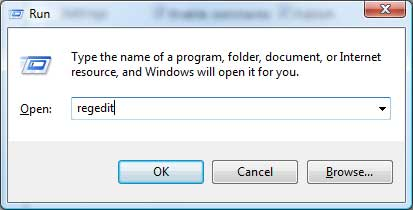
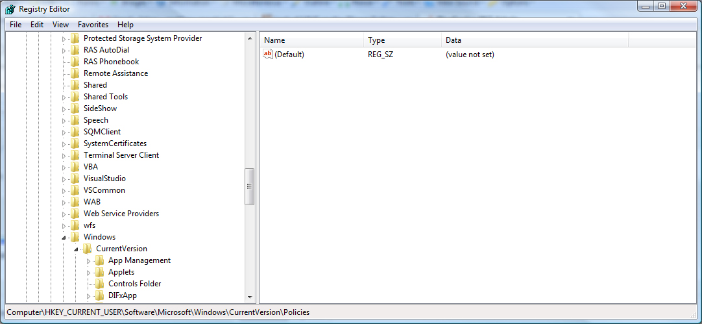

+++
date = '2009-05-12T12:00:00-07:00'
draft = false
title = 'Removing the Log Off Option from the Start Menu in Windows XP (and other versions)'
aliases = ['/windows/no-logoff-on-start-menu/']
description = "I was looking for a way to remove the log off option from the start menu in Windows XP, and I found that editing the registry key StartMenuLogOff to a value of 1 achieves this."
categories = ['Software', 'Windows']
tags = ['windows', 'start menu']
[params]
  author = 'Matt Goodrich'
+++

Here are the instructions for removing the log off option from the start menu in Windows XP (and possibly other versions of windows as well).

Click Start - > Run.

Type `regedit` and press "OK".

Navigate to `HKEY_CURRENT_USER\Software\ Microsoft\Windows\CurrentVersion\Policies\Explorer`.

Right-click on the StartMenuLogOff entry, select Modify and type `1` in the Value data box.

If the key entry isn't there, add it by right-clicking in the Contents pane and selecting New/String Value.

Now give it a name and enter a value of `1`.

Exit RegEdit and reboot.

The Log Off option should now be removed from the Start Menu.

To restore it, just change the value to `0`. You can also just delete the entire entry, press Ctrl+Alt+Delete, highlight Explorer and click on the End Task button. Cancel any dialogs that open, and the Log Off option should work again.