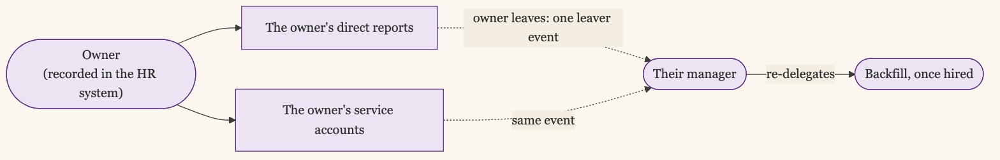

+++
date = '2026-06-11T00:01:00-07:00'
draft = false
title = 'The Identities Nobody Owns'
aliases = []
description = "Machine identities outnumber your people many times over, and unlike your people, no manager owns them and no auditor asks hard questions about them. So they accumulate access, keep static credentials, and outlive the projects they were built for. The fix is an owner for every one, plus telemetry to surface the dead and the over-privileged."
categories = ['Security', 'Engineering']
tags = ['Security', 'IAM', 'Identity', 'Service Accounts', 'Non-Human Identity', 'Machine Identity', 'Least Privilege', 'Compliance', 'Audit', 'CISO']
image = 'header.png'
[params]
  author = 'Matt Goodrich'
+++

Count the identities in your company. Not the people, the identities. Every employee, plus every service account, CI runner, deploy key, bot, integration token, and now every AI agent. CyberArk's 2025 research puts the ratio of machine identities to humans at [more than 80 to 1](https://www.cyberark.com/press/machine-identities-outnumber-humans-by-more-than-80-to-1-new-report-exposes-the-exponential-threats-of-fragmented-identity-security/), and other firms put it higher. The exact number varies by who is counting; the shape does not. The overwhelming majority of the things that can log into your systems are not people. And almost none of them have a manager, an offboarding, or anyone who notices when their access goes stale.

## The Identity With No Manager

Human identity has a lifecycle because humans have managers. Someone hires you, someone changes your role, someone walks you out, and each event fires a process: provision, adjust, deprovision. The whole machinery of IAM assumes a person on the other end with someone accountable for them.

A service account has none of that. It is created by an engineer in a hurry to make something work, granted whatever access made it work that day, and then forgotten. There is no manager to notice it. There is no offboarding when the engineer who made it leaves, or when the project it served is shut down. It just keeps existing, keeps authenticating, and keeps holding whatever access it was given, often a static credential that never rotates. These are the [accounts that improvise](/posts/service-accounts-that-improvise/), and there are eighty of them for every person you do govern.

## Why They Rot

Three things make non-human identity decay worse than the human kind.

**No owner.** When nobody is accountable for an identity, nobody reviews it, rotates it, or removes it. Ownership is the thing humans have by default and machines do not.

**Static credentials.** Many non-human identities authenticate with a long-lived key or token, because that was the easy way to set them up. A leaked human password runs into MFA and rotation policy. A leaked service-account key is valid until someone notices, which, with no owner, is often never.

**Over-grant by default.** A service account gets the access that made the integration work the first time, which is usually more than it needs, because narrowing it later is work nobody is assigned.

## No One Audits Them Either

Human access stays in line for two reasons: humans complain, and auditors ask. Non-human identities get neither.

In years of audits, I have never been asked to prove that a service account was least-privilege, that its credentials had been rotated, or that anyone could say what it was for and who was accountable for it. The evidence requests land on human accounts. The frameworks do not exclude service accounts, but in practice the scrutiny stops at the people, and the machine accounts that outnumber them and often hold more privilege go unexamined.

So they decay from two directions at once. No internal owner notices, and no external auditor asks. The largest and most privileged population of identities you have is the one under the least pressure from any side.

## Ownership Is the Fix

You cannot give a service account a manager, so you give it an owner: a human or a team accountable for its lifecycle, recorded at creation. An identity with no owner should not be allowed to exist, and the enforcement point is creation time, because retrofitting ownership onto thousands of legacy accounts is the hard version of this problem.

There is a cleaner version of this than a spreadsheet of owners. Put the owner where the rest of your identity lifecycle already lives. Companies are starting to give AI agents a real reporting line in the HR system, a manager in Workday or its equivalent, and a service account is just another reportee on that line. Record its owner there and [the leaver process](/posts/automate-the-leaver-before-the-joiner/) you already run does the work: when an owner leaves, their service accounts roll up to their manager the same way their direct reports do, and the manager re-delegates them once a backfill is hired. The same event that reassigns a departing employee's people reassigns their machines, so the account never becomes an orphan.

With an owner in place, the rest is the IAM you already know, pointed at machines. Short-lived credentials over static keys wherever the platform allows it, which is [workload identity where you can reach it](/posts/when-you-can-use-workload-identity/). Automated rotation where you cannot. And the same accountability model agents need: [scope every non-human identity to the actions it performs, not a broad role](/posts/agents-need-capabilities-not-roles/). Open-source tooling covers both ends of the static-credential problem: secret scanners like [Gitleaks](https://github.com/gitleaks/gitleaks) and [TruffleHog](https://github.com/trufflesecurity/trufflehog) find the keys already leaked into your code and history, and an [External Secrets Operator](https://external-secrets.io/) or a [SPIFFE/SPIRE](https://spiffe.io/) deployment replaces the long-lived ones with short-lived, brokered credentials.

Telemetry does more for machine identities than for human ones, because machine behavior is so much more predictable. A person's access is hard to judge from usage alone. A service account that has authenticated from one host to one API for two years and nothing else is trivial to right-size, and one that has not authenticated at all in a year is trivial to kill. [Telemetry-driven review](/posts/telemetry-driven-access-reviews/) is the single most effective tool you have here: it tells you which accounts are dead, what the live ones actually touch, and therefore how much of their access you can take away without breaking anything.

## You Will Not Get to Zero

You will not eliminate static credentials or fully inventory every machine identity, and pretending otherwise sets up the same theater as the quarterly access review. Legacy systems will keep needing keys. Some service accounts will outlive the people who can explain them.

The realistic goal is to stop the bleeding at creation, no new unowned identities and short-lived credentials by default, while you work backward through the legacy pile by blast radius, highest-privilege machines first. The point is simpler than a clean count: the largest population of identities in your company is currently the least governed, and the gap grows every time someone wires up a new integration or launches a new agent. Closing it starts with refusing to create one more identity that nobody owns.

## Govern the Ones That Don't Complain

Human identity gets attention because humans complain when it breaks. They file tickets when they cannot log in, and they notice when they still can after leaving. Machine identities never complain, never file tickets, and never mention that they still have production access from a project that ended two years ago. That silence is exactly why they are the bigger risk, and exactly why they need the governance the loudest humans never will.
