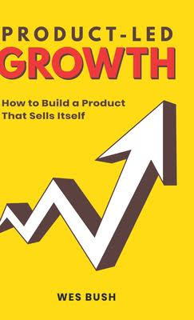
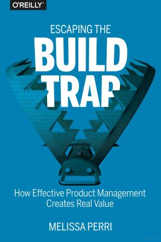

+++
date = '2022-09-15T12:00:00-07:00'
draft = false
title = 'Book Review: Product-Led Growth and Escaping the Build Trap'
aliases = ['/security/product-led-growth/']
summary = "As I finished reading Product-Led Growth and Escaping the Build Trap , I realized that these books have helped me understand the importance of customer insights in cutting through noise and providing real value during sales cycles. This realization has sparked an interesting intersection with my work in DPIA's, security, and audit logs."
genres = ['Product Management', 'Security']
tags = ['product-led growth', 'escaping the build trap', 'data privacy impact assessment', 'security', 'audit logs']
[params]
  author = 'Matt Goodrich'
+++

On my flight home tonight from a few days at our Broomfield, CO office I was able to finish two books I started earlier this year…
- *Product-Led Growth: How to Build a Product That Sells Itself* by Wes Bush 
- *Escaping the Build Trap: How Effective Product Management Creates Real Value* by Melissa Perri

Product-Led Growth really spoke to me as someone who would much rather navigate my own way through a sales process for any tool I want to trial whether in a professional or personal setting. It also somewhat indirectly implied that a deep understanding of what the customer is doing can be instrumental in cutting out the noise and providing real value during the sales cycle in the hopes of having a customer convert from their trial.

Having been diving into the world of DPIA’s (Data Privacy Impact Assessment) lately and developing and understanding of exactly what data we collect, where we send or store it and what legitimate business use we are collecting it for, it had me thinking a lot about the intersection of PLG and the security and privacy space.

Building on that, I had a realization that a lot of telemetry that is collected has an interesting overlap between many of the events that would be in a typical audit log - and I’m noodling on whether this overlap can be exploited to make both worlds better.

Would definitely recommend both books, even if your role isn’t a “typical” product role.