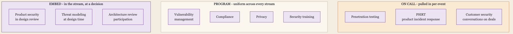
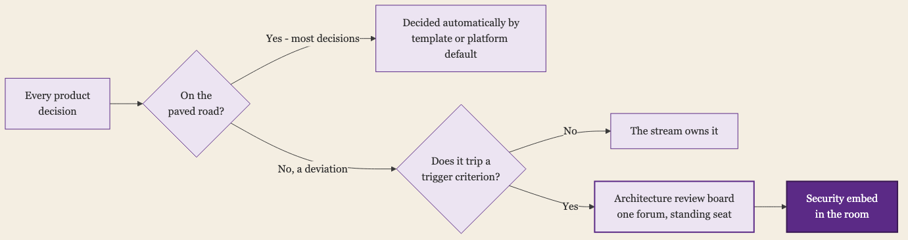

+++
date = '2026-05-24T01:00:00-07:00'
draft = false
title = 'Security Is an Overlay, Not a Column'
aliases = []
description = "A security team will never get a column on the org chart or a person on every value stream. Security has to attach as an overlay instead, woven from three modes: embed at decisions, program across every stream, on call for events. The highest-stakes embed is the architecture decision, which sets compliance scope and tooling cost for years, before it ever shows up in pricing."
categories = ['Security', 'Leadership']
tags = ['Security', 'Product Security', 'Compliance', 'Cloud Security', 'CISO', 'Vulnerability Management']
image = 'header.png'
[params]
  author = 'Matt Goodrich'
+++

**In the last post I argued that the value stream needs an owner. Security cannot be that owner.**

[That post](/posts/the-org-chart-is-not-the-value-stream/) made the case that work flows horizontally across a company while the org chart runs vertically, and that the horizontal path, the value stream, belongs to no one. Security gets dragged across that stream constantly, because it is the function least able to refuse the coordination nobody else was handed.

That diagnosis leaves security in an awkward place. Security is not the owner of any value stream and was never going to be. The harder problem is that security is also not a column on the org chart that scales with the company, and it will never get a person to sit on each value stream. The math forecloses that staffing fantasy before the org politics even start. The question this post answers is the one the last post did not: if security cannot own the value streams and cannot staff them one to one, how should it attach to them?

## There Is No Security Person for Every Stream

Start with the number, because the number ends the easy answer before it begins.

The rough industry benchmark for application security is one security engineer for every hundred developers. Teams that want genuine coverage talk about needing something closer to one in twenty. Almost nobody is staffed at one in twenty. Most security leaders run the program at one in a hundred or worse, and that gap is not a hiring problem you recruit your way out of in a quarter. It is the steady state.

Run that ratio against the actual work. One security engineer cannot sit in the design reviews, read the pull requests, threat model the new service, answer the customer questionnaires, and chase remediation for a hundred developers spread across a dozen value streams. So they do not. Industry surveys put the share of an application portfolio that gets deep security review as low as seven percent. The rest gets an automated scan and a written policy, and not much else.

That is the real starting condition, and it is worth saying plainly, because the next move people reach for is the wrong one. The wrong move is to imagine a future headcount plan where security finally embeds a person in every stream. That plan never arrives. Streams are added faster than the security team is, and the moment a security person is fully embedded in one stream they have stopped being able to see the other eleven. Coverage counted in headcount grows in a line. The work does not.

So security does not get a column on the org chart that scales with the company, and it does not get a body in every stream. What it gets to decide is *how it attaches* to streams it cannot staff. That is a design question, and most security teams have never actually designed their answer. They inherited it.

## Security Attaches Three Different Ways

Here is the reframe. Security, looked at against the value streams, is not a column and was never going to be one. It is an **overlay**: a layer that sits across all of the streams at once. The column model fails because a column is vertical and the streams are horizontal, the same mismatch the last post described. The overlay model works because a layer does not need a person per stream. It needs to be designed.

An overlay is not one uniform thing, though. It is woven from three different kinds of attachment, and the discipline is knowing which kind each piece of security work actually is.

The first is **embed**. Some security work has to happen *inside* a stream, in the room, while a specific decision is being made. Product security in a design review is the clearest case. You cannot do it from a dashboard and you cannot do it afterward. Embedding is the most expensive mode, because it spends the scarcest thing security has, which is a senior person's attention in real time. You cannot embed everywhere. The whole game with embedding is choosing the few places it pays for itself.

The second is **program**. Some security work applies to every stream in the same shape, and is better run as one horizontal program than as twelve embedded efforts. Vulnerability management is a program. Compliance is a program. Privacy, which overlaps so heavily with security that at most early companies it lands on the same desk, is a program. A program does not need a person per stream. It needs a consistent process, a place to see every stream's state at once, and a way to drive remediation without renegotiating the approach each time. The strength of a program is uniformity. Its weakness is that uniformity can curdle into box-checking, which I will come back to.

The third is **on-call**. Some security work is event-driven. It does not run continuously and it does not embed. It is summoned. Penetration testing is summoned, per release or on a schedule. A product security incident response process, a PSIRT, is summoned the day a vulnerability in your product becomes real. The security conversation with a customer's procurement team is summoned by a deal. On-call work is centralized on purpose, because the events are unpredictable and you want depth held ready rather than spread thin.

Almost every security function a company has fits one of those three. The mistake is rarely picking the wrong people. It is failing to decide, on purpose, which mode a given function is in, and then resourcing it as if it were a different mode. Running vulnerability management as twelve heroic embeds instead of one program. Treating incident response as something a single stream should handle alone. Trying to embed in a design review through a ticket filed afterward. The model is not complicated. It is just usually left implicit.

## Spend the Embed on Decisions, Not Code

If embedding is the scarce mode, the question becomes where to spend it. The instinct is to spend it on code: put a security engineer on the pull requests of the highest-risk team. That is not wrong, but it is not where embedding pays off most.

The place where embedding pays off most is the decision, specifically the architecture and design decision, made early, before there is code to review. A handful of early decisions silently set security's cost and obligations for years, and most of the people in the room when those decisions get made cannot see that they are doing it.

Consider one example, kept deliberately generic. A company is deciding how to deploy its product. One option keeps part of the data processing inside the customer's own environment. That infrastructure is the customer's, it runs in their cloud account, and it sits *outside* the company's own compliance boundary. It cannot be in scope for the company's SOC 2 report, which sounds like less work for security, and in a narrow sense it is. Another option offers a single-tenant deployment that the company hosts itself, one isolated environment per customer. Enterprise customers often want exactly that, and increasingly they will not buy without it. But the moment the company hosts it, that infrastructure comes *into* scope. It has to.

Look at what that one product decision just bought. Every single-tenant environment is now resources the company's cloud security posture management has to watch, so the counts in a tool like Wiz or Orca climb with every customer signed. Each environment may need its own runtime and cluster monitoring, the kind of thing tools like Upwind provide, and possibly network controls like an IDS or IPS. The compliance boundary the company has to attest to grew. None of that appeared in the product spec. None of it was in the pricing model for the deal either, which means the company is now eating margin on a tooling and compliance footprint nobody costed in. And it does not arrive on any predictable schedule. The meter starts the day the first single-tenant customer goes live, not on an annual planning cycle.

That is the callout, and it is the whole argument for spending the embed on decisions. A choice that looks like product packaging, or like a sales concession to close an enterprise deal, is in fact a multi-year security and compliance commitment. If security is embedded in that decision, the tradeoff gets made with eyes open. If security is not, the decision still gets made, the deal still closes, and security inherits the bill as a surprise, after the fact, with no say in whether it was worth it. The surprise is not a security failure. It is the predictable result of an embed that landed too late, on the code, instead of early, on the decision.

This is what threat modeling at design time and an architecture review board are actually for. Not ceremony. They are the mechanism that puts the scarce embed in the room while the expensive decisions are still cheap to change. But a board only works if there are a small number of rooms to be in, and most security teams hit the practical problem immediately. There are not three decisions a quarter across twelve streams. There are forty streams and a hundred decisions, and the few security people who could meaningfully embed cannot show up to all of them. So the embed model has to do two things at once: shrink the number of rooms, and shrink the number of decisions.

Shrinking the rooms means making the review board the actual decision forum rather than a parallel ceremony streams attend after the fact. Decisions above a defined threshold (a change to the hosting model, a new deployment topology, a new trust boundary, an architectural choice with compliance implications) do not happen elsewhere. They converge into one forum where security has a standing seat. Twelve streams making twelve scattered architectural choices in twelve standups is unworkable. One forum where the consequential decisions converge is not.

Shrinking the decisions is what paved roads and trigger criteria are for. Most decisions a product team makes are not security-consequential, and the ones that look like they are have often already been quietly pre-decided by the company's templates and platform defaults. The security review is reserved for the deviation, the place where a team is leaving the paved road. Pair that with written trigger criteria that tell engineers what does require security to be consulted, and with security champions inside the product teams who can recognize when a trigger has tripped, and the embed has a routing system. It gets summoned to the decisions that actually need it, rather than trying to be in every room by force of will.

Walk the earlier example back through that routing. The product team is debating whether to offer a single-tenant deployment the company hosts itself. Is that on the paved road? At a company whose paved road is multi-tenant SaaS, no. It is the textbook deviation from it. Does it trip a trigger criterion? It trips several at once: a change to the hosting model, a new compliance boundary, a new customer data flow, a new tooling and budget commitment. So the decision routes to the architecture review board, or to a higher forum if the call is also about packaging and pricing, and security is in the room before the slide deck reaches a customer.

The point is not that security blocks the decision. The point is that the tradeoff gets weighed with the compliance scope, the tooling footprint, the budget impact, and the pricing implications visible in advance, rather than discovered after the deal closes. That is what the routing model is supposed to deliver. It is what stops the meter from starting before anyone knew it had been turned on.

## Every Mode Fails the Same Way

I have described this model cleanly, and I want to be honest that it fails, predictably, and mostly for one reason.

Take the embed mode and its most common implementation, the security champion. A champion is an engineer inside a product team given a part-time security mandate, and on paper it is the perfect answer to the ratio problem. In practice, more than half of security champion programs stall or quietly die, usually within a year. The reason is almost never the people. It is that the champion is handed the responsibility without the two things that make it real: dedicated time, and authority. The feature roadmap eats the twenty percent that was supposed to be security. Nobody above the champion protects that time, and the champion has no standing to protect it themselves. Deputized influence still runs on borrowed authority, and borrowed authority gets called back the first time a deadline is tight.

The program mode fails differently. A program's strength is uniformity, and uniformity left alone drifts toward the form of the thing instead of the substance. Vulnerability management becomes a dashboard nobody acts on. Compliance becomes a checklist the streams resent. The security program stops being a partner and becomes an internal auditor, and once a stream sees security that way, the stream routes around it. The program is still running. It has just stopped changing any outcomes.

And the whole idea of pushing security into the streams, the thing the industry calls shifting left, has a failure mode severe enough to have earned its own counter-slogan. Done badly, shifting left is just shifting the work down onto developers who did not ask for it: a pile of scanners, a flood of mostly false alerts, and a steady erosion of the developer's willingness to look at any of it. Teams with weak security practice see measurably more developer burnout, not less. The point of the overlay is to cost the company less attention overall, not to move the same burden onto people with no security training and call it modern.

Underneath all three is the same honest fact. This model does not produce full coverage. It is a way to allocate coverage you have already admitted is insufficient. The ninety-three percent of the portfolio that gets only a scan is not an accident the model fixes. It is a number the model asks you to choose deliberately, by risk, instead of leaving to chance. Anyone selling you a security operating model that promises full coverage is selling you the column again, and the column was never real.

## The Paved Road Covers What You Can't Touch

If the model only allocates scarce coverage, something still has to account for the ninety-three percent. Embedding cannot reach it. A program can measure it but not fix it. On-call does not apply. The answer with the best evidence behind it is not a fourth way to attach people. It is to change what the streams build on.

A paved road is security built into the platform the streams already use. It is the secure default: the deployment pipeline that ships with the right controls already wired in, the service template that is hardened before a developer writes a line, the identity library that is correct because correct is the only option it offers. The stream does not get a security person. It gets infrastructure that is secure whether or not anyone on the team is thinking about security that day.

This is the part of the model that actually scales, and it scales because it does not depend on attention. Embedding depends on a senior person being in the room. A program depends on a stream acting on what the program surfaces. A paved road depends on nothing. It keeps working while everyone involved is asleep. The metric for a paved road is not how good it is. It is what fraction of the streams are on it, because a paved road nobody adopts protects nobody. Adoption is the whole scorecard.

None of the modes hold without one more thing, and it is the least technical thing in this post. The embed needs air cover, a leader who protects the champion's time and backs the security voice in the architecture review when that voice is inconvenient. The program needs its signal tuned, because a program that cries wolf is a program the streams have correctly learned to ignore. The paved road needs real investment, because someone has to build and maintain it. Distributing security across the value streams works. It works specifically when the company distributes the support along with the work, and it fails, every time, when it distributes only the work.

## Stop Waiting for the Column

Security is not going to get a column that scales with the company, and it is not going to get a person in every value stream. Both of those are versions of the same wish, the wish for security to be a vertical thing inside a company whose value runs horizontal. The last post argued that the value stream needs an owner. Security cannot be that owner. What security can be is the overlay: the layer that crosses every stream on purpose, attaching to each one in whatever mode the work actually calls for.

That is not a smaller job than owning a column. It is a harder one, because an overlay has to be designed and a column can just be staffed. The team that does it well has decided, deliberately, which streams get an embedded person and which get a paved road, which work is a program and which is on-call, and where the few expensive design decisions are that it cannot afford to miss. The team that does it badly is still waiting for the headcount that will turn security into a column, and while it waits, the decisions get made without it.

The overlay is not the consolation prize for not getting the column. It is the right shape. The column was the wrong shape all along.
