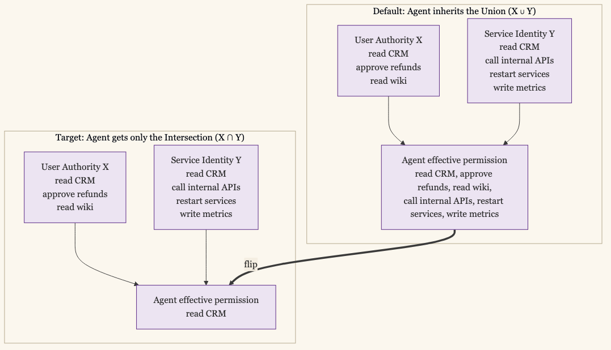

+++
date = '2026-05-26T12:00:00-07:00'
draft = false
title = 'Agent Identities Are Service Accounts That Improvise'
aliases = []
description = "A service account always does the same thing. An AI agent decides what to do as it runs, against inputs that may include adversarial text indistinguishable from instructions. The base identity discipline is the same; the operating model is different, and the difference is where most agent rollouts go wrong."
categories = ['Security', 'AI', 'Engineering']
tags = ['Security', 'AI', 'AI Agents', 'IAM', 'Non-Human Identity', 'CISO', 'Service Accounts', 'Workload Identity', 'MCP', 'OAuth']
image = 'header.png'
[params]
  author = 'Matt Goodrich'
+++

**An AI agent's identity is a non-human identity, and ninety percent of what governs it is decades-old hygiene. The other ten percent is where most agent rollouts fail.**

I came into this post not knowing whether to call agent identities a genuinely new class of non-human identity or just service accounts that improvise. After looking at what is published and what is failing in production, the honest answer is both. The base disciplines that govern any non-human identity (short-lived credentials, scoped per-action permissions, identity separated from the invoking user, audit on every call) are the disciplines that govern an agent. They have been the right answer for fifteen years. Most companies still have not implemented them, and the agent rollout is what is finally forcing the bill due.

What is actually new is narrower than the AI conversation usually allows, and more dangerous than the NHI conversation usually admits. Three new failure modes have no service-account analog. Prompt injection turns adversarial text into control flow. Model versioning rewrites what the agent does without rewriting who it is. Multi-hop delegation across tools confuses the principal in ways OAuth was not designed to handle. Those three are the genuinely new ground.

This post examines what is the same, what is different, and what that means for identity practice. The follow-on post argues the authorization model that falls out of it.

## What's Already Decades-Old Hygiene

Most of what makes an agent identity work is what makes any non-human identity work, and it has been correct since the 2010s.

Service accounts should have their own identity, separate from any human invoker. They should authenticate with short-lived credentials minted at execution, not long-lived API keys checked into config files. They should be scoped to the specific actions their workload requires, not granted broad role membership. Every action they take should land in an audit log with the service identity attributed. The service account should have a named human owner, a documented purpose, and a lifecycle that retires it when the workload retires. None of this is novel. [SPIFFE](https://spiffe.io/) has issued workload identities to Kubernetes pods since 2018. [AWS IAM roles](https://docs.aws.amazon.com/AWSEC2/latest/UserGuide/iam-roles-for-amazon-ec2.html) have minted short-lived credentials for EC2 instances for longer than that. The discipline is fifteen years old.

What is fresh is the volume. The Cloud Security Alliance's [*State of NHI and AI Security*](https://cloudsecurityalliance.org/artifacts/state-of-nhi-and-ai-security-survey-report) survey found that most organizations are still in *discovery* for basic NHI inventory. They do not know how many service accounts they have, who owns them, or what they are authorized to do. The agent rollout exposes the same gap at a faster cadence, because every new agent is a new identity, every new tool integration is a new credential boundary, and the count grows weekly. [GitGuardian's 2025 numbers](https://blog.gitguardian.com/the-state-of-secrets-sprawl-2026/) put a finer point on it: 28.6 million secrets leaked to public GitHub in 2025, up 34% year over year, with 1.2 million tied specifically to AI services and up 81% year over year. AI is making the existing NHI hygiene gap explode, not creating a fundamentally new gap.

If your security program does not have an NHI inventory today, the right first move is not "add agent identity tooling." It is finishing the NHI discipline that should have been finished by 2022. The agent rollout magnifies whatever your NHI posture already is. It does not improve it on its own.

## What's Actually New

Three things have no service-account analog. They are the entire reason "just treat the agent like a service account" is incomplete.

**Prompt injection turns adversarial text into control flow.** A service account is told to do exactly one thing by the code that invokes it. An agent reads inputs and decides what to do based on them. If those inputs include text that *looks like* instructions, the agent will sometimes follow them. The OWASP LLM Top 10 names this [LLM01:2025 Prompt Injection](https://genai.owasp.org/llmrisk/llm01-prompt-injection/); the [Agentic AI Top 10](https://genai.owasp.org/resource/owasp-top-10-for-agentic-applications-for-2026/) names the operational version ASI03 Identity and Privilege Abuse. The attack pattern is now documented in the wild. [Aim Security's June 2025 disclosure](https://www.aim.security/lp/aim-labs-echoleak-m365) of CVE-2025-32711 ("EchoLeak") showed zero-click prompt injection against Microsoft 365 Copilot, exfiltrating confidential data without user interaction. Invariant Labs in May 2025 demonstrated the "[GitHub MCP data heist](https://invariantlabs.ai/blog/mcp-github-vulnerability)": a malicious public-repo issue caused Claude with the GitHub MCP installed to copy private repository contents into a public pull request. No service account has ever been tricked into doing this by text.

**Model version is an identity property.** The agent's behavior depends on the model it is running under. A permission grant evaluated against one model version in March may produce different runtime behavior against the next model version in October. [Aembit's AIMS reference model](https://aembit.io/blog/aims-a-model-for-ai-agent-identity/) and [Saviynt's lifecycle guidance](https://saviynt.com/blog/ai-agent-lifecycle-management) both treat a model upgrade as a re-attestation event: the agent's identity has to be re-evaluated against the new model's behavior before any privileges carry forward. There is no service-account analog. A Python service account does not need to be re-attested when you upgrade from Python 3.12 to 3.13, because the program is deterministic and an interpreter upgrade does not change its output. An LLM upgrade changes everything the agent does.

**Multi-hop delegation confuses the principal.** When a human asks an agent to do something, the agent may invoke a tool that calls another agent that calls another tool. The current OAuth 2.0 model handles "agent acting on behalf of user" for one hop. It does not handle three. The IETF [*draft-oauth-ai-agents-on-behalf-of-user-00*](https://datatracker.ietf.org/doc/html/draft-oauth-ai-agents-on-behalf-of-user-00), published in 2025, extends OAuth specifically for this. The [Model Context Protocol's authorization spec](https://modelcontextprotocol.io/specification/2025-11-25/basic/authorization), finalized later in 2025, layers OAuth 2.1 with PKCE for the agent-to-tool boundary. The recurring failure mode is the confused deputy: the agent has authority X from the user and authority Y from its service identity, and the effective permission set should be the *intersection*, not the union. Most production agent stacks still default to inheritance, which is the union. That has to flip.

The reason all three of these are agent-specific is the property that links them: the agent's execution path is non-deterministic. A service account does the same thing every time. An agent decides what to do at runtime, against inputs it does not fully control, with a model whose behavior moves with each release.

## The Incidents Are Already in Production

Three things separate the "agent identity is a new concern" claim from theoretical hand-wringing. The incidents are already happening. The failure mode is consistent across them. And the controls that would have caught them are the boring ones nobody wired up.

A representative sample from 2025 and early 2026:

**[Meta SEV1, March 2025](https://kenhuangus.substack.com/p/the-day-metas-ai-agent-broke-least).** Internal LLM agent with write access to a company engineering forum hallucinated access-control guidance about who could see what. Another employee acted on the hallucinated guidance. Sensitive data was exposed to thousands of engineers for nearly two hours. The agent had real authority; the input that confused it was internal text the agent had no way to validate.

**EchoLeak / CVE-2025-32711, June 2025.** Zero-click prompt injection in Microsoft 365 Copilot. Aim Security disclosed the chain that let an attacker exfiltrate confidential data from a Copilot session without the user ever interacting with the malicious content. First production-weaponized prompt injection against a major commercial AI system.

**GitHub MCP "data heist," May 2025.** Invariant Labs demonstrated that a malicious public-repo issue, when ingested by Claude running with the GitHub MCP, would cause Claude to copy private repository contents into a public pull request. The agent's GitHub identity had access to both. The prompt-injected instructions told it to use that access in a way the user never authorized.

**["Comment and Control," April 2026](https://oddguan.com/blog/comment-and-control-prompt-injection-credential-theft-claude-code-gemini-cli-github-copilot/).** Researchers showed that Claude Code Security Review, the Gemini CLI Action, and the GitHub Copilot agent could all be tricked into leaking `GITHUB_TOKEN` or `GITHUB_COPILOT_API_TOKEN` through prompt injection embedded in PR titles and comments.

**GitGuardian's 2025 numbers.** 28.6 million secrets leaked to public GitHub in 2025, up 34% year over year. 1.2 million tied specifically to AI services, up 81% year over year. AI-assisted commits leak secrets at roughly twice the baseline rate.

**[CVE-2025-6514, mid-2025](https://jfrog.com/blog/2025-6514-critical-mcp-remote-rce-vulnerability/).** A flaw in the `mcp-remote` OAuth proxy enabled remote code execution. Roughly 437,000 environments affected.

None of these are about agents going rogue in the science-fiction sense. All of them are about agents executing real authority (the authority they were correctly granted under a normal service-account model) against inputs that turned out to be hostile. The identity discipline that would have caught them is the discipline I would have expected to be in place already: scope every credential to a task, never let an agent's authority be the union of the user's plus its own, and audit every tool call with the identity attached.

## What Is Converging as Practice

Published guidance has begun to converge on a small set of patterns. They are practical, they reuse existing security infrastructure, and they treat the agent as a new member of the service-account family that needs the family discipline plus a small set of agent-specific additions.

**Workload identity as the substrate.** SPIFFE/SPIRE and OIDC federation are consolidating as the default agent-identity primitive. [HashiCorp Vault 1.21](https://www.hashicorp.com/en/blog/vault-enterprise-1-21-spiffe-auth-fips-140-3-level-1-compliance-granular-secret-recovery) added native SPIFFE authentication; Vault 2.0 ships SPIFFE secrets-engine support. AWS, GCP, and Azure all expose workload identity federation that lets a SPIFFE-issued SVID become a short-lived cloud credential without long-lived API keys ever existing. Teleport ships [Machine and Workload Identity](https://goteleport.com/docs/machine-workload-identity/) with the same X.509 SVIDs and a full audit trail. The substrate is not new; the new move is using it for agents.

**Identity-aware tool gateways.** Every tool call the agent makes flows through a gateway that verifies the agent identity, applies fine-grained authorization, and writes the call to an append-only audit log. [Strata's AI Identity Gateway](https://www.strata.io/resources/news/strata-identity-introduces-ai-identity-gateway-and-validation-sandbox/), [Databricks Unity AI Gateway](https://www.databricks.com/blog/ai-gateway-how-connect-agents-external-mcps-securely), Teleport's proxy, and open-source projects like [agentgateway](https://github.com/agentgateway/agentgateway) (Solo.io's contribution to the Linux Foundation) and IBM's [ContextForge](https://github.com/IBM/mcp-context-forge) all instantiate this pattern. The gateway is the choke point that turns "the agent did something" into a structured, attributable, auditable record.

**Agent identity separated from invoking-user identity, with the effective permission set being the intersection.** The IETF's [*draft-oauth-ai-agents-on-behalf-of-user-00*](https://datatracker.ietf.org/doc/html/draft-oauth-ai-agents-on-behalf-of-user-00) formalizes this. The [Model Context Protocol's authorization spec](https://modelcontextprotocol.io/specification/2025-11-25/basic/authorization) layers OAuth 2.1 with PKCE for the agent-to-tool boundary. The principle is straightforward: the agent should only be able to do things both the user *and* its service identity are authorized for. Most production systems still default to inheritance, which is the union. The shift is from union to intersection.

**Per-agent registries with purpose, owner, and scope.** [Saviynt's Identity Security for AI](https://saviynt.com/products/identity-security-for-ai) and [SailPoint's Agentic Fabric](https://www.sailpoint.com/products/agentic-fabric) both ship an agent registry: every agent is registered with metadata at creation (purpose, owner, platform, model version, scope), and the registry drives lifecycle management. An orphan agent without an owner is flagged automatically. An agent whose stated purpose drifts from its observed behavior is flagged. The registry is the inventory the CSA survey says most organizations do not have.

**Credential injection over credential embedding.** [1Password's Unified Access](https://1password.com/blog/introducing-1password-unified-access) (with Runlayer and Natoma) addresses a specific MCP-era failure mode: credentials embedded in MCP server configs that then leak through prompt injection or PR commits. Credentials are referenced, not embedded, and resolved at connection time with hash-traceable retrieval. The [same pattern at developer scale](/posts/1password-service-account-claude-secrets/) is a dedicated 1Password vault read by a service account, with no AI credentials in `.env` at all. This is the boring-and-essential operational fix the MCP-era incidents were begging for.

**Runtime per-tool-call attribution.** [Permiso's runtime identity threat detection](https://permiso.io/blog/ai-agent-runtime-security) for agents attributes every tool invocation back to an initiating user and agent identity, and detects behavioral anomalies against a learned baseline. This is closer to the new ground: human service accounts rarely needed runtime behavioral analytics because their behavior was deterministic. Agents do.

None of those patterns require throwing out the existing IAM stack. They extend it. The agent enters the existing program as a new privileged service account class, and the new agent-specific controls sit alongside the long-standing NHI controls rather than replacing them.

## Where the Answer Is Still Settling

Worth being honest about the parts that are not settled, because skipping this would oversell the synthesis above.

**SPIFFE was not designed for non-deterministic workloads.** [Solo.io](https://www.solo.io/blog/agent-identity-and-access-management---can-spiffe-work) and others have noted that current SPIFFE/Kubernetes implementations treat all replicas of a workload as identical. That works for stateless web services. It works less well for agents whose behavior depends on prompt history, memory, and model version. Two instances of the same agent identity may produce wildly different actions on the same inputs, and the identity layer cannot currently distinguish them. The substrate is right; the granularity is not yet.

**Model version as an identity property is real but operationally fuzzy.** Aembit and Saviynt both treat model upgrades as re-attestation events. Nobody has converged on what re-attestation actually looks like. Re-run the entire eval suite? Re-evaluate just the high-risk action classes? Treat the new model as a different identity entirely, with its own permission set granted separately? The conceptual frame is converging. The operational answer is not.

**Multi-hop delegation chains are still being formalized.** OAuth 2.0 plus the IETF draft handles the human-to-agent boundary. MCP's spec handles agent-to-tool. Neither cleanly handles agent-to-agent with multiple intermediaries. When an orchestrating agent calls a specialist agent that calls a tool that calls another agent, the identity audit trail is patched together by hand. The protocol work is happening; the production patterns are not yet settled.

**The non-deterministic path itself does not fit current "allowed or denied" binaries.** Most authorization engines answer yes or no. An agent's correct authorization decision sometimes depends on what just happened: the conversation history, the most recent tool output, the confidence of the model's classification of the current step. Conditional, stateful, history-aware authorization is in the research literature (Cedar policies, OPA with state) but it is not the default. Production stacks are still doing static policy evaluation against requests that should probably be evaluated against trajectories.

The honest version is that the framework is converging on workload identity plus agent-specific extensions, and the agent-specific extensions are mostly still being designed.

## Where This Lands

After the research, the answer is the boring one and the interesting one at the same time. Agent identities are a new sub-class of non-human identity, and the new sub-class needs about ten percent new controls on top of about ninety percent existing NHI hygiene that most organizations have not implemented yet.

The ten percent that is genuinely new is genuinely new. Prompt injection has no service-account analog. Model version is a moving identity property. Multi-hop delegation with intersection-not-union semantics is a protocol problem still being solved. Those parts need their own controls, their own tooling, and their own threat model.

The ninety percent that is the same is the harder problem in practice, because it is the work most organizations have been deferring for a decade. The agent rollout does not let you defer it any longer. Short-lived workload identities, per-action scoping, intersection-not-union delegation, audit on every call, an inventory with owners and purposes for every identity in the system: that is the work, and you cannot do agent identity well without doing non-human identity well first.

What that authorization model looks like (how the permission grants are structured, how the policy is enforced, how the trust ladder progresses) is the subject of the [follow-on post](/posts/agents-need-capabilities-not-roles/). The shorter answer to the question this post set out to investigate is the one that fits on a sticky note. The agent identity is a service account that improvises. The discipline you need is half a service-account discipline you should already have, and half a set of new controls for the part that improvises.
