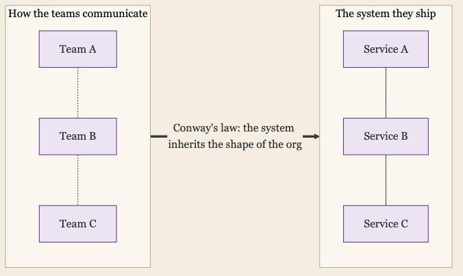
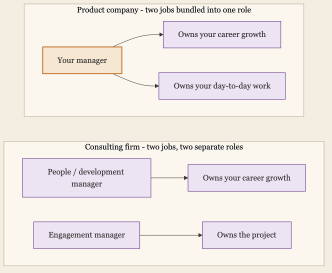
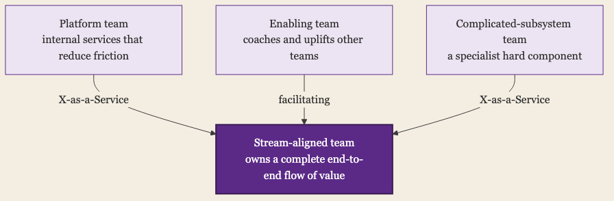
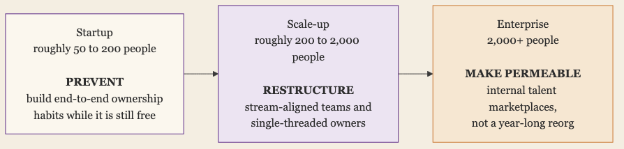

+++
date = '2026-05-23T01:00:00-07:00'
draft = false
title = 'The Org Chart Is Not the Value Stream'
aliases = []
description = "Most companies are organized into vertical silos, and Conway's law stamps that shape straight into the product they ship. The value stream, the path work actually takes to reach a customer, runs sideways across every silo and belongs to no one. The fix is not to break Conway's law or to reorganize, but to aim it and give the value stream an owner."
categories = ['Leadership', 'Engineering']
tags = ['Leadership', 'Engineering Culture', 'Organizational Design', 'Teams', 'AI']
image = 'header.png'
[params]
  author = 'Matt Goodrich'
+++

**Your company has an org chart. It is a precise, carefully negotiated map of who owns what. It is not a map of how anything actually gets done.**

Pull it up and you'll see clean vertical columns. Product and Engineering build the product and run the infrastructure it lives on. IT runs the internal systems the company itself depends on to operate, which is a different job from shipping the product to a customer. Go-to-market sells what gets built. Security sits somewhere in the middle, pulled toward Engineering one week and IT the next. Each column has a leader at the top, and beneath that leader sit directors and managers, each one owning a larger or smaller piece of the same column.

I have spent most of my career in the function that sits in the middle of that picture. From the middle, you see something the chart hides. Trace how a single feature actually reaches a customer and it does not travel down a column. It cuts sideways. It starts in Product, moves through Engineering, touches Security, runs on infrastructure a separate platform team inside Engineering operates, and only becomes revenue when go-to-market can sell and support it. Notice that IT is barely on that path. At a product company, IT runs the company's own internal systems, and the customer value stream mostly runs right past it. The work runs horizontally. The org chart runs vertically. Those are two different shapes, and the company is managed almost entirely around the first one.

## The Product Ships the Org Chart

If the org chart and the real flow of work were merely different shapes, that would be a measurement problem. You could fix it with better dashboards. It is worse than that, because the org chart does not just fail to describe the work. It shapes the work.

In 1968, Melvin Conway observed that any organization designing a system will produce a design whose structure copies the organization's communication structure. Almost sixty years later it has a name, Conway's law, and it has held up better than most things from 1968. It is not a slogan. The mirroring it predicts has been studied and measured, and the mirror is real.

What it means in practice is blunt. If three teams build a compiler, you get a three-pass compiler. If Team A owns Service A and a separate team owns Service B, the seam between those services will fall exactly where the seam between those teams falls, whether or not that is where a seam belongs. The architecture is not chosen on the merits. It is inherited from the org chart.

Amazon is the cleanest example, and it ran in the right direction on purpose. The two-pizza team is the famous version of the story, but the headcount cap was never the point. The point was single-threaded ownership and the near-total removal of cross-team dependencies. Teams were told to talk to each other through hard interfaces instead of meetings. The result, a decade later, was AWS, an architecture made of services with clean boundaries, because it was built by teams with clean boundaries. The org produced the system. It always does.

So when a company complains that its product is a tangle of components nobody can cleanly separate, the honest diagnosis is usually upstream. The product is a tangle because the org is a tangle. The **org chart** and the **value stream**, the actual end-to-end path from idea to delivered value, have drifted apart, and Conway's law guarantees the product will keep coming out shaped like the first one.

## The Value Stream Is an Orphan

Here is the consequence that does the real damage. Every vertical slice of the org chart has an owner. The value stream has none.

Walk down any column and you will find a name on every box. A manager owns a team. A director owns a few teams. A vice president owns the column. Hierarchy, in a product company, is mostly the act of owning a larger version of the same vertical slice. You get promoted by owning more of your column, not by owning more of the horizontal flow that crosses everyone's column.

The flow itself, the path a feature takes from a product idea to a customer who is successfully using it, belongs to nobody. It is an orphan. Pieces of it are owned. The product manager owns the part that lives in their team. The engineering manager owns the building. A platform team owns the infrastructure it runs on. But the whole pie, the complete path, is not on anyone's list of things they are accountable for.

Architects are the usual attempt at a fix, and more and more, staff-plus engineers are expected to do the same: look up from their own slice and make the pieces fit across it. That instinct is right. The most senior individual contributors should be looking well outside their own team. But an architect or a staff-plus engineer asked to span the columns is still a thin horizontal line laid across a very tall set of vertical structures, with real influence but rarely real authority, and the structures usually win. Asking a few senior people to look across ten silos is not the same as making the span someone's actual job.

I see this most clearly from inside security, because security is the function that is forced to live horizontally whether it wants to or not. A vulnerability does not respect the org chart. It starts in code one team wrote, rides a pipeline a second team owns, lands on infrastructure a third team runs, and becomes a contract problem a fourth team has to explain to a customer. Security gets dragged across the whole value stream constantly, and spends an enormous amount of its energy doing the coordination the org chart refused to assign to anyone.

It does not even stop at the edge of the company. The customer runs their own security review before they will buy, so security gets pulled out of the building entirely, onto sales calls, walking prospects through the architecture and the security posture, negotiating the terms that gate the deal. That customer-facing stretch of the job is what I dug into in [a recent post on what the first security hire actually signs up for](/posts/first-security-hire-unicorn-hire/), and it is the same pattern one more time. The span runs from a line of code to a customer's procurement review, no single column owns it, and security gets handed it because it is the function least able to say no. That is not a security problem. It is the shape of the company, and security just happens to be standing where the shape hurts most.

## Consulting Decoupled the Two Jobs

Now look at how a consulting firm is built, because it solved a specific piece of this on purpose.

In a product company, the person who manages your career is almost always the person who runs your work. Your manager sets your goals, owns your review, and also owns the thing you do all day. Those are bundled into one role, and it feels so natural that most people never notice it is a choice.

A consulting firm unbundles it. At a firm like McKinsey, you have a development manager and a more senior development leader in your home office whose job is your career. They own your reviews, your growth, and your advocacy in promotion discussions. They are deliberately not the person running your current project. The project has its own leader, an engagement manager, who is responsible for this deliverable, this client, this quarter.

The separation is not an accident, and it is not just a nicety for the consultant. An engagement manager has every incentive to keep a strong performer on their team and to grade in a way that serves the engagement. A career advocate with no stake in any single project can do things the engagement manager cannot. They can push back on bad staffing. They can see burnout building across a string of projects. They can give honest feedback the project lead would soften. They can carry a coherent story about a person across a dozen short, disconnected engagements. It is a check and balance, and product companies mostly do not have it.

The other half is how the work itself is organized. A consulting project is spun up to deliver a defined outcome end to end. It is staffed from across the firm based on what the work needs, it runs, it delivers, and then it disbands and the people flow to the next thing. The unit of organization is the value stream, not the column. The firm still has columns, the practices and offices and levels, but the columns are not where the work happens. The work happens in teams assembled around outcomes.

## Silos Are Load-Bearing

It would be easy to stop here and say product companies should become consulting firms. That would be wrong, and the rest of this depends on saying so clearly.

Start with the silos themselves. A vertical column is not a failure of imagination. It is a real mechanism. It concentrates expertise, so the people who know the identity system deeply sit together and get better at it. It creates stable ownership, so there is a team that still answers the pager for that service at 2am next year. It builds a career ladder people can actually climb. It gives the company one throat to choke when something breaks. Silos persist because they do real work, and any plan that treats them as pure waste will quietly break the things they were holding up.

The consulting model has its own bill, and it is not small. A consultant delivers a recommendation and leaves. They almost never operate the thing they designed, which means they never feel the slow cost of a decision that looked good in a slide. Nassim Taleb's phrase for the general version of this is skin in the game, and a pure project model is structurally short on it. Knowledge does not compound the way it does in a team that owns something for years, because each engagement is rented insight that walks out the door when the team disbands. Institutional memory stays thin. And the whole model runs on utilization, which means constant pressure to keep people billable and a real cost to anyone sitting on the bench between projects. A pure project organization is good at delivering outcomes and bad at owning them afterward.

There is also the cost of the reorganization itself, and this is the part that should make anyone cautious. McKinsey looked at twenty-five major reorganizations and the results are grim. Roughly eighty percent failed to deliver the value they were supposed to. About sixty percent measurably reduced productivity while they were underway. A typical reorg took around ten months, and output fell during the window. The reorg is not the cure. The reorg is the cost. A company that responds to silo pain by redrawing the chart has usually just bought itself ten months of lower output and a coin flip.

So the answer is not to abolish the columns, and it is not to become a consultancy. The answer has to work with the silos still standing.

## You Don't Break Conway's Law, You Aim It

The framing I started with, breaking Conway's law, is the wrong goal. You cannot break it. It is a description of how organizations and systems relate, and it is about as breakable as gravity. A team that sets out to break Conway's law is going to lose.

What you can do is aim it. If the product will inevitably come out shaped like the org, then the org is a design tool. Decide what architecture and what flow you want, then build the team structure that produces it. This has a name, the inverse Conway maneuver, and it is the single most useful idea in this whole area. You stop fighting the law and start using it.

In practice, aiming Conway's law means organizing teams around the value stream instead of around the technology layers. The clearest articulation of this is Team Topologies, which makes the default team a stream-aligned team: a team that owns a complete slice of end-to-end flow for some product or segment, with enough skills inside it to deliver without constant handoffs. Other teams exist to support that team rather than to compete with it. Platform teams provide internal services that reduce friction. Enabling teams coach. The whole arrangement is built so the stream-aligned team can actually own its stream.

It is worth being honest that this is a design heuristic, not a guaranteed outcome. The cautionary case sits right next to it. The Spotify model, the squads and tribes and chapters that half the industry tried to copy, was never really how Spotify worked. One of its own authors later said it was part ambition and part approximation even when they wrote it down. Companies copied the vocabulary and the diagram and skipped the culture, and mostly got a matrix with worse accountability. Copying the shape of someone else's value stream does not give you yours.

The piece that does travel is smaller and harder to fake. Give the value stream an owner. Amazon calls it a single-threaded leader, one person whose entire job is one end-to-end outcome, with no competing column to also run. You do not need to abolish the vertical columns to do this. You need to add a horizontal role that the columns are measured against, a named person who owns the pie and not a slice, with real authority and not just an architect's influence. The columns stay. What changes is that the flow across them finally has a name on it.

## The Move Is Different at Every Size

None of this is one move. What you should do about silos depends heavily on how big the company already is.

In a small company, roughly 50 to 200 people, the silos are still mostly harmless. There are functions, but everyone still knows everyone, and the coordination happens in hallways and a shared channel. The thing to do here is not structural. It is to notice that this stops working sooner than it feels like it will. Organizations tend to break down somewhere around 150 people, the point where you can no longer hold a real relationship with everyone and informal coordination quietly stops scaling. The cheap and valuable move at this size is to build the habit of owning outcomes end to end while it is still free, before headcount forces real hierarchy. You cannot reorganize your way out of a problem you do not have yet, but you can prevent the silo mentality that makes it worse.

In a scaling company, very roughly 200 to 2,000 people, the silos harden into the orphaned-value-stream problem, and this is where deliberate structure earns its cost. This is the range where stream-aligned teams and single-threaded ownership actually pay for themselves, because the company is large enough that the flow no longer coordinates itself and small enough that you can still change the shape without a year-long reorg. If a company is going to aim Conway's law on purpose, this is the window to do it.

In a large enterprise, several thousand people and up, you usually cannot redraw the chart at all. It is too big, too political, and the reorg tax is too high. So the most effective large companies stopped trying to move the boxes and started moving the people. Internal talent marketplaces are the clearest version. Unilever built one that matched tens of thousands of employees to internal projects and redeployed thousands of people quickly when the pandemic hit. Schneider Electric built its Open Talent Market in part because roughly half of the people who quit were leaving for moves they could have made internally. The telling detail in the Schneider numbers is that short projects and mentoring matches worked far better than full role changes. The win was not abolishing the columns. It was making the walls between them permeable, so a person could flow to where the work was without quitting and being rehired.

The pattern underneath all three is the same. Small companies prevent. Scaling companies restructure. Large companies make the existing structure permeable. The common mistake is applying the wrong size's move, usually a scale-up reorg attempted at enterprise size, where it turns into the ten-month productivity hole.

## AI Doesn't Pick a Side

It is fair to ask whether AI changes any of this, and the honest answer is that it cuts both ways at once.

The optimistic case is real. A lot of what a silo protects against is coordination cost, the expense of one team understanding another team's domain well enough to work across the line. AI lowers that cost. It can translate between domains, summarize what another team is doing, and give one person more reach across unfamiliar territory. There is early evidence of companies flattening management layers as this coordination cost drops. If silos are partly a response to expensive coordination, cheaper coordination should mean you need fewer of them.

The pessimistic case is just as real, and it is the one I would watch. Conway's law applies to AI systems too. When every team builds its own agents and its own tools and its own internal services for those agents to call, they are not bridging the silos. They are encoding them. The org chart gets reproduced one more time, now in software that is harder to see and harder to change. There is already a name for the early version of this, MCP shadow IT, teams standing up their own integrations against sensitive systems with no central view. AI does not break the silos in that story. It pours a faster-setting concrete into the molds that already exist.

So AI is not the answer here. It lowers the cost of any single cross-team interaction, which helps, and it lowers the cost of every team building its own walled garden, which does not. Which of those wins is still an organizational decision, not a technical one.

## What the Chart Leaves Out

The org chart is not going away, and it should not. It is a real map of accountability, expertise, and who owns the pager. The mistake was never having one. The mistake is believing it is the whole picture.

Because there is a second map. The value stream, the path the work actually takes from an idea to a customer who is better off, crosses every column on the org chart. At most companies it is the more important of the two maps, and it is the one nobody owns. Conway's law will keep stamping whichever map is real into the product. Right now, for most product companies, the map being stamped is the org chart, and the value stream is left to security teams, architects, and staff-plus engineers to hold together by force of will.

You do not fix that by breaking Conway's law, or by burning the org chart, or by reorganizing every ten months. You fix it by drawing the second map, saying out loud that it matters, and putting a real name on it. Give the pie an owner. The columns can stay exactly where they are. Someone just has to own the line that runs across them.
