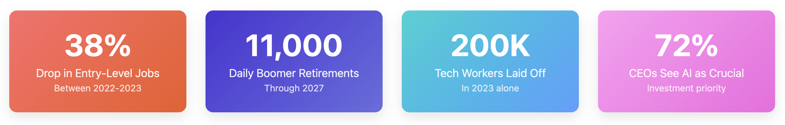
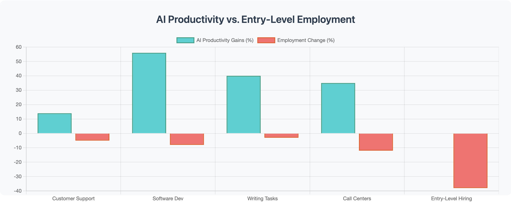
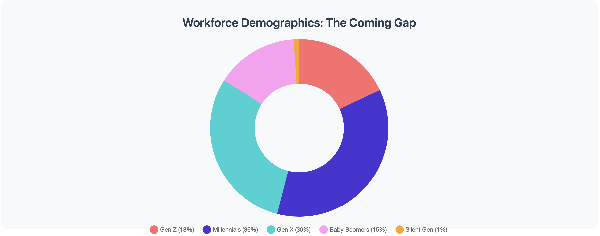

+++
date = '2025-08-27T12:00:00-07:00'
draft = false
title = 'The Perfect Storm: How AI Adoption Collided with Economic Reality to Create a Generational Career Gap'
aliases = []
description = "The convergence of economic downturn, AI adoption, and demographic shifts has created an unprecedented challenge for new graduates entering the job market. Companies using AI to boost productivity of existing workers rather than create new opportunities are inadvertently creating a generational career gap with long-term consequences."
categories = ['Artificial Intelligence', 'Career Development', 'Economic Analysis']
tags = ['AI', 'Artificial Intelligence', 'hiring crisis', 'new graduates', 'entry level jobs', 'job market', 'economic trends', 'workforce planning', 'productivity', 'tech layoffs', 'skills gap', 'workforce demographics', 'career development', 'generational gap']
image = 'header.png'
[params]
  author = 'Matt Goodrich'
+++

I left the Seattle Security Meetup this past week feeling genuinely troubled. Over the course of the evening, I had conversations with several recent graduates who shared remarkably similar stories of rejection, months-long job searches, and a market that seemed to have no place for them.

These conversations got me thinking about the broader forces at play. What I realized is that these new grads aren't just facing normal market fluctuations or typical entry-level competition. They're caught in a perfect storm that has fundamentally altered the employment landscape—particularly for new graduates who find themselves caught in an unprecedented squeeze.

The timing couldn't have been worse. Just as companies were still reeling from the end of the era of free money, grappling with layoffs and belt-tightening measures, artificial intelligence burst onto the corporate scene with a promise that was impossible to ignore: 20% productivity gains from existing resources.

## The Economic Backdrop: From Easy Money to AI Efficiency

The sequence of events reads like a corporate strategy playbook gone wrong. The Federal Reserve's prolonged period of near-zero interest rates from 2008-2015 and again during the pandemic created an environment where capital was essentially free. Companies hired aggressively, expanded rapidly, and invested in growth at any cost.

Then came the correction. As interest rates climbed and economic uncertainty grew, the belt-tightening began. Layoffs swept through the tech sector and beyond. Companies that had been hiring at breakneck speed suddenly found themselves with bloated workforces and pressure to demonstrate efficiency.

Enter AI—not as a tool for expansion, but as a solution for doing more with less.

## The C-Suite Calculation

The pitch to executives was irresistible: artificial intelligence could deliver significant productivity improvements without the overhead of new hires. Why bring on fresh talent when your existing workforce could theoretically handle 20% more work with AI assistance?

This wasn't necessarily wrong in principle. AI tools have indeed shown the ability to augment human capabilities across various roles—from software development to content creation to data analysis. The problem lies not in the technology itself, but in how organizations have chosen to deploy it.

Rather than using AI to enable growth and create new opportunities, many companies have used it as a justification to maintain smaller headcounts while demanding higher output from existing employees.

## The New Graduate Dilemma

For recent graduates, this shift has created a uniquely challenging environment. They're not just competing against other new grads anymore—they're competing against the enhanced productivity of experienced workers armed with AI tools.

The traditional entry-level positions that once served as stepping stones into careers are disappearing. Why hire a junior analyst when your senior analyst can now handle the additional workload with AI assistance? Why bring on an entry-level developer when your existing team can code more efficiently with AI pair programming?

This creates a vicious cycle: new graduates can't gain the experience needed to be competitive, while companies become increasingly reluctant to invest in training when their current workforce is already delivering enhanced results.

## The Looming Skills Gap

Here's where the short-term thinking becomes problematic. While companies are celebrating their current efficiency gains, they're inadvertently creating a significant long-term problem.

Every year, experienced professionals retire. Those who remain get promoted, leaving gaps in the organizational knowledge base. Historically, these gaps were filled by a steady pipeline of junior talent who had been developing their skills and institutional knowledge over several years.

But that pipeline is now severely constricted. The cohort of 2022-2025 graduates—potentially hundreds of thousands of professionals—are finding it exceptionally difficult to gain meaningful work experience. This isn't just an individual tragedy; it's an organizational time bomb.

## The Generational Career Gap

What we're witnessing isn't just a temporary market correction—it's the creation of what could be called a "generational career gap."

In 5-10 years, organizations will likely find themselves with a workforce heavy on senior talent and light on mid-level professionals who should have been developing their skills over the past few years. The institutional knowledge transfer that typically happens gradually through mentorship and career progression will be compressed into crisis-mode knowledge transfer as senior employees retire without adequate succession planning.

## Looking Ahead: The Reckoning

The companies celebrating today's efficiency gains may find themselves scrambling tomorrow to fill critical skill gaps. The cost of emergency hiring, extensive training programs, and consultant fees could far exceed the savings from today's leaner headcounts.

For new graduates, this period represents both a crisis and an opportunity. Those who can find ways to gain experience—through internships, project-based work, or by developing AI-augmented skills independently—may find themselves in high demand as the gap becomes apparent.

The irony is that AI, properly implemented, should be creating new opportunities and roles rather than simply eliminating them. Organizations that recognize this and invest in developing AI-literate junior talent today will likely have a significant competitive advantage in the coming decade.

The perfect storm that created this situation won't last forever. But its effects on careers, organizational capabilities, and economic productivity may be felt for years to come.

## The Data Behind the Perfect Storm
### 1. **Interest Rates and the Hiring Freeze**

- Federal Reserve raised rates 7 times in 2022
- Tech layoffs: 93,000 in 2022 → 200,000 in 2023
- Peak of 585 companies laying off workers in Q1 2023

### 2. **The AI Adoption Rush**

- 65% of orgs using GenAI (doubled in 10 months)
- 72% of US CEOs see it as crucial investment
- Productivity studies showing 8%-66% gains
- The "20%" figure being conservative

### 3. **The Entry-Level Job Crisis**

- 11.2% decrease in entry-level postings (Q1 2021-Q2 2024)
- 38% drop between 2022-2023 specifically
- Computer science: +0.8% for older workers, -8% for recent grads

### 4. **The Demographic Time Bomb**

- 11,000 Baby Boomers retire daily through 2027
- Need 240,000+ hires monthly just to replace retirees
- 14.8 million anticipated retirements over 5 years

### Sources

1. TechTarget, "Tech sector layoffs explained: What you need to know" - [https://www.techtarget.com/whatis/feature/Tech-sector-layoffs-explained-What-you-need-to-know](https://www.techtarget.com/whatis/feature/Tech-sector-layoffs-explained-What-you-need-to-know)
2. Crunchbase News, "Tech Layoffs: US Companies With Job Cuts In 2024 And 2025" - [https://news.crunchbase.com/startups/tech-layoffs/](https://news.crunchbase.com/startups/tech-layoffs/)
3. NerdWallet, "Tech Layoffs in 2025" - [https://www.nerdwallet.com/article/finance/tech-layoffs](https://www.nerdwallet.com/article/finance/tech-layoffs)
4. McKinsey, "The state of AI: Global survey," March 2025 - [https://www.mckinsey.com/capabilities/quantumblack/our-insights/the-state-of-ai](https://www.mckinsey.com/capabilities/quantumblack/our-insights/the-state-of-ai)
5. National University, "131 AI Statistics and Trends for 2024" - [https://www.nu.edu/blog/ai-statistics-trends/](https://www.nu.edu/blog/ai-statistics-trends/)
6. Science, "Experimental evidence on the productivity effects of generative artificial intelligence" - [https://www.science.org/doi/10.1126/science.adh2586](https://www.science.org/doi/10.1126/science.adh2586)
7. NBER, "Measuring the Productivity Impact of Generative AI" - [https://www.nber.org/digest/20236/measuring-productivity-impact-generative-ai](https://www.nber.org/digest/20236/measuring-productivity-impact-generative-ai)
8. Federal Reserve Bank of St. Louis, "AI and Productivity Growth: Evidence from Historical Developments in Other Technologies" - [https://www.stlouisfed.org/on-the-economy/2024/apr/ai-productivity-growth-evidence-historical-development-other-technologies](https://www.stlouisfed.org/on-the-economy/2024/apr/ai-productivity-growth-evidence-historical-development-other-technologies)
9. Aura, "Are Entry-Level Jobs Disappearing? Trends & Solutions," June 2025 - [https://blog.getaura.ai/where-did-all-the-entry-level-jobs-go](https://blog.getaura.ai/where-did-all-the-entry-level-jobs-go)
10. JobTest.org, "Why 2024 might be one of the hardest years for recent college grads to get hired," June 2025 - [https://www.jobtest.org/learn/hiring-projections-for-2024-graduates](https://www.jobtest.org/learn/hiring-projections-for-2024-graduates)
11. Fortune, "New grads struggling to find work in job market," June 2025 - [https://fortune.com/2025/06/12/tough-job-market-new-grads-entry-level-jobs-scarce-stagnation-tariffs-ai/](https://fortune.com/2025/06/12/tough-job-market-new-grads-entry-level-jobs-scarce-stagnation-tariffs-ai/)
12. CNBC, "Baby boomers hit 'peak 65' in 2024. Why retirement age is in question," February 2024 - [https://www.cnbc.com/2024/02/08/baby-boomers-hit-peak-65-in-2024-why-retirement-age-is-in-question.html](https://www.cnbc.com/2024/02/08/baby-boomers-hit-peak-65-in-2024-why-retirement-age-is-in-question.html)
13. Protected Income, "Peak Boomer Retirements Mean Hundreds Of Thousands of Employees Are Leaving The U.S. Labor Force Every Month," August 2024 - [https://www.protectedincome.org/news/labor-day-peak-65-trades-hit-hardest/](https://www.protectedincome.org/news/labor-day-peak-65-trades-hit-hardest/)