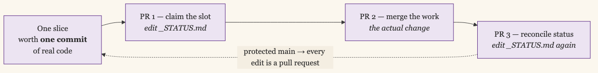

+++
date = '2026-07-20T17:50:01-07:00'
draft = false
title = 'Two Systems for Handing Work to Agents'
aliases = []
description = "I have built two systems for handing work to AI agents. The first kept the queue in the repository as a status file, where every task paid a bookkeeping tax in commits and pull requests. The second moved it to a self-hosted tracker that Claude and Codex poll every 12 minutes, which removed the tax and left the work breakdown as what breaks."
categories = ['Artificial Intelligence', 'Engineering', 'Tools']
tags = ['AI', 'Claude Code', 'Codex', 'Agents', 'Plane', 'Automation', 'Developer Tools', 'Workflow', 'Self-Hosting']
image = 'header.png'
[params]
  author = 'Matt Goodrich'
+++

**Where the queue lives decides what the work costs.** I have built two systems for handing work to AI agents. In the first, the queue lived inside the repository as a markdown file. In the second, it lives in a self-hosted issue tracker that two agent runtimes poll every twelve minutes. The second one is better, and the reason is bookkeeping.

## 639 Slices and a Status File

[security-atlas](https://github.com/mgoodric/security-atlas) is a security program in a box, aimed at early programs that are standing everything up from scratch. I have been building it for the better part of a year, and almost none of it was typed by me.

The unit of work is a **slice**: one tracer-bullet vertical change, specified in a single markdown file at `docs/issues/NNN-slug.md` with acceptance criteria, a threat model, an explicit anti-criteria list of what it will not do, and dependencies on other slices. A local skill, `idea-to-slice`, turns an idea into one of those documents. It reads the constitutional invariants in `CLAUDE.md`, the three most recent slices for current convention, the design canvas, and the recent migrations, then grills the idea against the domain model before it writes anything.

A second prompt, `Plans/prompts/05-parallel-batch.md`, is the orchestration unit: pick up to three conflict-safe slices from the ready set, build each in its own git worktree in parallel, squash-merge each to `main`. A third file, `07-continuous-batch-loop.md`, wraps that in Claude Code's `/loop` in dynamic mode with four guards, so batches keep running unattended until the ready set empties or a guard fires. It is stateless across invocations by design. Restarting it is just running `/loop` again, because all the state lives in git.

The agents ran on the Mac Studio, in the [tmux workspace I wrote about](/posts/my-ai-workspace-tmux-cloudflared/), which means I could check on a batch from a laptop anywhere.

It worked. 1,440 commits. 1,446 pull requests. 639 slice documents filed, 564 of them merged as of the last snapshot. I would file a batch of slices in the evening and read diffs in the morning. Work genuinely flowed through the system.

The problem was what each piece of work had to do on its way through.

## The Bookkeeping Tax

`docs/issues/_STATUS.md` was the queue and the ledger at the same time. It listed every slice and its state: ready, not-ready, in-progress, in-review, merged. To claim a slice, an agent edited that file. To finish one, it edited that file again. Both edits were commits, and because `main` was protected, both commits were pull requests.

So a slice worth one commit of real code cost three PRs: claim the slot, merge the work, reconcile the status. Multiply that by three slices running in parallel and the file becomes the contention point. Two agents claiming slices at the same moment touch the same lines of the same file, and one of them rebases. A measurable share of the system's throughput went into writing down what the system was doing.

I called it a status file. It behaved like a lock.



Slice 741 killed it. `_STATUS.md` became a generated artifact, projected from git history plus an append-only event log at `docs/issues/_events.jsonl`:

```bash
just ready                          # filed, unmerged, not in-flight, unblocked
just status                         # regenerate _STATUS.md from git + events
just event 742 not-ready "dep 700"  # append an event, don't edit the file
```

Pushing a `feat/NNN-…` branch claims a slice. Merging its PR completes it. Neither fact needs to be written down anywhere, because both are already in git. The `chore(status)` pull requests went away.

Even that fix has a rough edge worth naming. The plan was for CI to regenerate `_STATUS.md` and push it on every merge to `main`. A GitHub Actions `GITHUB_TOKEN` cannot push to a protected `main` on a personal repo, so the committed copy is regenerated on demand and allowed to lag. It is non-gating now, which is survivable precisely because git is the truth and the file is only a view of it.

The fix was right and it taught me something I did not want to hear. Deriving the ledger instead of authoring it is a workaround for the real issue: the queue was in the repository, and a repository is a bad place to keep a queue. Every state transition costs a commit. Every commit costs a review. Git is built for durable, reviewable, permanent change, which is the exact opposite of what a mutable to-do list needs.

## Plane Instead of Linear

I got the pattern from [Nate B. Jones](https://unlock-ai.natebjones.com/open-engine). His Open Engine puts the queue in Linear. Agent runtimes poll an issue tracker, claim an issue, do the work, and post receipts back as comments. The tracker becomes the coordination substrate and the repository goes back to being only a repository.

I did not want another paid SaaS subscription. [Plane](https://plane.so) is a self-hostable tracker with a REST API, so mine runs in a container on the Unraid box under a local DNS name, reachable [over the tailnet](/posts/collapsing-a-pile-of-tunnels-onto-tailscale/) and costing nothing. Everything else in Nate's pattern survives the swap.

## Two Runtimes, Twelve Minutes, One Task Per Fire

The engine is a Plane project called OPENENGINE running a seven-state machine. The states the runners key on:

```
Agent Todo → Agent Working → Agent Needs Input | Agent Review → Agent Done
```


An issue is addressed to a runtime by a bracket in its title and routed by an `agent-instructions` label. Two runtimes poll for it:

- **`matt-claude`** — Claude Code, every 12 minutes
- **`matt-codex`** — OpenAI Codex, every 12 minutes

Both are macOS launchd jobs running shell scripts that shell out to `claude --print` or `codex exec` with an XML prompt. The prompt is the loop, and it is explicit to the point of tedium, because a scheduled fire is a fresh session with no inherited context:

```xml
<order>
  <step>This runtime's agent code is `matt-claude`.</step>
  <step>Open the status ledger issue and find this agent's AGENT STATUS
    comment. Its id is b54e11dd-…. NEVER POST a new comment — always
    PATCH this exact id.</step>
  …
</order>
```

The rule that makes the whole thing tractable is Nate's: **one task per fire.** A runner claims exactly one Open Engine issue (OE) per tick, works it, posts a receipt, and exits. It never tries to drain the queue. Each fire gets its own git worktree, so two runtimes working two issues never see each other's files.

The support cast turned out to matter more than I expected:

| Script | Cadence | What it does | Why it exists |
|---|---|---|---|
| `heartbeat-watchdog.sh` | 15 min | macOS alert when a runner's heartbeat goes stale past 30 minutes | A launchd job can stop firing silently — a crash, a hung `claude` call, an API outage — and nothing else tells you the queue quit draining. This is the only thing that notices the loop is dead. |
| `pr-merge-reconciler.sh` | 15 min | Advances an OE to `Agent Done` when its PR merged outside the loop, flags closed-unmerged PRs, never touches `Agent Working` | PRs get merged by hand outside the loop, which leaves the ledger claiming work is still in flight that git already finished. Without reconciliation those OEs sit in limbo and the board stops reflecting reality. |
| `refresh-pat.sh` | manual | Re-caches the Plane PAT out of 1Password to `~/.config/openengine/plane-pat` at mode `0600` | The token rotates, and when it does every runner fails auth on its next fire. Sourcing it from 1Password keeps the secret out of the scripts and turns a rotation into one command instead of an edit across every job. |

## Three Issues Per Feature

A feature that actually ships lands as three OEs, chained parent to child:

| Stage | Runtime | Output |
|---|---|---|
| Implementation | `matt-codex` | Code in a worktree, an open PR, and a child OE for review |
| Review and merge | `matt-claude` | Merged PR, deleted branch, removed worktree, and a child OE for deploy |
| Deploy | `matt-claude` | New container running, `/health` returning 200 |


The runtime split is convention, not enforcement. Codex is better at hands-on file editing inside a worktree with broad system access. Claude is better at reading a diff, running the tests, and orchestrating a multi-step deploy with careful boundary checks. Either runtime could do either stage. Keeping the convention means each queue stays unambiguous and I can tell at a glance who is holding what.

Three stages is three fires and three `AGENT DONE` receipts. The first product to go the whole way through was my notification hub — a small service that takes events from my agents and scripts and turns them into spoken and pushed notifications. Codex implemented it, Claude reviewed and merged it, and it deployed to Unraid as a container with a passing health check.

## The CLI, the MCP, and the Sharp Edges of the Plane API

Talking to Plane from a shell script with `curl` cost me more time than any other part of this, and none of it for interesting reasons. The API has a set of traps:

- Control characters arrive unescaped inside JSON responses, so `jq` chokes on a valid-looking payload
- The pagination field that reports whether there is a next page will lie to you
- Server-side filters are accepted and then silently ignored, so you get everything back and think you filtered
- An apostrophe in an issue title returns a 400
- There is a per-token rate limit that nothing documents

I encoded those workarounds once, in [`plane-client`](https://github.com/mgoodric/plane-client): a Python client, a CLI, and an MCP server. Standard library only, no `requests`, nothing to audit but the code in the repo. The MCP server is what lets any Claude session read and write the engine directly, with `plane_list`, `plane_get`, `plane_create`, `plane_comment`, and `plane_set_state`, instead of shelling out to `curl` and rediscovering the traps. It is public because the sharp edges are not specific to me.

Two Claude Code skills sit on top of it. [`to-engine`](https://github.com/mgoodric/plane-client/blob/main/docs/open-engine/to-engine.md) files a single OE with the right title bracket, the `agent-instructions` label, and the nine-section body the runners know how to parse. [`break-to-engine`](https://github.com/mgoodric/plane-client/blob/main/docs/open-engine/break-to-engine.md) takes a feature or a spec and cuts it into a set of OEs the loop can actually ship. Both are published, lightly redacted, alongside the `plane-client` code.

That second skill exists because of one specific bad week.

## Six Issues That Did Not Cohere

On 3 July I broke four features into OEs and let the loop run: Meross energy monitoring (whole-panel power data from a monitor in my breaker box, aggregated into Grafana), a web front end for the notification hub, Plaid onboarding (bank-account linking for Tend, my home-management tool meant to replace Quicken and YNAB), and voice fan-out (ElevenLabs speaking notifications aloud on my machines to pull my attention back to a waiting Claude session). I sliced them the way you would break down a sprint. One issue per file. One issue per layer.

Meross became six issues. A migration. A config module. A collector. A schedule. A health check. A dashboard.

Every one of them completed. Every one reported implementation complete. The feature was non-functional at the first database write, because **the migration OE and the collector OE had diverged on column names.** No per-slice test caught it and no per-slice test could have, because the contract was split across two issues and each side was internally consistent with itself.

That was the cheapest of the four failures.

- Slices that depended on each other said so in prose ("requeue after OE-183") instead of in Plane's `parent` field, so the runner's dependency-gating never saw the edge and the issues piled up in `Agent Needs Input` waiting for a human to notice.
- One OE was sized too large, its fire timed out, and it fail-looped. That is OE-200, and it is why there is now a circuit breaker.
- A boilerplate boundary I had been pasting into every issue, "do not push, do not open a PR," stranded **17 finished items** in `Agent Needs Input` with their work done and nowhere to go.
- One epic left a 47-commit runaway branch behind.

The loop executed correctly through all of it. The runners claimed, worked, and reported exactly as designed. The breakdown was what failed, and nothing in the system could have told me so.

## The Five Rules

`break-to-engine` is those failures turned into rules.

1. **Vertical slices, not horizontal steps.** A slice is one independently shippable, end-to-end-verifiable change. If it cannot merge and be verified on its own, it is not a slice. Fold it into the one it completes.
2. **Keep a contract inside one slice.** A schema and the code that writes it. An API and its first caller. A config field and the code that reads it. Never across two OEs. This is the load-bearing rule and it is the one Meross broke.
3. **Right-size for a single fire.** Roughly 20 minutes of walltime. Too big and it times out. Too small and it floods the queue and multiplies integration seams.
4. **Structure the dependencies, do not narrate them.** If B needs A merged first, set B's `parent` to A's UUID. The runner gates on the field. It cannot gate on a sentence.
5. **Risk-scoped boundaries, integration-test acceptance.** Boundaries come from a risk tier in [`docs/AUTONOMY.md`](https://github.com/mgoodric/plane-client/blob/main/docs/open-engine/AUTONOMY.md), never a blanket prohibition. Acceptance criteria require end-to-end verification against the real interface, because the mocked-database unit test is exactly what let the schema break through.

The sizing heuristic that does the most work: if you are writing more than about six OEs for one feature, you are slicing horizontally. Stop and re-cut.

## What Each System Is Actually Good At

I did not throw the slice system away, and I am not going to.


| | Slices and `/loop` | Open Engine |
|---|---|---|
| Where the queue lives | In the repo: `docs/issues/`, git, events | Outside it, in Plane |
| Scope | One repository | Any repo, any machine, plus ops and deploys |
| Cost of a state change | A commit, sometimes a PR | One API call |
| Parallelism | Up to 3 conflict-safe slices per batch, in worktrees | One task per fire, per runtime |
| Runs when | I start a loop | Every 12 minutes, whether I am there or not |
| Audit trail | Git history, which is the best audit trail there is | Plane comments, which are receipts |
| Fails at | Bookkeeping overhead and file contention | Bad work breakdown, silently |
| Infrastructure to maintain | Nothing beyond the repo | Self-hosted Plane, 2 launchd runners, a watchdog, a reconciler |

The slice system is still the better fit inside a single deep codebase with a long dependency chain, because the queue and the code live in the same place and a slice can point at another slice's merge commit. The parallel-batch pattern, three conflict-safe slices at once in three worktrees, is genuinely faster than one task per fire when the ready set is deep.

Open Engine wins the moment work crosses a boundary. Deploy a container to Unraid. Fix a script on a different machine. File a follow-on issue against a different repo. None of that fits in a slice document and all of it fits in an issue. It also wins on the thing I actually cared about: it runs whether I am at the keyboard or not, and moving an item costs one API call rather than a pull request.

Its cost is real and I should name it. I now maintain a self-hosted Plane instance, two launchd runners, a heartbeat watchdog, a PR-merge reconciler, and a PAT cached out of 1Password. When that breaks, no agent fixes it for me. It also took a couple of months of reading receipts before I trusted the runners enough to let them push, merge, and deploy on their own. Nothing about the architecture produced that trust. Watching it be right, over and over, is what produced it.

## The Bottleneck Moved

The loop is not the hard part anymore. Two runtimes polling a tracker every twelve minutes, each doing one task per fire in its own worktree, is a solved problem I have stopped thinking about. The heartbeat tells me if it stops.

What I think about now is the cut. Whether a schema and its writer are in the same issue. Whether a dependency lives in the `parent` field or only in a sentence. Whether an acceptance criterion checks the real interface or a mock. Those decide whether the work coming out the other side does anything, and none of them are automatable yet.

I used to spend my time maintaining the queue. Now I spend it deciding what goes in it. That is a much better problem to have.
