+++
date = '2026-02-21T10:00:00-03:00'
draft = false
title = 'Ushuaia & Tierra del Fuego'
description = "A day exploring Tierra del Fuego National Park from the southernmost city in the world. Patagonia cruise stop in Ushuaia, Argentina."
categories = ['Photography']
tags = ['argentina', 'ushuaia', 'tierra-del-fuego', 'south-america', 'travel', 'photography', 'cruise', 'patagonia', 'national-park', 'landscape']
image = 'DSC02890-HDR-optimised.jpg'
[params]
  author = 'Matt Goodrich'
+++

Ushuaia — the southernmost city in the world, and our gateway to Tierra del Fuego National Park. Snow-capped mountains, sub-Antarctic forests, and the end-of-the-world feeling that Patagonia is known for.

<!--more-->

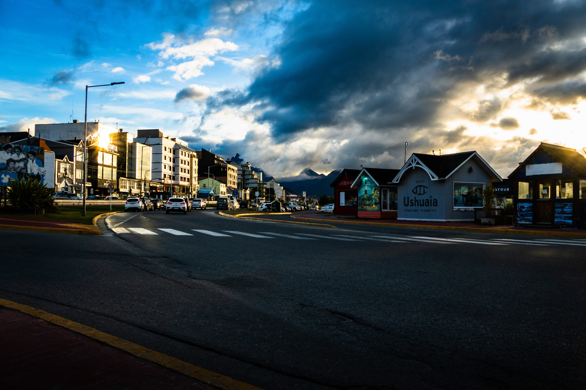 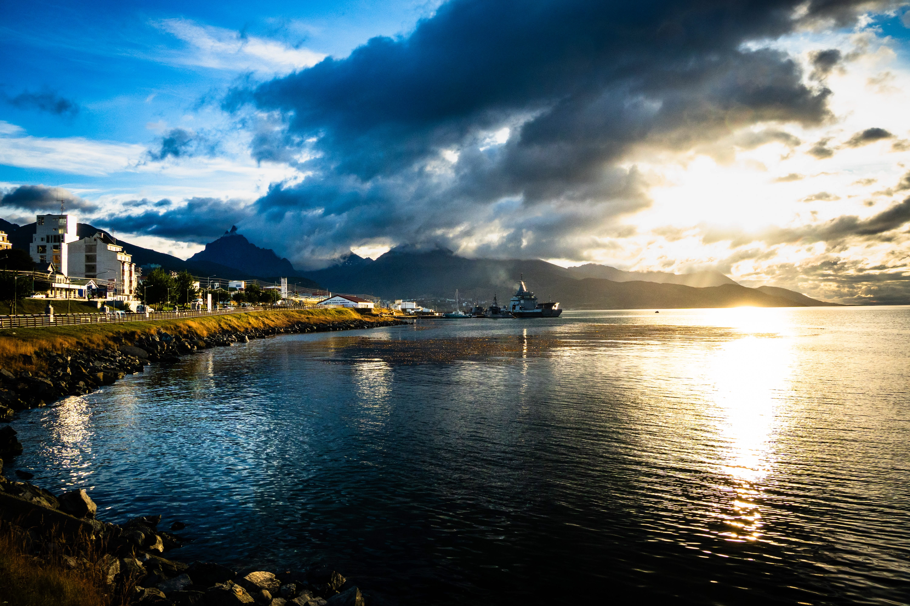
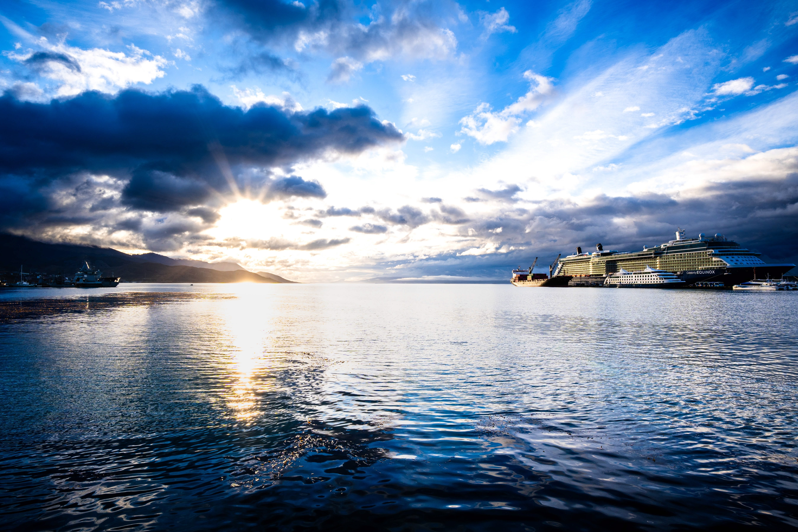 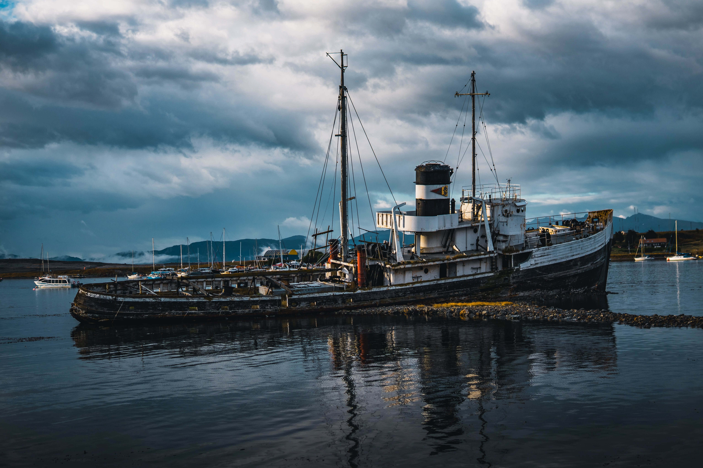
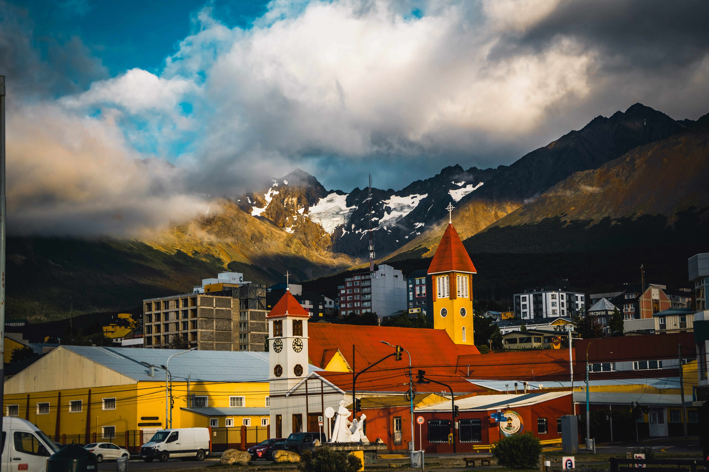 
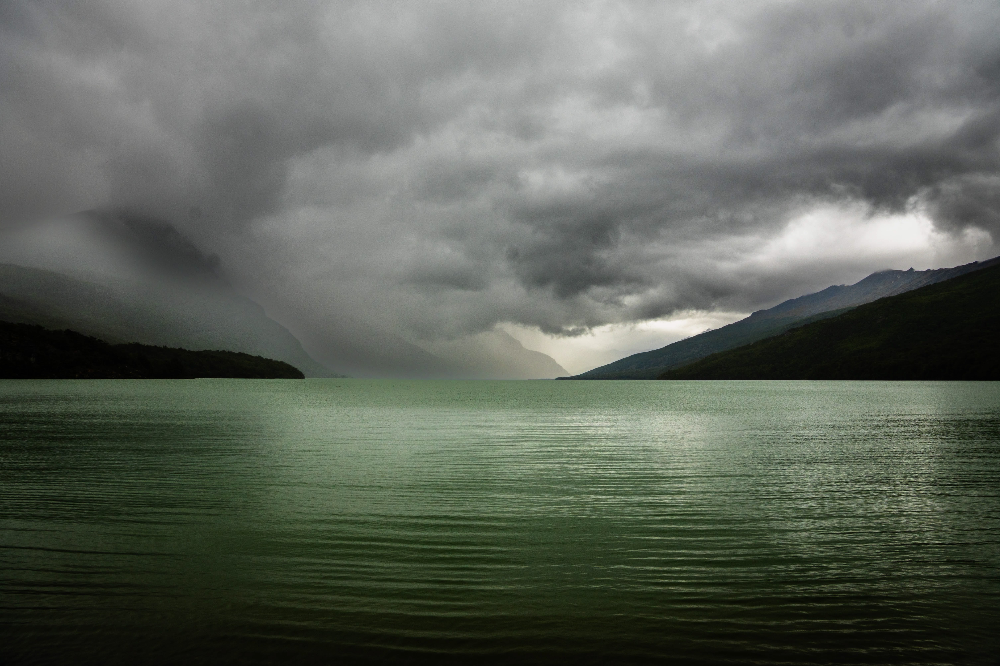 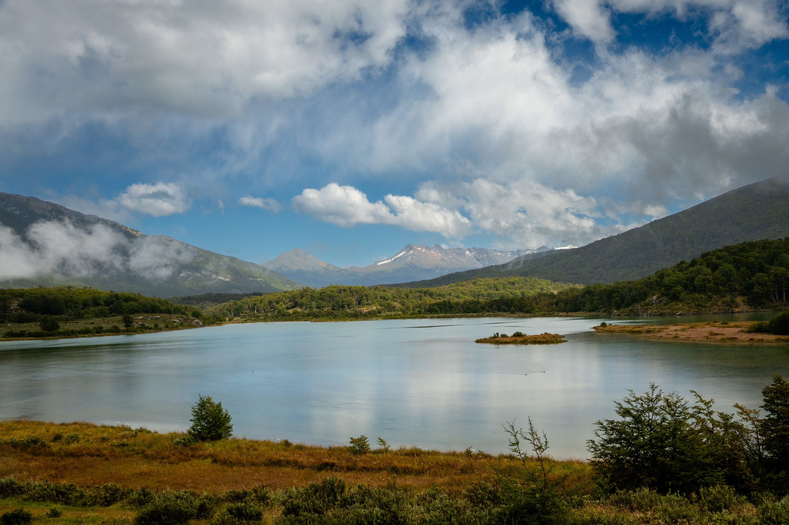
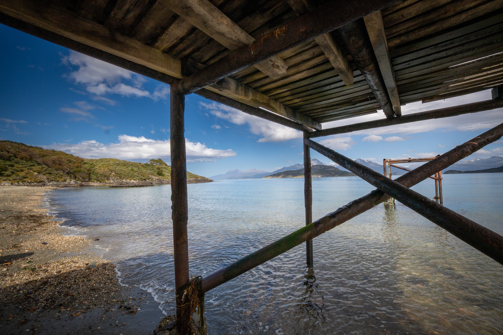 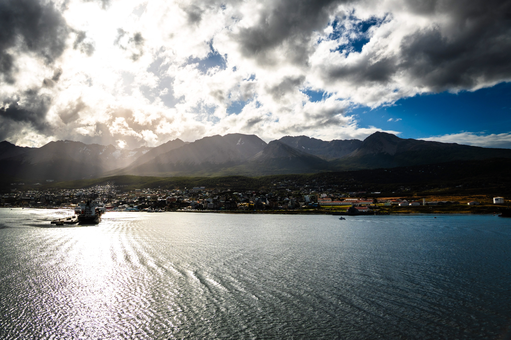
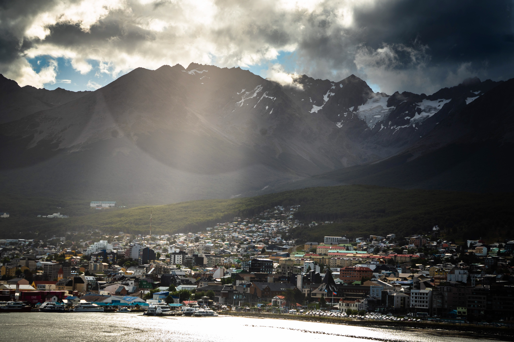 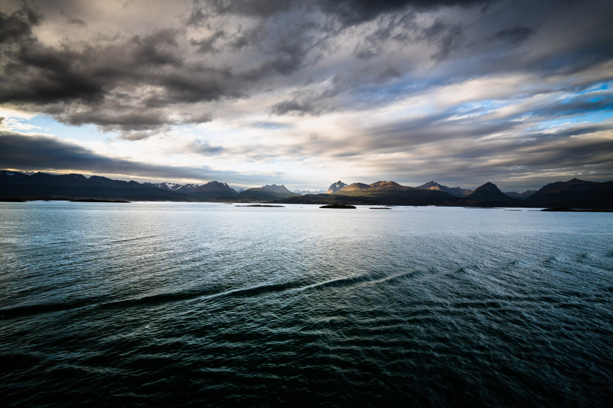
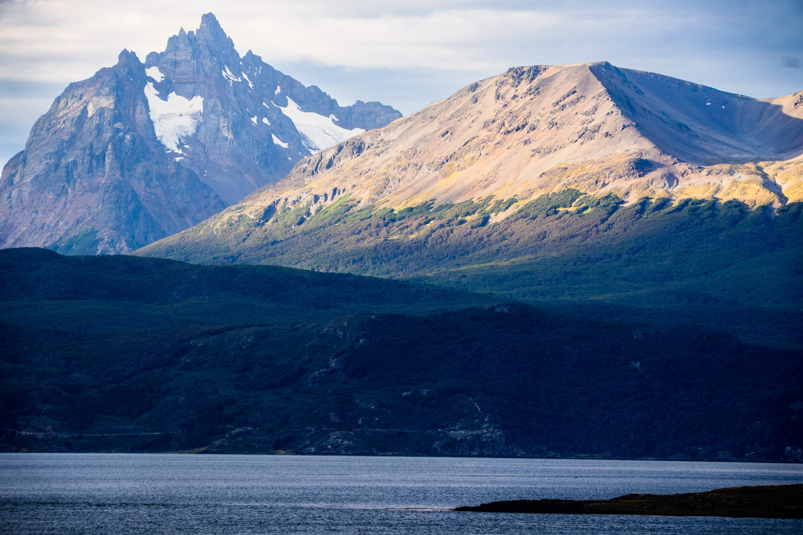
