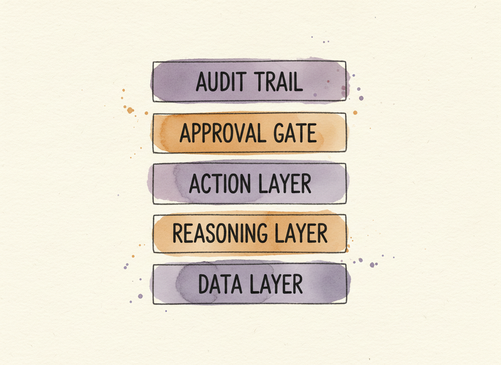

+++
date = '2026-05-31T12:00:00-07:00'
draft = true
title = 'What Compliance Work Belongs to the Agent'
aliases = []
description = "The same shape that makes AI useful for access reviews extends to firewall rule cleanup, certificate rotations, vulnerability triage, and a long list of other recurring compliance work. The criteria are simple: the task happens on a schedule, it produces evidence, and the action it proposes is bounded. Here's how to build the agents and the guardrails that keep them honest."
categories = ['Security', 'AI', 'Engineering']
tags = ['Security', 'AI', 'AI Agents', 'Compliance', 'GRC', 'CISO', 'Automation', 'Security Operations']
image = 'header.png'
[params]
  author = 'Matt Goodrich'
+++

**The shape that made AI useful for access reviews fits a lot of other compliance work too.**

The [access-reviews post](/posts/telemetry-driven-access-reviews/) made a narrow argument: a manager who hasn't touched a kubectl command in two years cannot review access better than telemetry can, and an AI agent can take the volume and the evidence-packaging while a human signs the decision and stays accountable. That pattern is not specific to access reviews. It fits a long list of recurring compliance and security work, and there is a useful test for telling which tasks belong on the list and which do not.

The test has three parts.

## Three Properties of an Agent-Suitable Task

**First, the work is recurring.** It happens on a schedule the calendar already knows about, or in response to a stream of events the system already produces. The annual SOC 2 cycle. The monthly vulnerability scan. The daily DLP queue. Every deal that triggers a security questionnaire. An agent that has to be invoked manually for every run is barely an agent; an agent that has a steady stream of input is doing real work.

**Second, the work is evidence-shaped.** It produces an artifact that a real downstream consumer wants: an auditor, a customer's security team, a regulator, a stakeholder inside the company. The output has a known shape, with sections, fields, and formats. "A SOC 2 evidence package." "A response to a customer questionnaire." "A triaged alert with rationale." The clearer the shape of the output, the more an agent can compress and produce, because retrieval and structured generation are good at exactly this.

**Third, the action the agent proposes is bounded.** Whatever the agent recommends, it picks from a [small set of possible moves](/posts/agents-need-capabilities-not-roles/): approve, escalate, deny, draft, file, tag, route. The set is closed, defined in advance, and small enough that you can write down what each one means and what guardrail applies to each. If the agent's job is to come up with novel actions, you do not have an agentic task. You have a research task with an agent label on it.

Three properties: recurring, evidence-shaped, bounded action. If a piece of compliance work has all three, an agent can take it. If it is missing one of them, leave it to humans, or to classical automation, or to the trash.

## Where the Pattern Already Works

Take that test through some real compliance and security work that is shipping today, and the candidates sort themselves into two piles. Some pieces of work were always agentic-shaped, and the industry has built real agents for them. Others were sold as "AI agents" but turn out to be classical automation with a chat box added on the front. The pile that matters is the first one.

**Customer security questionnaires** are the cleanest case. A prospect's security team sends a three-hundred-row spreadsheet. The work is recurring (every enterprise deal triggers one), evidence-shaped (the output is a populated row-by-row response with citations to the company's controls), and bounded (each cell takes one of a small number of moves: answer from the knowledge base, escalate to an SME, mark as out of scope). Vanta, Drata, Conveyor, and Whistic all ship agents for this. Conveyor's "Sue" claims around 95% accuracy and around 90% autonomous fill. The headline number deserves skepticism, but the pattern works because the shape of the work makes it possible.

**Vulnerability triage and prioritization** is the next clean case. A continuous scanner produces thousands of findings; the work is to figure out which ones matter, in what order, against what context. Wiz's SAST Triage AI Agent reads the finding plus the runtime context plus the identity graph and produces a prioritized list with rationale. Tenable's ExposureAI surfaces "toxic risk combinations" the same way after its Vulcan Cyber acquisition. The agent does the reachability reasoning a person could do but does not have time for; the security engineer accepts the prioritized list and signs the remediation tickets that flow from it. Three-property test cleanly passed.

**DLP and alert triage** is the operational mirror. Every day produces a queue of DLP or detection alerts. The queue is too big for a human to read end-to-end (recurring stream); each alert needs a triage decision (evidence-shaped); the decision is one of a small set (true positive escalate, false positive close, related to incident X, needs human). Microsoft Purview's Data Security Triage Agent, the Phishing Triage Agent in Defender, and CrowdStrike's Charlotte AI Detection Triage all do this. They rank the queue, write a justification per alert, and the analyst still adjudicates the ones that need adjudicating. The volume that used to crush a team becomes a sorted list with the work already half done.

**Cloud configuration drift and remediation** is the slightly more autonomous case. The agent watches the cloud posture (recurring stream of state changes), produces a finding with proposed remediation (evidence-shaped), and the action is one of a small set (open a ticket, suggest a fix, revoke a credential, quarantine a workload, do nothing). Sysdig's Sage is the closest to genuinely autonomous in this set. It can execute remediation when policy allows, and present for review when policy doesn't. Cisco Hypershield tests proposed firewall changes in a dual data-plane shadow before letting a human approve promotion. Both are still recommend-or-stage by default. The human stays in the loop.

Four different domains, same shape. The agent does the volume work and produces an artifact a person or system can act on. The person on the other end keeps the accountability.

## Where the Pattern Doesn't

It is worth being specific about what does not pass the test, because the market is loudly selling agents in these spaces too.

**Vendor risk scoring** fails the bounded-action property at the front. BitSight, Black Kite, SecurityScorecard, and adjacent ratings products consume external signals about a vendor and produce a number. There is no agentic decision in the loop. Reading the number is research; acting on it is a human procurement decision. Calling the rating engine an "AI agent" adds nothing the existing platform did not already do.

**Regulatory horizon scanning** fails the same property at the output stage. OneTrust DataGuidance's Copilot lets a privacy lawyer ask questions over the regulatory corpus. That is high-value retrieval-augmented chat, and it is genuinely useful, but the action it proposes is "read this answer." There is no bounded action that flows downstream.

**Firewall rule cleanup** fails the test in a more interesting way. The work is recurring (ongoing posture review) and evidence-shaped (the report flags shadow rules, unused rules, overly broad rules). But the actual recommended action is so well understood and so deterministic that classical NSPM tools (AlgoSec, Tufin, Skybox) have solved it for years without anything that deserves the name "agent." Adding a chat box to the report does not make the report an agent. This is a domain where "AI agent" branding is mostly marketing.

**The exception is the telemetry-driven slice.** Reading firewall logs to find which rules have not been hit in ninety days, which are still load-bearing for one infrequent business case, and which look dead but are required by an upstream compliance contract is the [access-reviews pattern](/posts/telemetry-driven-access-reviews/) applied to firewalls. That slice does fit the three-property test, and it is where an agent earns its place. The same NSPM vendors are now layering usage telemetry into their products; the boundary between "classical" and "agentic" on firewalls is shifting.

**Certificate lifecycle and rotation** is the inverse failure: the action is so bounded that classical automation does it perfectly. Renew, deploy, rotate, revoke. The decisions are deterministic and well served by automation that has been in production for a decade. Venafi, DigiCert, AWS Private CA, and HashiCorp Vault have automated this for years. The "agent" framing adds nothing because no judgment call exists to add it to. This is plumbing, and plumbing does not need an agent.

The general rule is that an agent earns its place between deterministic automation and human judgment. If the deterministic version works, ship that. If only judgment will do, ship a human. The agent fits in the middle, where the work is bounded enough to be safe but ambiguous enough to need a model in the loop.

## Building One Without Building the Whole Stack

Once you know the work fits the test, the architecture is less surprising than the marketing makes it sound. Five layers, none of which are new. Reading from the foundation up:

A **data layer**. The agent reads from the systems of record that produced the work in the first place. Telemetry, evidence repositories, the customer's previous questionnaire responses, the policy library, the asset inventory. Most security teams already have most of this; the agent reads it the same way a human would.

A **reasoning layer**. The model, with retrieval against a curated corpus. For a compliance task the corpus is your control language, your prior decisions, your evidence templates. Curate it deliberately. The corpus is the agent.

An **action layer**. The bounded set of moves the agent can take on its output. Approve, escalate, draft, route, file. Every move has a name, a guardrail, and a logging shape. The move set is what makes this an agent rather than a chatbot.

An **approval gate**. The default is that a named human signs every consequential action. Exceptions to the default are explicit, written, and bounded by policy. Reversible auto-actions for trivial cases are fine. Irreversible auto-actions are almost never fine.

An **audit trail**. Every decision logged with what the agent recommended, what executed, and the reasoning behind both. The trail is the evidence packet a future auditor will look at. It is also the eval set you will use to grade the agent's drift.

The shape is the same shape as the [overlay post](/posts/security-is-an-overlay-not-a-column/)'s **program** mode: a horizontal capability that runs across the streams it serves, evaluated as a unified system, with humans on the consequential decisions. The specialized agent is a program instrumented to act.

## Guardrails Are the Whole Job

The architecture is the easy part. The guardrails are what separate an agent you can put in front of an auditor from one you have to apologize for in a postmortem.

**Bounded action set.** The agent can only do what is on the list. The list is short, named, and reviewed. There is no path for the agent to invent a new action.

**Human gate by default.** A named human approves the consequential output. The exceptions are written down: which actions are reversible enough to auto-execute, which fail-safe to recommend-only, which require two approvers. The default is approval, not autonomy.

**Cost and rate limits.** Per-task cost cap. Per-day action cap. The agent cannot run a thousand operations in an hour because the model decided to retry. Google SecOps explicitly caps its triage agent at five automatic investigations per hour, and that is the right kind of limit, not a bug.

**Reversibility on irreversibility.** Any operation classified as irreversible (delete, revoke, send-to-customer, post-publicly) escalates to a human regardless of confidence. The agent cannot grade its own confidence into letting itself delete production data.

**Auditable reasoning.** Every recommendation arrives with its rationale and its sources. Not "the model said so." Each cited control, each retrieved evidence item, each prior precedent that informed the call. The reasoning is the substrate the human reviewer uses to actually review.

**Drift detection.** Periodic re-evaluation against a held-out eval set, with thresholds that demote the agent automatically when its output drifts. If the agent that classified DLP alerts at 92% accuracy in Q1 is at 78% in Q3 against the same eval, you find out from the system, not from the next audit.

**Identity boundary.** The agent has its own [service identity, scoped to the systems it needs to read and the actions it is allowed to take](/posts/agents-need-capabilities-not-roles/). Not the invoking human's identity, not a broad role. When the agent acts, the action is attributable to the agent, not borrowed from a person.

**Kill switch.** A documented, tested path to halt the agent in seconds. Not "restart the service." Halt, the way you would yank a junior employee out of the room when they are about to make a wrong call.

[None of those guardrails are AI-specific](/posts/ai-governance-existing-controls-identity-guardrails/). Every single one is what a mature security team would expect for any [privileged service account](/posts/service-accounts-that-improvise/) running in production. The difference is that an agent's outputs are model-generated and the controls have to be written before the model is in the room, not after the model has surprised you.

## Where This Fails

I want to be honest about what the pattern does not solve, because the same agents that pass the three-property test are also the agents that have failed in public.

**Hallucination is not theoretical.** A 2024 Stanford study of domain-tuned legal RAG products (Lexis+ AI, Westlaw AI, Ask Practical Law) measured hallucination rates of seventeen to thirty-three percent despite the corpora being narrow and curated. Compliance RAG is not better than legal RAG. Conveyor's headline 95% accuracy for security questionnaires sits inside that uncertainty band. The right posture is to treat the agent's output as evidence to be reviewed, not as evidence of correctness.

**Confidence does not track accuracy.** An MIT study found that models use 34% more confident language when wrong than when correct. An agent that says "this DLP alert is a false positive, confidence 0.95" is not necessarily more reliable than one that hedges. Confidence numbers are useful as triage signal, not as decision criteria.

**Volume creates rubber stamp.** The same risk that broke the quarterly access review, five hundred tuples in thirty minutes at three seconds per item, breaks the human reviewer of an agent that produces fifty candidate decisions a day. If the human's job is to click "approve" on the agent's recommendations, the human is a rubber stamp, not an oversight layer. The fix is to constrain the agent's output volume, not to assume the human will scale.

**Real-world failures are real.** A 2025 internal incident at Meta saw an agent hallucinate permission scopes and surface restricted data for about forty minutes before the system was suspended. That is the failure case for an agent with real-world authority. It is also the case where every guardrail in the previous section gets exercised at once, and most organizations have not built every one of them.

The pattern is not "agents replace the work." The pattern is "agents do the volume and the evidence work; humans keep the accountability." Anyone selling the first version is selling an outcome the auditor will not accept and the postmortem will indict.

## The Test, on a Page

The check is short enough to fit on a sticky note.

Is the work recurring? Does it produce a known-shaped artifact? Is the action it proposes bounded to a small named set? If all three, an agent can take it. If only two, an agent might help with the parts that fit; the rest stays human. If only one, an agent is the wrong tool, and the marketing is selling you something else.

And then, before any of it goes into production: the guardrails. Bounded action set. Approval gate. Cost cap. Reversibility on irreversibility. Auditable reasoning. Drift detection. Identity boundary. Kill switch. None of those are AI-specific. All of them have to be in place before the agent runs.

The compliance work that fits this test is the work that should belong to the agent. Whatever the vendor calls the rest of it, leave to the humans, the auditors, and the deterministic plumbing that has been doing the job correctly for twenty years.
