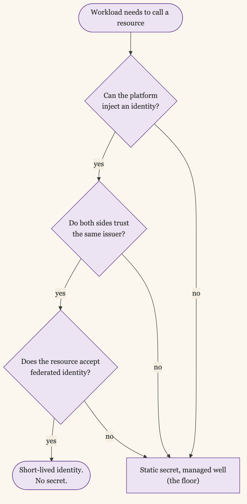

+++
date = '2026-06-09T12:00:00-07:00'
draft = false
title = 'When You Can Actually Use Workload Identity'
aliases = []
description = "Workload identity is the goal: no static secrets, short-lived credentials, identity the platform vouches for. But you can't flip to it everywhere at once. Here's what has to be true before a workload can drop its secrets, and what to do about the systems that aren't there yet."
categories = ['Security', 'Engineering']
tags = ['Security', 'IAM', 'Workload Identity', 'SPIFFE', 'Secrets Management', 'Identity', 'Cloud Security', 'CISO']
image = 'header.png'
[params]
  author = 'Matt Goodrich'
+++

The pitch for workload identity is clean. Your service proves who it is with a credential the platform issues and rotates, instead of a long-lived secret you stored, shipped, and hope nobody leaked. No API key in an environment variable. No password in a vault that something still has to read. Just an identity the infrastructure vouches for, valid for minutes, scoped to one job.

It is the right end state. The catch is that you cannot flip every workload to it at once, and the reason is not laziness. Workload identity has preconditions, and a lot of systems do not meet them yet.

I have argued before that for AI tooling, secrets belong in a scoped vault and the real ceiling is workload identity: [the floor, not the ceiling](/posts/1password-service-account-claude-secrets/). This post is about how you actually climb from one to the other, and where the climb stops.

## What Workload Identity Actually Requires

Three things have to be true, all three, before a workload can drop its secret.

**A trusted issuer both sides accept.** The workload gets a token from an identity provider: the cloud's metadata service, a [SPIFFE/SPIRE](https://spiffe.io/) deployment, an OIDC issuer. The resource it is calling has to trust that issuer. Inside one cloud this is a given. Across a boundary, the far side has to be configured to accept your issuer, and many cannot.

**A platform that can inject identity.** The runtime has to hand the workload its identity automatically: an instance profile, a Kubernetes service account bound to a cloud role (IAM Roles for Service Accounts, or IRSA, on EKS; Workload Identity on GKE), a managed identity on Azure. If the workload runs somewhere that cannot inject identity, there is nothing to present.

**A resource that accepts federated identity instead of a key.** The thing being called has to support authenticating an identity rather than checking a static secret. Your own services and the major cloud APIs do. A great many third-party SaaS products, and most legacy systems, only know how to check an API key.

When all three line up, the secret disappears. When any one is missing, you are still holding a credential, and the honest move is to manage it well rather than pretend it is gone.

## Where You Can Use It Today

The places workload identity is real and boring:

- **Service to cloud API, same cloud.** IRSA, GKE Workload Identity, Azure managed identity, EC2 instance profiles. There is no excuse for a static cloud key here.
- **CI to cloud.** GitHub Actions, GitLab, and others issue OIDC tokens that AWS, GCP, and Azure can federate. The long-lived deploy key sitting in your CI secrets is replaceable today.
- **Service to service inside a mesh.** [SPIFFE/SPIRE](/posts/workload-identity-that-crosses-boundaries/) and most service meshes issue short-lived identity, usually mTLS certificates, to workloads automatically.
- **Workload outside the cloud, into the cloud.** [AWS IAM Roles Anywhere](https://docs.aws.amazon.com/rolesanywhere/) and [GCP Workload Identity Federation](https://cloud.google.com/iam/docs/workload-identity-federation) trade an external identity, an X.509 certificate or an OIDC token, for short-lived cloud credentials, so an on-prem or other-cloud workload can reach a cloud API without a stored key.

If you are running any of these on static credentials, that is debt you can pay down now, because the preconditions are already met.

## Where You're Stuck With Secrets

And the places it does not reach yet:

- **Third-party SaaS that only takes API keys.** Most of them. Until the vendor supports OAuth client credentials or OIDC, the key is the only interface.
- **Legacy systems that predate federated identity.** The database that wants a username and password, the appliance with a static token baked in.
- **Cross-vendor calls with no shared trust.** If neither side will trust the other's issuer, there is no federated identity to present.

For these, workload identity is not this year's answer. The answer is the floor done well: a scoped secret in a real secrets manager such as [HashiCorp Vault](https://www.hashicorp.com/products/vault) or [AWS Secrets Manager](https://aws.amazon.com/secrets-manager/), short rotation, tight access to the secret itself, and an audit trail on every read. That is the [1Password service-account pattern](/posts/1password-service-account-claude-secrets/), and being there is not a failure. It is the correct rung for a system whose far side cannot meet you at the ceiling.

## When a Secret Is the Right Answer

It is tempting to treat any remaining secret as a failure. It is not. A well-managed, short-lived, tightly scoped secret with an audit trail is a perfectly good control, and for a system that cannot federate, it is the best one available.

The waste is not in holding a secret. The waste is in holding a secret you did not need, because the workload and the resource could have federated and nobody did the work. Spend the effort where the preconditions are met and the secret is pure legacy. Leave the secret in place, managed well, where the far side cannot meet you.

## Climb Where You Can Reach

The pattern is the same as everywhere else in identity. There is a ceiling worth wanting, a floor you should never fall below, and most real systems live somewhere on the way up.

Move every workload that can federate off its secrets, because for those the secret is pure risk with no remaining purpose. Manage the rest at the floor and revisit them when the far side finally supports identity. You climb where you can reach, and you stop treating the systems that cannot as a personal failing.
