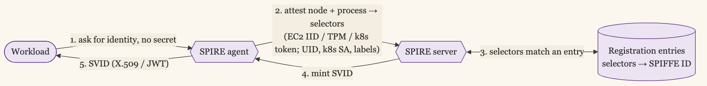

+++
date = '2026-06-12T00:01:00-07:00'
draft = false
title = 'SPIFFE Is Workload Identity That Crosses Boundaries'
aliases = []
description = "Every cloud has its own workload identity, and none of them reach a service running in a different cloud, on-prem, or on bare metal. SPIFFE is the vendor-neutral standard that does, and SPIRE issues those identities by attestation, solving the secret-zero problem of proving a workload with nothing to start from. Here's how it works, and when it's worth the infrastructure."
categories = ['Security', 'Engineering']
tags = ['Security', 'IAM', 'Identity', 'Workload Identity', 'SPIFFE', 'SPIRE', 'mTLS', 'Zero Trust', 'CISO']
image = 'header.png'
[params]
  author = 'Matt Goodrich'
+++

Every plan to get the secrets out of your workloads runs into the same wall. To pull a credential from the vault, the workload has to authenticate to the vault, which means it needs a credential to do that. You did not remove the secret. You moved it down one level, and there is always another level beneath it.

This is the secret-zero problem, and it has a name borrowed from an old joke about what holds up the world: it is turtles all the way down. Somewhere the stack has to rest on something that is not one more secret. SPIFFE is a standard for making that bottom turtle stand on solid ground, and SPIRE is the implementation that puts it there.

## Native Workload Identity Stops at the Cloud's Edge

Inside a single cloud, this is already solved, and solved well. [When a workload can use the platform's native identity](/posts/when-you-can-use-workload-identity/), AWS, GCP, and Azure each attest it for you: an EC2 instance gets an instance profile, a Kubernetes pod gets a service account bound to a cloud role, and the credential is short-lived and injected automatically. There is no secret to place and no bottom turtle, because the cloud itself is the ground the stack rests on.

The catch is the words "inside a single cloud." That native identity is the cloud vouching for its own workloads to its own services. It does not cross the edge. A service in AWS calling a service in GCP, a workload on a bare-metal VM in your own data center, a container talking to a managed database on a different platform: the moment the caller and the callee do not share one cloud's identity plane, the native mechanism has nothing to say, and you are back to placing a secret by hand.

## SPIFFE Is a Name and a Document

SPIFFE, the Secure Production Identity Framework for Everyone, is a [specification](https://spiffe.io/), not a product. It defines two things, and they are simpler than the acronyms around them suggest.

A [SPIFFE ID](https://spiffe.io/docs/latest/spiffe-about/spiffe-concepts/) is a name for a workload, written as a URI: `spiffe://example.org/payments/api`. The first part is the trust domain, the rest identifies the specific workload. It is a stable name that means the same thing no matter which cloud or machine the workload runs on.

An SVID, a SPIFFE Verifiable Identity Document, is the credential that proves a workload holds that name. It comes in two forms: an X.509-SVID, a short-lived TLS certificate with the SPIFFE ID written into it, used for mutual TLS between services; and a JWT-SVID, a signed token for the cases where TLS is not the transport. Either form is short-lived and rotated automatically.

The workload gets its SVID from the Workload API, a local endpoint it calls to fetch and refresh its identity. The workload holds no long-lived key, stores no secret, and does not even need to know how it was identified. It asks the local API, and a fresh SVID comes back.

## The SVID Is a Credential You Hold

In a single cloud, workload identity is close to free at the call site. You write `s3.get_object`, and the SDK's default credential chain quietly finds the temporary credentials in the environment, signs the request, and refreshes them before they expire. You never touch the credential, and most engineers do not know it is happening.

SPIFFE asks for a little more visibility, because the SVID is a credential the workload holds rather than one the SDK signs with on its behalf. The workload fetches its SVID from the Workload API, the local socket the SPIRE agent exposes, and then it has to use it. For an X.509-SVID that means mutual TLS: the workload presents its certificate when it opens a connection and checks the peer's certificate against the trust bundle. For a JWT-SVID it means attaching the token to the request as a bearer token scoped to a named audience.

How visible that is depends on what does the work. Run a service mesh and it is nearly as quiet as the cloud SDK: an Envoy sidecar fetches the SVID and wraps every connection in mTLS, so the app makes a plain localhost call and never sees the certificate. Without a mesh, a library like [go-spiffe](https://github.com/spiffe/go-spiffe) pulls the SVID from the Workload API and configures your TLS client and server in a few lines, and [SPIFFE Helper](https://github.com/spiffe/spiffe-helper) can write the rotating certificate to disk for an app that already speaks TLS, like a database client or a web server.

The deeper difference is what the credential is for. The cloud's native identity signs requests to that cloud's own APIs and stops at its edge. An SVID authenticates the workload to any service that trusts its domain, including one in another cloud or your own data center. The convenience you get for free inside one cloud, you get from a sidecar or a few lines of library code with SPIFFE, and in return it works in the places the cloud SDK has nothing to say.

## Reaching a Cloud's Own APIs

There is one case the mutual TLS story does not cover, and it trips people up: calling a cloud provider's own managed API, like reading from S3. S3 does not speak SPIFFE. It authenticates with AWS credentials and a signed request, and it has never heard of your trust domain. You cannot present an SVID to S3 and have it mean anything, because S3 is not a SPIFFE-aware peer the way another one of your own workloads is.

What you do instead is trade the SVID for the cloud's own short-lived credentials, then make an ordinary API call. A workload in GKE that needs to read an S3 bucket has two ways to do the exchange.

**OIDC federation, with a JWT-SVID.** SPIRE runs an OIDC discovery endpoint, AWS is configured to trust it as an identity provider, and the workload's JWT-SVID is [exchanged through AWS STS for temporary IAM credentials](https://spiffe.io/docs/latest/keyless/oidc-federation-aws/), with the role's trust policy scoped to the specific SPIFFE ID. Nothing to install, but AWS has to be able to reach SPIRE's OIDC endpoint.

**IAM Roles Anywhere, with an X.509-SVID.** You register your SPIFFE trust domain's CA as a trust anchor, and a small [credential helper](https://goteleport.com/docs/machine-workload-identity/workload-identity/aws-roles-anywhere/) trades the X.509-SVID for temporary AWS credentials. It is generally the more secure of the two, and it does not require AWS to reach into your infrastructure.

Either way the SVID never touches S3. It is traded for AWS credentials, and the S3 call is a normal signed AWS request. The same shape works for GCP and Azure managed APIs.

The exchange raises a fair question: where do the permissions come from, since the SVID carries none? They live in the cloud's IAM, exactly as they would for a native workload. You create an IAM role with two parts. A trust policy names which SPIFFE ID is allowed to assume the role. Permission policies say what the role can do, like `s3:GetObject` on one bucket. At call time the workload names which role to assume; the trust policy decides whether this SPIFFE ID may, and the permission policies decide what it gets back. If you want to tighten it further per call, an optional session policy on the request can subtract from the role's permissions, though it can never add to them.

This is the same authentication-and-authorization split you already run. The SVID authenticates the workload, the IAM role authorizes it, and the token exchange is the seam where one becomes the other. Authorization stays in IAM. SPIFFE only changes how the workload proves the identity the role is bound to, and the SPIFFE ID is the hook IAM keys on, in that trust policy, to map a specific workload to a specific role.

One honest note before you reach for this. If a GKE workload calling S3 is the only boundary you cross, you do not need SPIRE at all: GKE already issues its workloads a Google OIDC token, and AWS can federate that directly through the same STS exchange. SPIFFE is worth running when you have many such hops across a mixed estate and want one identity scheme with consistent attestation and audit across all of it, rather than wiring each cloud's native federation by hand.

## Attestation Is How the Turtle Reaches the Ground

The question that matters is how the Workload API knows which SVID to hand back when the workload presented no secret. The answer is attestation, and it works in two layers.

[Node attestation](https://spiffe.io/docs/latest/spire-about/) proves the machine. When a SPIRE agent starts on a node, it proves what node it is using something the platform already vouches for: the signed instance identity document AWS gives every EC2 instance, the GCP or Azure equivalent, a Kubernetes projected service-account token, or a hardware TPM. The agent did not start with a secret. It started with a property of where it runs, signed by something able to sign it.

Workload attestation proves the process. When a workload calls the Workload API, the SPIRE agent inspects the caller through the operating system: its Unix UID and binary path, the Kubernetes service account and namespace of its pod, the labels on its container. These are selectors, and they are facts about the process that the kernel reports, not claims the process makes about itself.

The SPIRE server holds registration entries that map a set of selectors to a SPIFFE ID: this UID, in this Kubernetes service account, on an attested node of this kind, is issued `spiffe://example.org/payments/api`. When an agent's attestation matches an entry, the server mints the SVID. The workload proved nothing it had to be handed in advance. It proved what it is and where it runs, and that was enough. That is the bottom turtle standing on the ground: identity bootstrapped from attested properties instead of a planted secret.

## SPIRE Runs the Whole Thing

[SPIRE](https://github.com/spiffe/spire) is the reference implementation, and it is two components. The SPIRE server is the certificate authority and the registry: it holds the trust domain's signing key, stores the registration entries, and issues SVIDs. The SPIRE agent runs on every node, performs node and workload attestation, and serves the Workload API to the workloads beside it.

The part that crosses boundaries is federation. Two trust domains, say your AWS estate and your on-prem data center, each run their own SPIRE server and their own trust domain. They exchange trust bundles, the public keys each uses to sign its SVIDs. Once domain A trusts domain B's bundle, a workload in A can verify the X.509-SVID a workload in B presents, and mutual TLS between them works across the boundary with neither side holding a secret for the other. This is the thing the per-cloud mechanisms could not do.

## When the Estate Spans Boundaries

SPIFFE is the right tool where the estate does not fit one cloud. A company running services across AWS and GCP, on-prem VMs next to a Kubernetes cluster, bare metal alongside managed services, needs one identity scheme that spans all of it, and the per-cloud mechanisms cannot provide that, because each only speaks for its own ground. SPIFFE gives every workload, wherever it runs, a name and a verifiable document in the same format, and federation lets workloads on different ground authenticate across the seams.

It is also already under your feet if you run a service mesh. Istio issues SPIFFE IDs to its workloads and uses X.509-SVIDs for mesh mTLS, so the identity model you might adopt deliberately is one a mesh adopts on your behalf. And it is the clean way to give [the machine identities that outnumber your people](/posts/non-human-identities/) short-lived credentials instead of static keys, and to put the service-to-service authentication behind per-app access on attested identity rather than shared secrets.

## Do Not Run SPIRE for One Cloud

For all of that, SPIRE is heavy, and most companies should not run it. It is a certificate authority you operate, an agent on every node, and a server that is now critical infrastructure: it has to be highly available, because when it is down, no workload can get or refresh an identity, and your whole identity plane stalls with it. The registration entries are a real management surface that someone has to own.

If your estate is one cloud and the native workload identity covers it, run the native path and leave SPIRE alone. IRSA, GKE Workload Identity, or Azure managed identity solves secret-zero inside its cloud with none of this operational weight, because the cloud is already running the SPIRE-equivalent for you. SPIFFE is worth its complexity precisely when you have outgrown a single cloud's identity plane, when workloads that must trust each other live on different ground. Reach for it then. Reaching for it while everything still runs in one account is buying a cross-domain solution for a problem that has not yet crossed a domain.

## One Identity Per Workload, Not Per Instance

There is a second limit worth naming, and it bites hardest on the workload type growing fastest. SPIFFE issues an identity to a workload, and in the common Kubernetes deployment every replica of that workload shares it. For a stateless web service that is exactly right: the replicas are interchangeable, so one identity for all of them is the correct model.

Agents break that assumption. Two replicas of the same agent identity can behave very differently on the same input, because their behavior depends on more than the code they run: prompt history, memory, and model version. SPIFFE cannot tell those replicas apart, so when one drifts, [the audit trail points at the workload identity but not the instance that misbehaved](/posts/mcp-headless-authorization/). I have written about this [granularity gap for agent identity](/posts/service-accounts-that-improvise/) before: the substrate is right, and the per-instance resolution is not there yet. If your workloads are deterministic services, this never matters. If they are agents, it is a real limit to design around rather than assume away.

The direction of the solve has converged, even if the standard has not landed: one identity per agent instance, or per task, issued fresh and never reused, so each run is distinguishable in the audit log even when the code is identical. The blocker is mechanical. Certificate issuance is too slow for agents that spawn and die in seconds, and attestation needs a per-instance selector to tell replicas apart. The standards work is live: the [IETF's WIMSE working group](https://datatracker.ietf.org/wg/wimse/about/) is building the model for non-deterministic workloads acting on a user's behalf with a provable chain of custody, and SPIFFE is extending its own APIs to catch up. Until that lands, the workable pattern is to mint a per-run identifier in the orchestrator, carry it in the SPIFFE ID path or a per-run token, and pair it with the delegation chain for the on-behalf-of attribution. The substrate is here; the per-instance layer is being built on top of it.

## Identity That Rests on the Ground

The secret-zero problem never fully disappears. Something at the bottom has to be trusted with no secret beneath it, and the only honest options are a secret you placed by hand or a property the platform can attest. SPIFFE picks attestation, and SPIRE turns it into identity that means the same thing across clouds, data centers, and bare metal.

Inside one cloud, let the cloud be the ground. When your workloads no longer share one, SPIFFE is how you give them a name that crosses the wall, resting on attested fact instead of one more secret.
