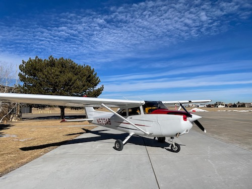
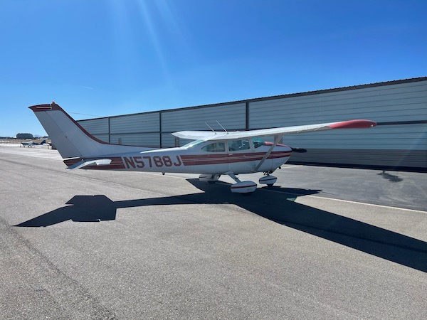
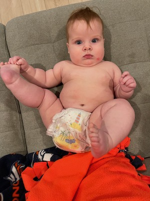
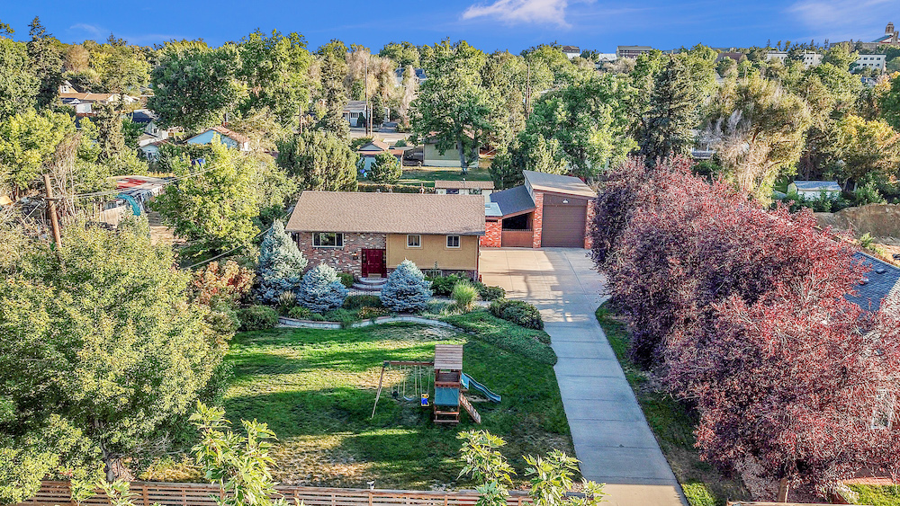
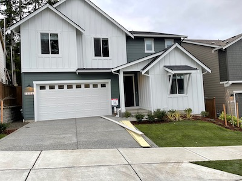

+++
date = '2021-12-31T12:00:00-07:00'
draft = false
title = 'My 2021 Year in Review: Life, Leadership, and Learning'
aliases = ['/personal/year-in-review-2021/']
summary = "As I reflect on my year, I realize that leading several groups within an Information Security team was a significant departure from being deeply focused on technical details. Despite not meeting my resolution to be more healthy and lose weight, I made progress as a better business partner and took time off to focus on completing my private pilot's license."
genres = ['Career Development', 'Personal Growth']
tags = ['Year in Review', 'Leadership', 'Private Pilot License', 'DevSecOps', 'Family Life']
[params]
  author = 'Matt Goodrich'
+++

When thinking about what I am going to write, these posts always sound better in my head. Having read several year in review posts myself over the last week, I have gone back and forth between covering the big things that happened in each month, using data from the various things I did throughout the year, or just something else entirely. I decided to go with a mixture of data and some of the high points throughout the year.

This year started out like most years - a resolution to be more healthy and lose weight - and it turns out like every prior year that did not actually happen. What did make this year different however is that I was leading several groups within an Information Security team, instead of being deeply focused on the technical details I have been previously. As the Director of Security Architecture, my team and I were focused on enterprise/cloud/product security architecture and maturing our application security program. What I was most focused on however was being a better business partner; making sure less slipped through the cracks, and reducing the amount of time it took for us to respond to requests. 

Outside of work, I was focused on completing my private pilots license. This is a major step in a journey I started 18 years earlier when I first logged time in a Cessna 150 (N11518) on July 26, 2003 at Ryan Field (KRYN) in Tucson, Arizona. On February 2nd, 2021 I passed my check ride in a Cessna 172 (N523AB) at Erie Metropolitan Airport (KEIK) in Erie, Colorado. Since then, I have taken my family on several flights, and have myself visited several airports in the central and western United States, taken a mountain flying course, received my high performance endorsement, bought into a partnership of a Cessna 182 (N5788J) at Centennial Airport (KAPA), and sold my share of the partnership. Going into 2022, I am a few hours into my Instrument rating, and plan to get it wrapped up in early 2022. I flew for a total of 67.5 hours in 2021.

> "I flew for a total of 67.5 hours in 2021."

*2021 Airports*

* Erie Municipal Airport, Erie, CO (KEIK)
* Centennial Airport, Denver, CO (KAPA)
* Central Colorado Regional Airport, Buena Vista, CO (KAEJ)
* Meadow Lake Airport, Colorado Springs, CO (KFLY)
* Steamboat Springs/Bob Adams Field, Steamboat Springs, CO (KSBS)
* Pueblo Memorial Airport, Pueblo, CO (KPUB)
* Lake County Airport, Leadville, CO (KLXV)
* Las Vegas Municipal Airport, Las Vegas, NM (KLVS)
* Payson Airport, Payson, AZ (KPAN)
* Scottsdale Airport, Scottsdale, AZ (KSDL)
* Marana Regional Airport, Marana, Arizona(KAVQ)
* El Tiro Gliderport, Tucson, AZ (AZ67)
* Limon Municipal Airport, Limon, CO (KLIC)
* Kit Carson County Airport, Burlington, CO (KITR)
* Renner Field/Goodland Municipal Airport, Goodland, KS (KGLD)
* San Luis Valley Regional Airport/Bergman Field, Alamosa, CO (KALS)
* Northern Colorado Regional Airport, Fort Collins/Loveland, CO (KFNL)

At the beginning of May my family welcomed home its' newest addition "Coco". I became a father to a beautiful daughter, and was on leave from work for 3 months thanks to the benefits provided by Alteryx. I was happy to have the time - I had only one week with our previous kiddo - but the longest I had not worked since I was 14 years old was 3 weeks. We had big ambitions and tight timelines at work... I definitely had FOMO prior to going out on leave, but that quickly went away. In sort of an unplanned drive, I decided to do some learning while I was out. Many of the mentors, peers, and leaders I have learned the most from in the past are avid readers and always have a number of recommendations. I read more in 2021, than I had in any previous year. Not something I am actually super proud of - but I definitely understand the love of books my wife has a little bit more now (for the record she read over 100 books this year). Here is what I read (or listened to):

* *Oh Crap! Potty Training: Everything Modern Parents Need to Know to Do It Once and Do It Right* - Jamie Glowacki
* *The Five Dysfunctions of a Team: A Leadership Fable* - Patrick Lencioni
* *An Elegant Puzzle: Systems of Engineering Management* - Will Larson
* *Turn the Ship Around: A True Story of Turning Followers into Leaders* - L. David Marquet
* *Extreme Ownership* - Jocko Willink & Leif Babin
* *Staff Engineer: Leadership Beyond the Management Track* - Will Larson
* *The Managers Path: A Guide for Tech Leaders Navigating Growth and Change* - Camille Fournier 
* *Death by Meeting* - Patrick Lencioni
* *The Kubernetes Book* - Nigel Poulton
* *This Is How They Tell Me the World Ends: The Cyberweapons Arms Race* - Nicole Perlroth
* *Powerful: Building a Culture of Freedom and Responsibility* - Patty McCord
* *Rich Dad Poor Dad: What the Rich Teach Their Kids About Money That the and Middle Class Do Not!* - Robert Kiyosaki
* *Kitchen Confidential: Adventures in the Culinary Underbelly* - Anthony Bourdain

I had another 8-10 books that I started, but did not make it through them yet.

> "I read more in 2021, than I had in any previous year."

After returning from leave, the latter half of the year has come with a number of changes.
* I transitioned back into the Alteryx Engineering organization, and am building out a new team focused on DevSecOps

* We sold our home in Denver
* We welcomed our first au pair to the family

* We moved our family across the country and bought a home in Poulsbo, Washington

We're still getting settled, and though we have moved almost a dozen times in the past decade, doing it with two kids is A LOT more work than it has been previously. 

Looking forward to 2022, here are some more realistic things I would like to accomplish:
* Continue posting on mattgoodrich.com & improve my writing skills
* Complete my Instrument Rating
* Read at least as many books as I did this year
* Keep my family healthy and safe

Stretch goals:
* Buy a new (to me) airplane
* Actually take our scheduled vacation to Maui in February

-G$