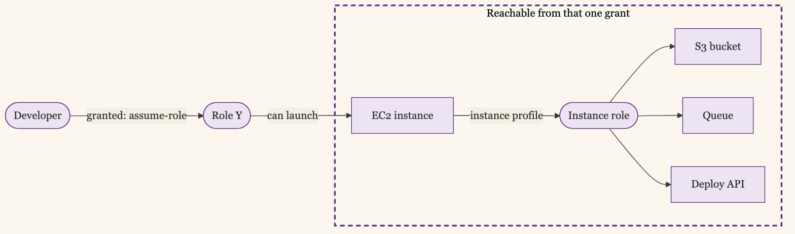
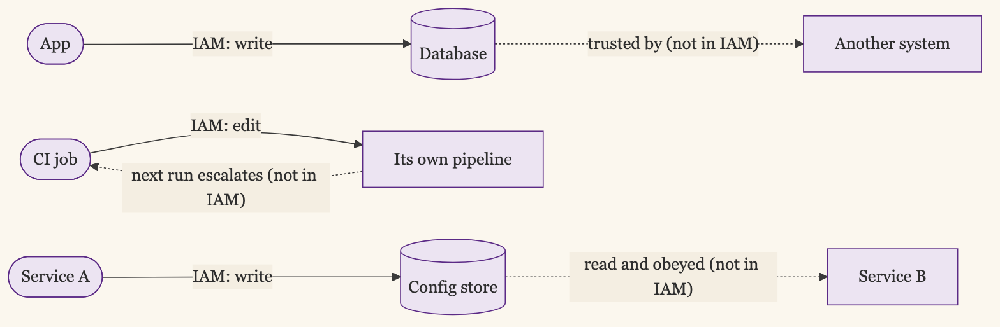

+++
date = '2026-06-08T12:00:00-07:00'
draft = false
title = 'You Can Reach More Than You Were Granted'
aliases = []
description = "On paper a role grants a short list of permissions. In practice you assume a role, land on an instance, the instance has its own role, and that role reaches further. The dangerous access is the access you cannot see, and most reviews never look for it."
categories = ['Security', 'Engineering']
tags = ['Security', 'IAM', 'AWS', 'GCP', 'Azure', 'Least Privilege', 'Privilege Escalation', 'CIEM', 'Cloud Security', 'Identity']
image = 'header.png'
[params]
  author = 'Matt Goodrich'
+++

A developer has permission to assume one role. That role can start an EC2 instance. The instance comes up with an instance profile attached, which is another role. That second role can read a specific S3 bucket, write to a queue, and call an internal deploy API. The grant on the developer's account says one thing: assume this role. What the developer can actually reach is everything at the far end of that chain, and no one wrote that part down.

This is the gap that makes least privilege so much harder than it sounds. The permission you grant and the access you create are not the same thing, and the distance between them is where the risk hides.

## Granted Versus Reachable

It is worth naming the two things cleanly, because most conversations blur them.

A **granted** permission is what shows up in the policy. User X can assume role Y. Service account Z can read table T. These are the statements you write, review, and attest to. They are legible.

A **reachable** permission is everything an identity can get to by following grants through other grants. Assume a role that can launch compute, and you reach whatever that compute can do. Assume a role that can pass another role to a service, and you reach that role's permissions too. Reachable access is the transitive closure of every grant, and it is almost never written down anywhere.

Granted is a list. Reachable is a graph. The list is what your access review looks at. The graph is what an attacker explores.



## Why the Chain Is Invisible

This stays hidden because each link looks reasonable on its own.

The developer needs to assume a role to do their job. The role needs to launch instances. The instance needs a profile so the code on it can reach its database. Every grant in the chain passes review individually, because every grant in the chain is individually defensible. The danger appears only when you compose them, and nothing in the normal review process composes them.

Cloud platforms sharpen this, because the building blocks are designed to chain into each other. AWS lets a role pass another role to a service (`iam:PassRole`), assume roles across accounts, and chain assumptions one into the next. Each is a useful feature. Together they mean a modest-looking grant can sit two or three hops from something you would never have approved directly. The classic case is an over-broad `iam:PassRole` that lets a low-privilege principal hand a high-privilege role to a service it controls. Now the low-privilege principal has the high-privilege role's reach, and the policy on its own account still looks tame.

## Where Reviews Miss It

A quarterly access review reads memberships and policies. It can tell you a user is in the developers group and the group can assume role Y. It cannot tell you, in the thirty seconds a reviewer spends per line, that role Y reaches the customer database three hops later. Even [telemetry-driven review](/posts/telemetry-driven-access-reviews/), which is a large improvement over the quarterly ritual, mostly sees direct use: who authenticated, what they called. It sees the hops that happened, not the hops that could happen. The unused transitive path is the most dangerous kind, because it is reachable and invisible at the same time.

## What Actually Helps

You cannot eyeball a permission graph, and this is one of the few places in identity where tooling is genuinely worth running.

The category is cloud infrastructure entitlement management, and the useful capability under the marketing is effective-access analysis: computing the transitive closure and answering "what can this identity actually reach?" AWS IAM Access Analyzer does a slice of this natively, covering external access, unused access, and policy validation. Wiz, Sonrai, and Tenable (through the Ermetic acquisition) build the fuller graph across accounts and clouds. The common thread is that they treat access as a graph and compute reachability, which is the thing humans cannot do by hand.

The other half is `iam:PassRole` discipline. Scope pass-role permissions to specific roles, never a wildcard. Most dangerous chains route through a sloppy PassRole grant, and tightening it cuts a lot of reachable access without touching anything anyone uses.

And where you can, prefer short-lived, narrowly scoped credentials over standing roles, so even a reachable path is only reachable for a bounded window. This is the same argument as [capabilities over roles](/posts/agents-need-capabilities-not-roles/): the narrower the grant, the smaller the graph it sits in.

## Building the Graph Without Buying One

The commercial tools build the graph for you. If you want to build it yourself, the data is all queryable, and a couple of open-source tools already do the hard part.

The raw material is your account's authorization details. `aws iam get-account-authorization-details` dumps every user, role, policy, and trust relationship as JSON, which is the graph's nodes and edges. The work is computing the paths through it, and you do not have to write that yourself.

```bash
# every identity, policy, and trust relationship in the account
aws iam get-account-authorization-details > auth-details.json

# or let PMapper build the privilege graph and ask it directly
pmapper graph create
pmapper query 'preset privesc *'
```

[PMapper](https://github.com/nccgroup/PMapper) (Principal Mapper, from NCC Group) builds the privilege graph and answers reachability questions directly: which principals can reach admin, which can escalate, what a given role can get to. [Cartography](https://github.com/cartography-cncf/cartography) (originally from Lyft) ingests AWS and other clouds into a Neo4j graph so you can write your own queries against the whole estate. AWS IAM Access Analyzer covers the managed slice, external and unused access, without standing anything up.

Reach for PMapper when you want answers this afternoon, and Cartography when you want a graph you can keep querying as the estate changes. Either way the shift is the same: you stop reviewing policies one at a time and start asking the graph a question.

None of this is AWS-only. Cartography ingests GCP and Azure too, so one graph can span all three clouds. GCP has Policy Analyzer to ask who can reach a resource and IAM Recommender to surface unused access, both native. On Azure the open-source pair is [AzureHound](https://github.com/SpecterOps/AzureHound) and [BloodHound](https://github.com/SpecterOps/BloodHound), which collect the environment and render privilege-escalation paths directly, the closest analog to PMapper, while Microsoft Defender for Cloud bundles a CIEM that does the managed version across all three. The tools differ by cloud; the question you ask the graph does not.

## The Role Hides Who Used It

Finding a reachable edge tells you the access exists. It does not tell you who used it, and on a transitive edge that second question gets genuinely hard.

When code on that instance writes to the S3 bucket, CloudTrail records the action under the instance's role, not under a person. The log says role X wrote to the bucket. It does not say whether a human connected to the instance and ran a command, or the application did exactly what it was built to do on its own schedule. Both look identical in the trail, because by the time the write happens, both are wearing the same role.

That ambiguity matters. "A human reached production through this chain" and "the workload reached production because we designed it to" are completely different findings, and the default audit trail cannot tell them apart.

AWS gives you a way to keep them apart for one of those cases, but you have to opt in. `sts:SourceIdentity` carries the original human identity through a chain of role assumptions. You add `sts:SetSourceIdentity` to the role's trust policy, alongside `sts:AssumeRole`, with a condition that requires it so nobody can omit it, and the caller (or your IdP, mapping an email or username) sets `--source-identity jane@example.com` at assume time. From then on the value is immutable and rides along on every downstream CloudTrail event, so the log can say "Jane, operating through role X, wrote to the bucket" instead of just "role X."

The catch is which case that covers. SourceIdentity works for role chaining, a human assuming a role that assumes another role. It does nothing for the instance-profile hop in the example above, because the instance's role is handed to it by the EC2 service, not by a human's assume-role call. A person who connects to that instance and uses its credentials leaves no source identity at all, and CloudTrail shows only the instance role. To attribute that, you are correlating SSM Session Manager or SSH logs against CloudTrail by timestamp, which is exactly as fragile as it sounds. The hardest hop to trace is the one this post opened with.

This is the deeper thing the chain exposes, and it is worth naming on its own. The hop that erases attribution is the one where a human assumes a role and lands on a workload that has its own identity. From that point the person is operating as the workload, and their actions are indistinguishable from the workload's own. User identity crossing into workload identity is where accountability goes to disappear, and it is a big enough problem to deserve its own post. I will come back to it.

The other clouds land in the same place, with one twist. GCP actually logs the full impersonation chain by default: when one service account impersonates another, Cloud Audit Logs records every principal in `serviceAccountDelegationInfo`, including the human who started it, no opt-in required. Azure leans on Microsoft Graph activity logs, which only reached general availability in 2024 and which most tenants still have not turned on. But all three share the same blind spot you cannot configure away: a workload with an attached identity, an EC2 instance profile, a GCP service account on a VM, an Azure managed identity, logs its actions as that identity, and a human operating through it vanishes into it.

## The Map Is Never Complete

Here is the part the tooling vendors undersell. The reachable graph is never fully knowable, because some hops are not in IAM at all.

An application with database write access can change data another system trusts. A CI job that can edit its own pipeline can grant itself more. A service that writes to a config store another service reads can influence that service's behavior. These are reachability paths too, and no entitlement tool sees them, because they run through application logic, not access policy. Effective-access analysis shrinks the invisible part. It does not erase it.



So the honest goal is a smaller gap between granted and reachable, plus the awareness that the gap is never zero. A complete map was never on offer. You shrink it by scoping grants tightly, killing wildcard pass-role, shortening credential lifetimes, and running a tool that computes the closure for the parts that live in IAM. The rest you handle by assuming any identity can eventually reach a little further than its policy claims.

## You Are Reviewing the Wrong Object

The thing to internalize is that your access review is reviewing the wrong object. It reviews grants, a list. The risk lives in reachability, a graph. Until you can see the graph, you are approving the links one at a time and hoping nobody walks the chain. Someone always walks the chain.
